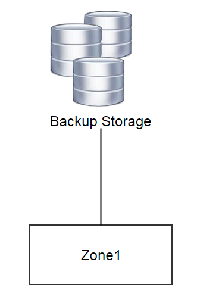
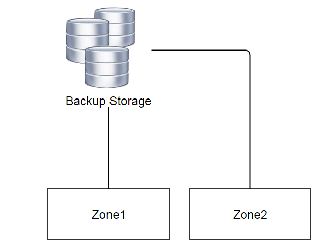

.. _backup storage:

==============
备份存储（Backup Storage）
==============

.. contents:: `目录`
   :depth: 6

--------
概览（Overview）
--------

备份存储是保存用于创建云盘的:ref:`images <image>`的存储系统. 备份存储可以是基于存储的文件系统（filesystem based storage，例如NFS），也是可以基于对象的存储（object store based storage，例如OpenStack SWIFT）, 只要该存储系统为网络可共享的存储（network
shared storage）. 除了可以为创建云盘提供模板以外, 备份存储也允许用户备份云盘或云盘快照（volume snapshots）.

备份存储必须挂载到:ref:`zone <zone>`之后，区域中的资源才能访问它.
管理员可以利用备份存储在多个区域之间共享镜像, 例如:

在云的初期, 可能只有一个区域(Zone1)以及一个备份存储. 随着业务的发展,
管理员可能会选择创建另一个区域(Zone2)，但使用现有的镜像创建虚拟机; 这时管理员可以将备份存储挂载到区域Zone2, 这样区域Zone1和区域Zone2都可以共享同样的镜像了.

.. 注意:: ZStack当前版本仅支持:ref:`SFTP backup storage <sftp backup storage>`作为备份存储

.. _backup storage inventory:

---------
清单（Inventory）
---------

属性（Properties）
==========

.. list-table::
   :widths: 20 40 10 20 10
   :header-rows: 1

   * - 名字
     - 描述
     - 可选的
     - 可选的参数值
     - 起始支持版本
   * - **uuid**
     - 请参见 :ref:`resource properties`
     -
     -
     - 0.6
   * - **name**
     - 请参见 :ref:`resource properties`
     -
     -
     - 0.6
   * - **description**
     - 请参见 :ref:`resource properties`
     - 是
     -
     - 0.6
   * - **url**
     - 请参见 :ref:`url <backup storage url>`
     -
     -
     - 0.6
   * - **totalCapacity**
     - 字节为单位的磁盘总容量, 请参见 :ref:`capacity <backup storage capacity>`
     -
     -
     - 0.6
   * - **availableCapacity**
     - 字节为单位的磁盘可用容量, 请参见 :ref:`capacity <backup storage capacity>`
     -
     -
     - 0.6
   * - **type**
     - 备份存储类型e
     -
     - - SftpBackupStorage
     - 0.6
   * - **state**
     - 请参见 :ref:`state <backup storage state>`
     -
     - - Enabled
       - Disabled
     - 0.6
   * - **status**
     - 请参见 :ref:`status <backup storage status>`
     -
     - - Connecting
       - Connected
       - Disconnected
     - 0.6
   * - **attachedZoneUuids**
     - 备份存储所挂载的所有区域的UUID
     -
     -
     - 0.6
   * - **createDate**
     - 请参见 :ref:`resource properties`
     -
     -
     - 0.6
   * - **lastOpDate**
     - 请参见 :ref:`resource properties`
     -
     -
     - 0.6

示例
+++++++

::

        {
            "attachedZoneUuids": [
                "36de66d82f424639af67215a465418f6"
            ],
            "availableCapacity": 1258407346176,
            "name": "sftp",
            "state": "Enabled",
            "status": "Connected",
            "totalCapacity": 1585341214720,
            "type": "SftpBackupStorage",
            "url": "/export/backupStorage/sftp",
            "uuid": "33a35f75885f45ab96ea2626ce9c05a6",
            "lastOpDate": "Jun 1, 2015 3:42:26 PM",
            "createDate": "Jun 1, 2015 3:42:26 PM"
        }

.. _backup storage url:

统一资源定位符（URL）
+++

备份存储需要使用URL字符串存储的信息来控制存储系统. 虽然名字叫URL, 具体的字符串存储格式依据主存储的类型而定， 并不完全等同于标准的URL规范, 这样可以给插件更多的灵活性以存储一些不方便以URL格式存储的信息.

.. _sftp backup storage url:

SFTP备份存储URL（SFTP Backup Storage URL）
-----------------------

对于SFTP备份存储而言, URL是一个目录在文件系统中的绝对路径. 例如, /storage/sftp.

.. _backup storage capacity:

容量（Capacity）
++++++++

为了方便选择合适的备份存储存放镜像, ZStack会监控备份存储的容量.
备份存储的容量根据下面公式来计算::

    总容量 = 备份存储的总容量
    可用容量 = 总容量 - sum(镜像的实际大小)

.. _backup storage state:

可用状态（State）
+++++

备份存储有两种可用状态:

- **Enabled**:

  启用（Enabled）状态下，允许镜像被注册，备份，和下载

- **Disabled**:

  禁用（Disabled）状态下，不允许镜像被注册，备份，和下载. 
  需要特别注意的是，如果一个镜像只存在于一个禁用了的备份存储中，并且这个镜像还没有被下载到主存储的镜像缓存中，这时不能从这个镜像创建虚拟机.

.. _backup storage status:

连接状态（Status）
++++++

主存储的连接状态反应了管理节点和备份存储之间的命令通道的状态.

- **Connecting**:

  在这种状态时，一个ZStack管理节点正在尝试建立自己和备份存储之间的命令通道. 这时还不能在备份存储上执行任何操作.

- **Connected**

  这种状态时，ZStack管理节点和备份存储之间的命令通道已经被成功建立. 可以在备份存储上执行操作.

- **Disconnected**

  在这种状态时，ZStack管理节点和备份存储之间的命令通道丢失. 这时不能在备份存储上执行任何操作.

在ZStack管理节点启动过程中会开始和备份存储建立命令通道，并且会在运行中周期性的向主存储发送ping命令（ping commands）以检查命令通道的健康状态; 
一旦某个备份存储响应失败, 或者ping命令超时，备份存储的连接状态就会变为Disconnected.

.. 警告:::: ZStack会持续的发送ping命令到Disconnected状态的备份存储. 一旦备份存储恢复并响应ping命令, ZStack会重新建立命令通道，并将备份存储的状态设置为Connected. 因此如果一个备份已经彻底从云中移除，请将它也从ZStack中删除，否则ZStack会一直尝试ping它.

备份存储的可用状态转换图如下:

.. image:: backup-storage-status.png
   :align: center

.. _sftp backup storage:

-------------------
SFTP备份存储（SFTP Backup Storage）
-------------------

SFTP备份存储是使用本地文件系统（native filesystem）存储镜像，并使用OpenSSH服务器/客户端传输镜像的Linux服务器.
ZStack使用一个python代理(SftpBackupStorageAgent)来管理Linux服务器; 镜像是通过使用`SCP <http://en.wikipedia.org/wiki/Secure_copy>`_从服务器上传/下载. 
除了:ref:`backup storage inventory <backup storage inventory>`章节中提到的属性, SFTP备份存储还有一个额外的属性:

.. list-table::
   :widths: 20 40 10 20 10
   :header-rows: 1

   * - 名字
     - 描述
     - 可选的
     - 可选的参数值
     - 起始支持版本
   * - **hostname**
     - SFTP备份存储的IP地址或DNS域名
     -
     -
     - 0.6

示例
=======

::

        {
            "attachedZoneUuids": [
                "36de66d82f424639af67215a465418f6"
            ],
            "availableCapacity": 1258407346176,
            "hostname": "172.16.0.220",
            "name": "sftp",
            "state": "Enabled",
            "status": "Connected",
            "totalCapacity": 1585341214720,
            "type": "SftpBackupStorage",
            "url": "/export/backupStorage/sftp",
            "uuid": "33a35f75885f45ab96ea2626ce9c05a6",
            "lastOpDate": "Jun 1, 2015 3:42:26 PM",
            "createDate": "Jun 1, 2015 3:42:26 PM"
        }

----------
操作（Operations）
----------

添加备份存储（Add Backup Storage）
==================

不同的备份存储类型使用不同的添加命令.

添加SFTP备份存储（Add SFTP Backup Storage）
+++++++++++++++++++++++

管理员可以使用AddSftpBackupStorage来添加一个新的备份存储. 例如::

    AddSftpBackupStorage name=sftp1 url=/storage/sftp1 hostname=192.168.0.220 username=root password=password

参数（Parameters）
----------

.. list-table::
   :widths: 20 40 10 20 10
   :header-rows: 1

   * - 名字
     - 描述
     - 可选的
     - 可选的参数值
     - 起始支持版本
   * - **name**
     - 资源的名字, 请参见 :ref:`resource properties`
     -
     -
     - 0.6
   * - **resourceUuid**
     - 资源的uuid, 请参见 :ref:`create resource`
     - 是
     -
     - 0.6
   * - **description**
     - 资源的描述, 请参见 :ref:`resource properties`
     - 是
     -
     - 0.6
   * - **url**
     - 请参见 :ref:`url <backup storage url>`
     -
     -
     - 0.6
   * - **hostname**
     - SFTP备份存储的IP地址或DNS域名
     -
     -
     - 0.6
   * - **username**
     - **root**用户
     -
     - root
     - 0.6
   * - **password**
     - **root**的SSH密码
     -
     -
     - 0.6

删除备份存储（Delete Backup Storage）
=====================

管理员可以使用DeleteBackupStorage来删除备份存储. 例如::

    DeleteBackupStorage uuid=1613b627cb2e4ffcb30e7e59935064be

.. 警告:: 删除备份存储, 会使备份存储从挂载的区域上卸载. 所有的备份存储上的镜像或云盘快照的拷贝都会被删除;
             如果被删除的拷贝是镜像或云盘快照的唯一拷贝，相对应的镜像或快照也会被删除.
             没有办法恢复一个已经删除了的备份存储.

参数（Parameters）
++++++++++

.. list-table::
   :widths: 20 40 10 20 10
   :header-rows: 1

   * - 名字
     - 描述
     - 可选的
     - 可选的参数值
     - 起始支持版本
   * - **uuid**
     - 备份存储的uuid
     -
     -
     - 0.6
   * - **deleteMode**
     - 请参见 :ref:`delete resource`
     - 是
     - - Permissive
       - Enforcing
     - 0.6

改变可用状态（Change State）
============

管理员可以使用ChangeBackupStorageState来改变备份存储的可用状态. 例如::

    ChangeBackupStorageState uuid=33a35f75885f45ab96ea2626ce9c05a6 stateEvent=enable

参数（Parameters）
++++++++++

.. list-table::
   :widths: 20 40 10 20 10
   :header-rows: 1

   * - 名字
     - 描述
     - 可选的
     - 可选的参数值
     - 起始支持版本
   * - **uuid**
     - 备份存储的uuid
     -
     -
     - 0.6
   * - **stateEvent**
     - 状态触发事件

       - 启用: 改变可用状态为启用（Enabled）
       - 禁用: 改变可用状态为禁用（Disabled）
     -
     - - enable
       - disable
     - 0.6

.. _attach backup storage to zone:

挂载区域（Attach Zone）
===========

管理员可以使用AttachBackupStorageToZone将备份存储挂载到区域上. 例如::

    AttachBackupStorageToZone backupStorageUuid=d086c30f33914c98a6078269bab7bc8f zoneUuid=d086c30f33914c98a6078269bab7bc8f

参数（Parameters）
++++++++++

.. list-table::
   :widths: 20 40 10 20 10
   :header-rows: 1

   * - 名字
     - 描述
     - 可选的
     - 可选的参数值
     - 起始支持版本
   * - **backupStorageUuid**
     - 备份存储的uuid
     -
     -
     - 0.6
   * - **zoneUuid**
     - 区域的uuid
     -
     -
     - 0.6

.. _detach backup storage from zone:

卸载区域（Detach Zone）
===========

管理员可以使用DetachBackupStorageFromZone从一个区域卸载备份存储. 例如::

    DetachBackupStorageFromZone backupStorageUuid=d086c30f33914c98a6078269bab7bc8f zoneUuid=d086c30f33914c98a6078269bab7bc8f

参数（Parameters）
++++++++++

.. list-table::
   :widths: 20 40 10 20 10
   :header-rows: 1

   * - 名字
     - 描述
     - 可选的
     - 可选的参数值
     - 起始支持版本
   * - **backupStorageUuid**
     - 备份存储的uuid
     -
     -
     - 0.6
   * - **zoneUuid**
     - 区域的uuid
     -
     -
     - 0.6

查询备份存储（Query Backup Storage）
====================

管理员可以使用QueryBackupStorage来查询备份存储. 例如::

    QueryBackupStorage state=Enabled

::

    QueryBackupStorage image.platform=Linux

原生域查询（Primitive Fields of Query）
+++++++++++++++++++++++++

请参见 :ref:`backup storage inventory <backup storage inventory>`

.. _backup storage nested fields:

嵌套和扩展域查询（Nested And Expanded Fields of Query）
+++++++++++++++++++++++++++++++++++

.. list-table::
   :widths: 20 30 40 10
   :header-rows: 1

   * - 域（Field）
     - 清单（Inventory）
     - 描述
     - 起始支持版本
   * - **zone**
     - :ref:`zone inventory <zone inventory>`
     - 该备份存储挂载的所有区域
     - 0.6
   * - **image**
     - :ref:`image inventory <image inventory>`
     - 该备份存储包含的所有镜像
     - 0.6
   * - **volumeSnapshot**
     - :ref:`volume snapshot inventory <volume snapshot inventory>`
     - 该备份存储包含的所有云盘快照
     - 0.6

查询SFTP备份存储（Query SFTP Backup Storage）
=========================

管理员可以使用QuerySftpBackupStorage来查询SFTP备份存储::

    QuerySftpBackupStorage name=sftp

原生域查询（Primitive Fields of Query）
+++++++++++++++++++++++++

请参见 :ref:`SFTP backup storage inventory <sftp backup storage>`

嵌套和扩展域查询（Nested and Expanded Fields of Query）
+++++++++++++++++++++++++++++++++++

请参见 :ref:`backup storage nested and expanded fields <backup storage nested fields>`

---------------------
全局配置（Global Configurations）
---------------------

.. _ping.interval:

ping.interval
=============

.. list-table::
   :widths: 20 30 20 30
   :header-rows: 1

   * - 名字
     - 类别
     - 默认值
     - 可选的参数值
   * - **ping.interval**
     - backupStorage
     - 60
     - > 0

管理节点发送ping命令到备份存储的间隔时间, 单位是秒.

.. _ping.parallelismDegree:

ping.parallelismDegree
======================

.. list-table::
   :widths: 20 30 20 30
   :header-rows: 1

   * - 名字
     - 类别
     - 默认值
     - 可选的参数值
   * - **ping.parallelismDegree**
     - backupStorage
     - 50
     - > 0

管理节点可以同时ping的最大并行数量.

----
标签（Tags）
----

管理员可以使用resourceType=BackupStorageVO在备份存储上创建用户标签. 例如::

    CreateUserTag tag=lab1 resourceType=BackupStorageVO resourceUuid=2906471068802c501773d3ee55b7766e
