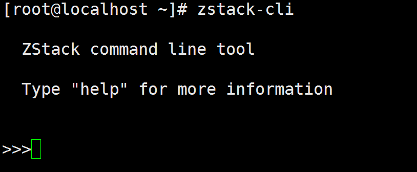
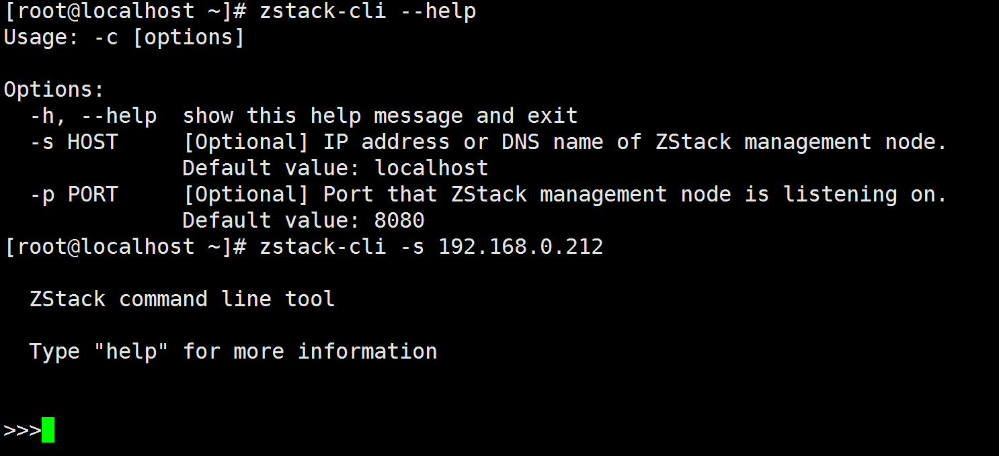
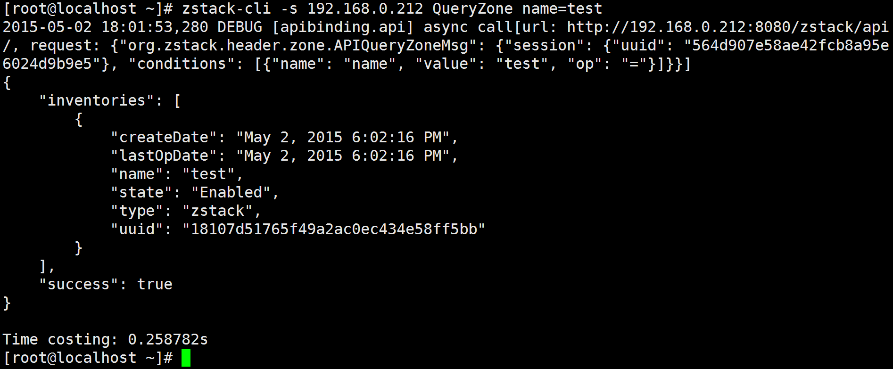
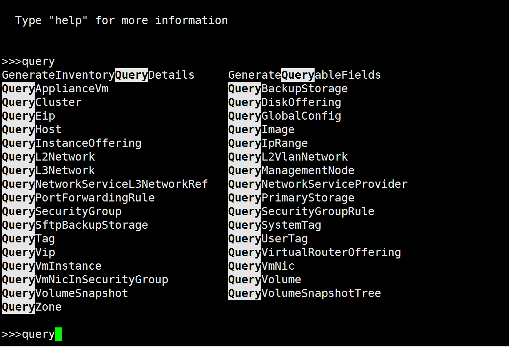
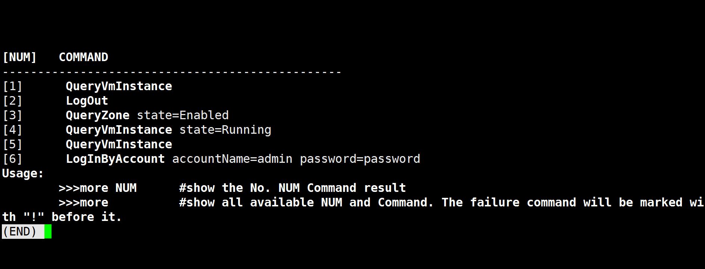
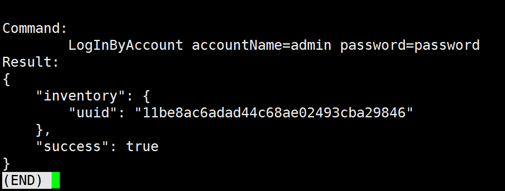

.. _cli:

=================
命令行工具
=================

.. contents:: `目录`
   :depth: 6

--------
概览
--------

zstack-cli是供用户调用所有ZStack API的命令行工具. 本手册中所有API示例都将用zstack-cli来展示.

由于ZStack是基于面向服务架构（SOA，Service Oriented Architecture）, 所有的ZStack本质上都是消息; 例如, 你将会在虚拟机相关的章节中看到
一个叫做*StartVmInstance*的CLI命令, 它实际上映射到这个API消息: APIStartVmInstanceMsg;
然而，相对于消息大家对HTTP调用更加熟悉，因此ZStack包含了一个内置HTTP服务将所有API消息封装于HTTP POST请求中. 
zstack-cli就是基于这个内置HTTP服务调用API的.

-----
用法
-----

链接到ZStack管理节点
=================================

默认情况下安装ZStack管理节点后zstack-cli就会被安装. 你可以在shell终端简单的通过命令'zstack-cli'来启动它:

在没有参数指定的情况下, zstack-cli会连接到localhost的8080端口; 如果要连接远程的ZStack管理节点,
你可以通过选项'-s'和'-p'来分别指定IP和端口号:

.. 注意:: ZStack运行于Java servlet容器中, 例如Tomcat, 其端口号很少变化; 因此多数情况下你只需通过'-s'指定IP地址.

如果你有多个管理节点, 你可以通过zstack-cli连接到任一个管理节点.

模式（Modes）
=====

zstack-cli可以从shell接受参数工作在命令模式, 在这种模式下，他只运行一次, 然后从shell输出结果, 例如:

ztack-cli也可以工作在交互模式，在这种模式下，他会维护一个会话(session)来不断的执行命令, 例如:

手动执行时通常更适合使用交互模式，而脚本集成的时候通常适合用命令模式.

登陆（LogIn）
=====

在当前ZStack版本(0.6), 认证和访问管理系统（IAM，Identity and Access Management)还没就绪; 唯一的账户是'admin'，它使用默认密码('password'). 
在执行任何命令之前, 你需要运行登陆命令'LogInByAccount'取得一个会话令牌（session token），这个令牌会被zstack-cli自动保存到~/.zstack/cli/session，所以你需要单独维护它::

    >>> LogInByAccount accountName=admin password=password

登出（LogOut）
======

一旦你的工作已完成, 你可以使用'LogOut'命令来结束当前会话::

    >>> LogOut

LogOut命令接受一个参数'sessionUuid', 但你并不需要指定它，因为zstack-cli会自动从它所保存的位置获取.

执行API命令
====================

每一个API都是一个拥有多个参数的命令, 你可以通过命令模式或者交互模式来执行他们::

    >>> StartVmInstance uuid=11be8ac6adad44c68ae02493cba29846

::

    [root@localhost ~]# zstack-cli StartVmInstance uuid=11be8ac6adad44c68ae02493cba29846

.. 注意:: 在交互模式中, 你可以使用Tab键来自动补全（auto-complete）命令或者提示你可以用的备选参数.

查看命令历史
====================

你可以使用'more'命令来查看命令历史, 例如::

    >>> more

或者::

    [root@localhost ~]# zstack-cli more

结果格式和Linux *more*命令类似, 你可以使用上下键来浏览或者搜索.

使用'more'后面跟上命令编号可以查看一个命令的详情::

    >>> more 6

或者::

    [root@localhost ~]# zstack-cli more 6

结果类似于:

.. 注意:: 当命令结果超过一个屏幕的大小时，查看命令详情非常有用; 例如, 查看QueryVmInstance的结果时.

导出命令结果
======================

你可以通过'save'命令导出命令历史, 可以一次保存一个历史也可以一次保存多个历史::

    >>> save 1
    Saved command: 1 result to file: /home/root/QueryZone-1.json

::

    [root@localhost ~]# zstack-cli -s 192.168.0.212 save 1
    Saved command: 1 result to file: /home/root/QueryZone-1.json

或者::

    >>>save 1,2,3
    Saved command: 1 result to file: /home/root/QueryZone-1.json
    Saved command: 2 result to file: /home/root/CreateZone-2.json
    Saved command: 3 result to file: /home/root/LogInByAccount-3.json

::

    [root@localhost ~]# zstack-cli -s 192.168.0.212 save 1,2,3
    Saved command: 1 result to file: /home/root/QueryZone-1.json
    Saved command: 2 result to file: /home/root/CreateZone-2.json
    Saved command: 3 result to file: /home/root/LogInByAccount-3.json

默认情况下结果被保存到当前目录下, 你也可以通过额外提供一个路径来指定目的文件夹::

    >>> save 1 /tmp
    save history command 1 result to /tmp/COMMAND-1.json

