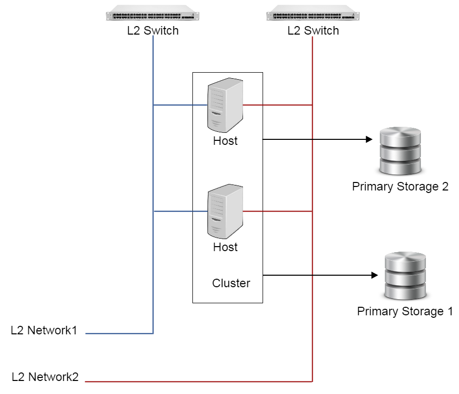

.. _cluster:

=======
集群（Cluster）
=======

.. contents:: `目录`
   :depth: 6

--------
概览（Overview）
--------

一个集群是类似主机（Host）组成的逻辑组. 在同一个集群中的主机必须安装相同的操作系统(虚拟机管理程序,hypervisor), 拥有相同的二层网络连接, 可以访问相同的主存储. 
在实际的数据中心, 一个集群通常对应一个机架（rack）.

下图展示了一个典型的集群,以及它和主存储,L2网络之间的关系.

一个集群可以挂载一个或者多个主存储, 只要这些主存储可以被这个集群中的所有主机访问. 同时, 主存储也可以从集群卸载;
在数据中心的网络拓扑发生改变导致主存储不能被集群中的主机继续访问的时候,这非常有用.

只要集群中的主机都在所挂载的L2网络所代表的物理二层广播域中,一个集群可以挂载一个或多个L2网络. 同时,如果数据中心的网络拓扑发生改变导致集群中的主机不再在L2网络所代表的物理二层广播域中,L2网络也可以从集群卸载.

集群的规模,也就是每个集群中可以包含主机的最大数量,没有限制.

.. _cluster inventory:

---------
清单（Inventory)
---------

属性（Properties）
==========

.. list-table::
   :widths: 20 40 10 20 10
   :header-rows: 1

   * - 名字
     - 描述
     - 可选的
     - 可选的参数值
     - 起始支持版本
   * - **uuid**
     - 请参见 :ref:`resource properties`
     -
     -
     - 0.6
   * - **name**
     - 请参见 :ref:`resource properties`
     -
     -
     - 0.6
   * - **description**
     - 请参见 :ref:`resource properties`
     - 是
     -
     - 0.6
   * - **hypervisorType**
     - 请参见 `cluster hypervisor type`_
     -
     - - KVM
     - 0.6
   * - **state**
     - 请参见 `cluster state`_
     -
     - - Enabled
       - Disabled
     - 0.6
   * - **zoneUuid**
     - 包含集群的区域uuid. 请参见 :ref:`zone <zone>`.
     -
     -
     - 0.6
   * - **createDate**
     - 请参见 :ref:`resource properties`
     -
     -
     - 0.6
   * - **lastOpDate**
     - 请参见 :ref:`resource properties`
     -
     -
     - 0.6
   * - **type**
     - 保留域
     -
     -
     - 0.6
   * - **userTags**
     - 用户标签, 请参见 :ref:`create tags`
     - 是
     -
     - 0.6
   * - **systemTags**
     - 系统标签, 请参见 :ref:`create tags`
     - 是
     -
     - 0.6

示例
=======

::

    {
      "inventory": {
        "uuid": "c1bd173d5cd84f0e9e7c47195ae27ec6",
        "name": "cluster1",
        "description": "test",
        "state": "Enabled",
        "zoneUuid": "1b830f5bd1cb469b821b4b77babfdd6f"
        "hypervisorType": "KVM",
        "lastOpDate": "Jun 1, 2015 5:54:09 PM",
        "createDate": "Jun 1, 2015 5:54:09 PM",
        "type": "zstack",
      }
    }

.. _cluster hypervisor type:

虚拟机管理程序类型（Hypervisor Type）
===============

虚拟机管理程序类型指明了哪种虚拟机管理程序（操作系统, operating system）被安装在集群中的主机上. 在当前ZStack版本中, 仅支持KVM管理程序.

.. _cluster state:

可用状态（State）
=====

集群有两种可用状态: 启用（Enabled）和禁用（Disabled）, 类似于 :ref:`zone <zone>`. 当改变集群的可用状态时, 操作会被迭代到集群中的所有主机;
例如, 禁用一个集群也会禁用集群中的所有主机.

.. 注意:: 管理员可以有选择的启用已经禁用的集群中的某些主机,或者有选择的禁用已经其中的集群中的某些主机, 以达到用更好的粒度来控制可用状态.

----------
操作（Operations）
----------

创建集群（Create Cluster)
==============

管理员可以使用CreateCluster命令来创建一个集群. 例如::

    CreateCluster name=cluster1 hypervisorType=KVM zoneUuid=1b830f5bd1cb469b821b4b77babfdd6f

参数（Parameters）
++++++++++

.. list-table::
   :widths: 20 40 10 20 10
   :header-rows: 1

   * - 名字
     - 描述
     - 可选的
     - 可选的参数值
     - 起始支持版本
   * - **zoneUuid**
     - 父区域的uuid
     -
     -
     - 0.6
   * - **name**
     - 资源名字, 请参见 :ref:`resource properties`
     -
     -
     - 0.6
   * - **resourceUuid**
     - 资源uuid, 请参见 :ref:`create resource`
     - 是
     -
     - 0.6
   * - **description**
     - 资源描述description, 请参见 :ref:`resource properties`
     - 是
     -
     - 0.6
   * - **hypervisorType**
     - 请参见 `cluster hypervisor type`_
     -
     -
     - 0.6
   * - **type**
     - 保留域, 请不要使用
     - 是
     -
     - 0.6

删除集群（Delete Cluster）
==============

管理员可以使用DeleteCluster命令来删除一个集群. 例如::

    DeleteCluster uuid=c1bd173d5cd84f0e9e7c47195ae27ec6

.. 危险:: 删除一个集群会删除集群中的所有主机; 虚拟机会被迁移到其他集,如果没有可用的集群供迁移,虚拟机将被停止;
            挂载的主存储和L2网络也会被卸载. 没有办法可以恢复一个已经删除的集群.

参数（Parameters）
++++++++++

.. list-table::
   :widths: 20 40 10 20 10
   :header-rows: 1

   * - 名字
     - 描述
     - 可选的
     - 可选的参数值
     - 起始支持版本
   * - **uuid**
     - 集群的uuid
     -
     -
     - 0.6
   * - **deleteMode**
     - 请参见 :ref:`delete resource`
     - 是
     - - Permissive
       - Enforcing
     - 0.6

改变可用状态（Change State）
============

管理员可以使用ChangeClusterState来改变一个集群的可用状态. 例如::

    ChangeClusterState uuid=c1bd173d5cd84f0e9e7c47195ae27ec6 stateEvent=disable

参数（Parameters）
++++++++++

.. list-table::
   :widths: 20 40 10 20 10
   :header-rows: 1

   * - 名字
     - 描述
     - 可选的
     - 可选的参数值
     - 起始支持版本
   * - **uuid**
     - 集群的uuid
     -
     -
     - 0.6
   * - **stateEvent**
     - 可用状态触发事件

       - 启用: 改变可用状态为启用（Enabled）
       - 禁用: 改变可用状态为禁用（Disabled）
     -
     - - enable
       - disable
     - 0.6

.. _attach primary storage to cluster:

挂载主存储（Attach Primary Storage）
======================

管理员可以使用AttachPrimaryStorageToCluster命令来挂载主存储到集群. 例如::

    AttachPrimaryStorageToCluster clusterUuid=c1bd173d5cd84f0e9e7c47195ae27ec6 primaryStorageUuid=1b830f5bd1cb469b821b4b77babfdd6f

.. 注意:: 只有兄弟主存储（sibling primary storage）可以被挂载到集群. 换言之, 主存储和集群必须在同一个区域中.

参数（Parameters）
++++++++++

.. list-table::
   :widths: 20 40 10 20 10
   :header-rows: 1

   * - 名字
     - 描述
     - 可选的
     - 可选的参数值
     - 起始支持版本
   * - **clusterUuid**
     - 集群的uuid
     -
     -
     - 0.6
   * - **primaryStorageUuid**
     - 主存储的uuid
     -
     -
     - 0.6

.. _detach primary storage from cluster:

卸载主存储（Detach Primary Storage）
======================

管理员可以使用DetachPrimaryStorageFromCluster命令从集群卸载一个主存储. 例如::

    DetachPrimaryStorageFromCluster clusterUuid=c1bd173d5cd84f0e9e7c47195ae27ec6 primaryStorageUuid=1b830f5bd1cb469b821b4b77babfdd6f

.. 注意:: 主存储卸载时, 在主存储上有根存储云盘并且在集群中运行的虚拟机会被停止. 如果主存储依然被挂载在其他某些集群上,用户可以再次启动那些虚拟机,或者在主存储被挂载到新的集群之后再启动它们.

当管理员需要让一个主存储不能再被集群访问,可以卸载主存储. 例如, 当需要将虚拟机从一个配置较低的主机的集群中迁移到一个配置更新更高的主机的集群时,管理员可以将这些虚拟机的根存储云盘所在的主存储从老的集群卸载,并将主存储挂载到新的集群,之后就可以启动这些停止虚拟机;
由于老的集群已经不能再访问主存储, ZStack会选择新的集群启动这些虚拟机.

参数（Parameters）
++++++++++

.. list-table::
   :widths: 20 40 10 20 10
   :header-rows: 1

   * - 名字
     - 描述
     - 可选的
     - 可选的参数值
     - 起始支持版本
   * - **clusterUuid**
     - 集群的uuid
     -
     -
     - 0.6
   * - **primaryStorageUuid**
     - 主存储的uuid
     -
     -
     - 0.6

.. _cluster attach L2 Network:

挂载（Attach L2 Network）
=================

管理员可以使用AttachL2NetworkToCluster来挂载一个L2网络到集群. 例如::

    AttachL2NetworkToCluster clusterUuid=c1bd173d5cd84f0e9e7c47195ae27ec6 l2NetworkUuid=1b830f5bd1cb469b821b4b77babfdd6f

.. 注意:: 只有兄弟（sibling）L2网络可以挂载到集群. 换言之, L2网络和集群需要在同一个区域中.

参数（Parameters）
++++++++++

.. list-table::
   :widths: 20 40 10 20 10
   :header-rows: 1

   * - 名字
     - 描述
     - 可选的
     - 可选的参数值
     - 起始支持版本
   * - **clusterUuid**
     - 集群的uuid
     -
     -
     - 0.6
   * - **l2NetworkUuid**
     - L2网络的uuid
     -
     -
     - 0.6

.. _cluster detach L2 network:

卸载L2网络（Detach L2 Network)
=================

管理员可以使用DetachL2NetworkFromCluster来从集群卸载一个L2网络. 例如::

    DetachL2NetworkFromCluster clusterUuid=c1bd173d5cd84f0e9e7c47195ae27ec6 l2NetworkUuid=1b830f5bd1cb469b821b4b77babfdd6f

.. 注意:: 卸载L2网络时, 集群中运行的有网卡（nic）在该L2网络（通过L3网络）上的虚拟机将会被停止. 用户可以再次启动这些虚拟机如果这个L2网络仍然挂载在某些集群上,或者在L2网络被挂载到新的集群上后再次启动这些虚拟机.

当管理员需要在数据中心改变网络拓扑结构的时候可以利用卸载L2网络. 当集群中没有主机还连在物理二层网络时,管理员可以从集群中卸载代表这个物理二层网络的L2网络.

参数（Parameters）
++++++++++

.. list-table::
   :widths: 20 40 10 20 10
   :header-rows: 1

   * - 名字
     - 描述
     - 可选的
     - 可选的参数值
     - 起始支持版本
   * - **clusterUuid**
     - 集群的uuid
     -
     -
     - 0.6
   * - **l2NetworkUuid**
     - L2网络的uuid
     -
     -
     - 0.6

查询集群（Query Cluster——
=============

管理员可以使用QueryCluster命令来查询集群. 例如::

    QueryCluster hypervisorType=KVM

::

    QueryCluster primaryStorage.availableCapacity>100000000

原生域查询（Primitive Fields of Query）
+++++++++++++++++++++++++

请参见 :ref:`cluster inventory <cluster inventory>`

嵌套和扩展查询（Nested And Expanded Fields of Query）
+++++++++++++++++++++++++++++++++++

.. list-table::
   :widths: 20 30 40 10
   :header-rows: 1

   * - 域（Field）
     - 清单（Inventory）
     - 描述
     - 起始支持版本
   * - **zone**
     - 请参见 :ref:`zone inventory <zone inventory>`
     - 父区域（parent zone）
     - 0.6
   * - **host**
     - 请参见 :ref:`host inventory <host inventory>`
     - 属于这个集群的主机
     - 0.6
   * - **vmInstance**
     - 请参见 :ref:`vm inventory <vm inventory>`
     - 属于这个集群的虚拟机
     - 0.6
   * - **l2Network**
     - 请参见 :ref:`L2 network inventory <l2Network inventory>`
     - 这个集群挂载的L2网络
     - 0.6
   * - **primaryStorage**
     - 请参见 :ref:`primary storage inventory <primary storage inventory>`
     - 这个集群挂载的主存储
     - 0.6

----
标签（Tags）
----

管理员可以使用resourceType=ClusterVO在集群上创建用户标签. 例如::

    CreateUserTag resourceType=ClusterVO resourceUuid=80a979b9e0234564a22a4cca8c1dff43 tag=secureCluster

系统标签（System Tags）
===========

.. _cluster.host.reservedMemory:

保留的容量（Reserved Capacity）
+++++++++++++++++

.. list-table::
   :widths: 20 30 40 10
   :header-rows: 1

   * - 标签（Tag）
     - 描述
     - 示例
     - 起始支持版本
   * - **host::reservedMemory::{capacity}**
     - 请参见 :ref:`host capacity reservation`
     - host::reservedMemory::1G
     - 0.6

.. _hypervisor: http://en.wikipedia.org/wiki/Hypervisor
