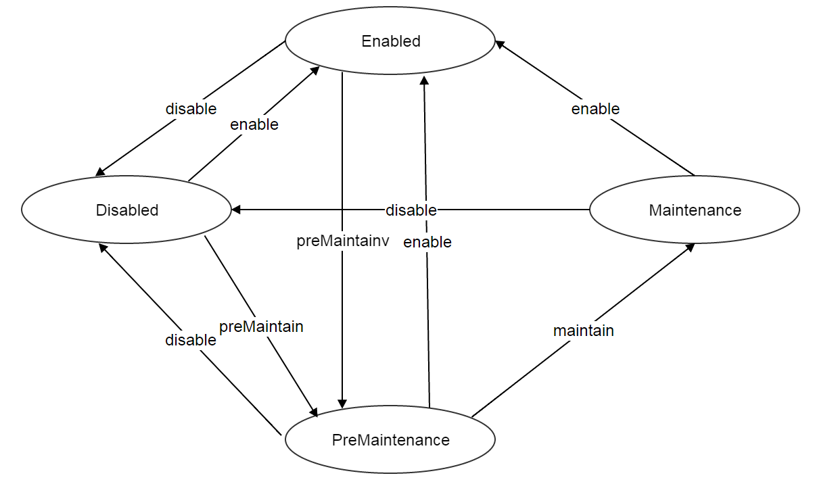
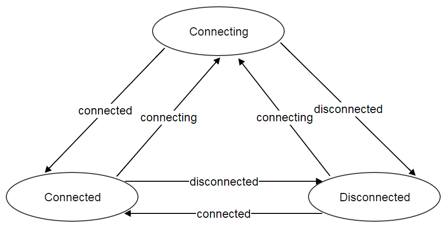

.. _host:

====
主机（Host）
====

.. contents:: `目录`
   :depth: 6

--------
概览（Overview）
--------

主机是一个安装有操作系统（虚拟机管理系统，hypervisor)的物理服务器.

.. image:: host.png
   :align: center

在ZStack中, 主机是提供虚拟机运行所需计算资源（computing resources）的最小单元. 区域（Zones）和集群（clusters）通常包含成组的主机，它们是更大的单元. 相较他的父亲资源和先驱资源都是逻辑资源, 主机是物理资源;
很多看似应用到区域和集群上的操作，实际都被指派到对应的主机上了. 
例如, 在挂载一个主存储到集群的时候, 实际的操作是在集群中所有的主机上挂载这个主存储.

.. 注意:: 在当前ZStack版本中, 只支持KVM主机

.. _host inventory:

---------
清单（Inventory）
---------

属性（Properties）
==========

.. list-table::
   :widths: 20 40 10 20 10
   :header-rows: 1

   * - 名字
     - 描述
     - 可选的
     - 可选的参数值
     - 起始支持版本
   * - **uuid**
     - 请参见 :ref:`resource properties`
     -
     -
     - 0.6
   * - **name**
     - 请参见 :ref:`resource properties`
     -
     -
     - 0.6
   * - **description**
     - 请参见 :ref:`resource properties`
     - 是
     -
     - 0.6
   * - **zoneUuid**
     - 所在区域的uuid. 请参见 :ref:`zone <zone>`
     -
     -
     - 0.6
   * - **clusterUuid**
     - 父集群的uuid. 请参见 :ref:`cluster <cluster>`
     -
     -
     - 0.6
   * - **managementIp**
     - 请参见 :ref:`management ip <host management ip>`
     -
     -
     - 0.6
   * - **hypervisorType**
     - 请参见 :ref:`cluster hypervisor type <cluster hypervisor type>`
     -
     -
     - 0.6
   * - **state**
     - 请参见 :ref:`state <host state>`
     -
     - - Enabled
       - Disabled
       - PreMaintenance
       - Maintenance
     - 0.6
   * - **status**
     - 请参见 :ref:`status <host status>`
     -
     - - Connecting
       - Connected
       - Disconnected
     - 0.6
   * - **createDate**
     - 请参见 :ref:`resource properties`
     -
     -
     - 0.6
   * - **lastOpDate**
     - 请参见 :ref:`resource properties`
     -
     -
     - 0.6

示例
=======

::

    {
      "inventory": {
        "zoneUuid": "2893ce85c43d4a3a8d78f414da39966e",
        "name": "host1-192.168.0.203",
        "uuid": "43673938584447b2a29ab3d53f9d88d3",
        "clusterUuid": "8524072a4274403892bcc5b1972c2576",
        "description": "Test",
        "managementIp": "192.168.0.203",
        "hypervisorType": "KVM",
        "state": "Enabled",
        "status": "Connected",
        "createDate": "Jun 1, 2015 6:49:24 PM",
        "lastOpDate": "Jun 1, 2015 6:49:24 PM"
      }
    }

.. _host management ip:

管理IP（Management IP)
=============

ZStack管理节点（ZStack management nodes）使用管理IP访问主机操作系统（虚拟机管理系统）;  根据虚拟机管理系统类型的不同,可以有或者没有管理IP.
例如, 在VMWare中,  访问ESXi主机的官方途径是使用VCenter服务器（VCenter Server）, 在这种情况下就没有使用管理IP的必要;
然而, 在KVM主机中, ZStack需要通过管理IP来部署代理程序（agent）到Linux操作系统中.

.. 注意:: 管理IP可以是IP地址也可以是DNS域名, 只要DNS域名能被运行ZStack管理节点的操作体统解析即可.

.. 注意:: 由于当前版本的ZStack仅支持KVM主机, 所以管理IP是必须的.

管理网络（Management Network）
++++++++++++++++++

虽不做强制限定, 推荐使用一个或者多个专用的子网（dedicated subnets）作为管理网络. 由于管理节点需要通过管理网络发送命令到主机和其他的装置, 运行ZStack管理节点的Linux服务器必须能够访问管理网络. 
在以后的章节中, 当谈到特殊应用虚拟机（appliance VMs）的时候，我们会将再次看到管理网络, 在ZStack当前版本中这个特殊应用虚拟机是:ref:`virtual router <virtual router>`.

.. 警告:: 对于KVM, 推荐配置同一个区域中的所有主机的管理网络能够互相访问. 在ZStack当前版本中, 没有供虚拟机迁移（VM migration）使用的专用网络;
             ZStack在进行 虚拟机迁移时使用管理IP来传输数据.
             如果主机不能通过管理IP互相访问, 即使他们可以被ZStack管理节点访问, 主机间的虚拟机迁移也会失败.

.. _host state:

可用状态（State）
=====

主机有四种可用状态:

- **Enabled**:

  在这种状态下，允许在该主机上创建，启动虚拟机，或迁移虚拟机到该主机上

- **Disabled**:

  在这种状态下，不允许在该主机上创建，启动虚拟机，或迁移虚拟机到该主机上

- **PreMaintenance**:

  指示主机即将进入维护状态的中间状态(intermediate state). 请参见 :ref:`maintenance mode <host maintenance mode>`.

- **Maintenance**:

  该状态表明该主机在维护状态中.

主机的可用状态转换图如下:

.. _host maintenance mode:

维护模式（Maintenance Mode）
++++++++++++++++

当管理员需要实施一些维护工作时可以将主机设置为维护模式, 例如, 安装更多的内存.
当主机在维护模式中, 不管是API操作还是ZStack内部任务都不会再在主机上执行任何操作. 也就是说, 类似启动虚拟机（API）, 停止虚拟机(API), 挂载主存储(内部)的任务都不能在该主机上进行.
ZStack将维护模式设计为两个可用模式: PreMaintenance和Maintenance. 主机进入维护模式的顺序如下:

1. 改变host的可用状态为PreMaintenance. 在这个阶段, ZStack会尝试将所有运行在该主机上的虚拟机迁移到其他合适的主机上.
   如果迁移失败, ZStack将停止这些虚拟机.

2. 当所有虚拟机都被迁移或者停止后, ZStack会将主机的可用状态改变为Maintenance. 这时, 管理员就可以开始在主机上实施维护工作.

维护工作结束后，管理员可以通过将主机设置为Enabled或Disabled，以使主机退出维护模式.

.. 注意:: 当主机在维护模式中时, 管理员仍旧可以向它的父集群挂载主存储或L2网络.
          一旦主机退出管理模式, ZStack会向主机发送重连信息(reconnect message),这个消息会指导主机完成它在维护模式时所错过的工作;
          例如, 挂载一个NFS主存储.

.. _host status:

连接状态（Status）
======

连接状态反应了主机和管理节点之间命令通道（command channel）的状态. 命令通道是ZStack管理节点和主机通信并只会其执行操作的途径. 
例如, 在KVM管理节点中, 命令通道是ZStack管理节点和运行在主机上的Python代理（agents）之间的HTTP连接; 在VMWare管理节点中, 命令通道是VCenter服务器和
ESXi主机之间的连接.

主机有三种连接状态:

- **Connecting**:

  在这种状态时，一个ZStack管理节点正在尝试建立自己和主机之间的命令通道. 这时还不能再主机上执行任何操作.

- **Connected**

  在这种状态时，ZStack管理节点和主机之间的命令通道已经被成功建立. 可以在主机上执行操作.
  只有在这个状态下主机才能创建和启动虚拟机.

- **Disconnected**

  在这种状态时，ZStack管理节点和主机之间的命令通道丢失. 这时不能在主机上执行任何操作.

在ZStack管理节点启动过程中会开始和所有他所管理的主机建立命令通道; 在这个阶段, 主机的状态是Connecting; 命令通道建立完成后, 主机的连接状态会变为Connected; 如果管理节点建立命令通道失败,
或者之后某个时候命令通道丢失了, 命令通道所对应的主机连接状态会变为Disconnected.

ZStack管理节点会周期性的向主机发送ping命令（ping commands）以检查命令通道的健康状态; 一旦某个主机响应失败, 或者ping命令超时，主机的连接状态就会变为Disconnected.

.. 注意:: ZStack会持续的向断开连接的主机发送ping命令. 一旦主机恢复并响应ping命令, ZStack会重新建立命令通道并改变主机为Connected状态.
          因此，如果一个主机已经从云中移除, 请记得将它从ZStack中删除，否则ZStack管理节点会一直尝试ping它.

.. 注意:: ping命令不会被发送给维护模式的主机.

主机的连接状态转换图如下:

可用状态（State）和连接状态（Status）
================

可用状态和连接状态之间没有直接关系. 可用状态代表了管理员针对主机的意愿, 而连接状态代表了主机的通信状况.

----------
操作（Operations）
----------

添加主机（Add Host）
========

不同虚拟机管理程序添加主机的命令不同.

添加KVM主机（Add KVM Host）
++++++++++++

管理员可以使用AddKVMHost来添加一个KVM主机. 例如::

    AddKVMHost clusterUuid=8524072a4274403892bcc5b1972c2576 managementIp=192.168.10.10 name=kvm1 username=root password=password

参数（Parameters）
----------

.. list-table::
   :widths: 20 40 10 20 10
   :header-rows: 1

   * - 名字
     - 描述
     - 可选的
     - 可选的参数值
     - 起始支持版本
   * - **name**
     - 资源名字, 请参见 :ref:`resource properties`
     -
     -
     - 0.6
   * - **resourceUuid**
     - 资源的uuid, 请参见 :ref:`create resource`
     - 是
     -
     - 0.6
   * - **description**
     - 资源的描述, 请参见 :ref:`resource properties`
     - 是
     -
     - 0.6
   * - **clusterUuid**
     - 父集群的uuid, 请参见 :ref:`cluster <cluster>`
     -
     -
     - 0.6
   * - **managementIp**
     - 请参见 :ref:`management ip <host management ip>`
     -
     -
     - 0.6
   * - **username**
     - 请参见 :ref:`kvm credentials <kvm credentials>`
     -
     -
     - 0.6
   * - **password**
     - 请参见 :ref:`kvm credentials <kvm credentials>`
     -
     -
     - 0.6

.. _kvm credentials:

KVM证书（KVM Credentials）
---------------

ZStack使用一个叫做kvmagent的Python代理(agent)来管理KVM主机. ZStack使用`Ansible <http://www.ansible.com/home>`_ 来配置目标Linux操作系统并部署kvmagents，以实现完全的自动化;
为了在目标Linux操作系统上启动Ansible, ZStack需要KVM主机的SSH **root**用户名和密码来注入SSH公钥（public keys），目的是为了让Ansible可以不需要输入用户名密码就可以工作. 需要**root**是因为Ansible和kvmagent都需要对系统有完整的控制权限.

删除主机（Delete Host）
===========

管理员可以使用DeleteHost命令来删除一个主机. 例如::

    DeleteHost uuid=2893ce85c43d4a3a8d78f414da39966e

.. 危险:: 删除主机会停止主机上的所有虚拟机. 没有办法可以恢复一个删除的主机.

参数（Parameters）
++++++++++

.. list-table::
   :widths: 20 40 10 20 10
   :header-rows: 1

   * - 名字
     - 描述
     - 可选的
     - 可选的参数值
     - 起始支持版本
   * - **deleteMode**
     - 请参见 :ref:`delete resource`
     - 是
     - - Permissive
       - Enforcing
     - 0.6
   * - **uuid**
     - 主机的uuid
     -
     -
     - 0.6

改变主机可用状态（Change Host State）
=================

管理员可以使用ChangeHostState命令来改变一个主机的可用状态. 例如::

    ChangeHostState stateEvent=preMaintain uuid=2893ce85c43d4a3a8d78f414da39966e

参数（Parameters）
++++++++++

.. list-table::
   :widths: 20 40 10 20 10
   :header-rows: 1

   * - 名字
     - 描述
     - 可选的
     - 可选的参数值
     - 起始支持版本
   * - **uuid**
     - 主机的uuid
     -
     -
     - 0.6
   * - **stateEvent**
     - 可用状态触发事件. 请参见 :ref:`state <host state>`

       .. 注意:: :ref:`state <host state>`章节中'maintain'可用状态触发事件仅供内部使用，不能再API中使用.

     -
     - - enable
       - disable
       - preMaintain
     - 0.6

重连主机（Reconnect Host）
==============

管理员可以使用ReconnectHost来重新建立ZStack管理节点和主机间的命令通道. 例如:

    ReconnectHost uuid=2893ce85c43d4a3a8d78f414da39966e

请参见 :ref:`status <host status>` for details.

参数（Parameters）
++++++++++

.. list-table::
   :widths: 20 40 10 20 10
   :header-rows: 1

   * - 名字
     - 描述
     - 可选的
     - 可选的参数值
     - 其实支持版本
   * - **uuid**
     - 主机的uuid
     -
     -
     - 0.6

查询主机（Query Host）
==========

管理员可以使用QueryHost来查询主机. 例如::

    QueryHost managementIp=192.168.0.100

::

    QueryHost vmInstance.vmNics.ip=10.21.100.2

原生域查询（Primitive Fields of Query）
+++++++++++++++++++++++++

请参见 :ref:`host inventory <host inventory>`

嵌套和扩展域查询（Nested And Expanded Fields of Query）
+++++++++++++++++++++++++++++++++++

.. list-table::
   :widths: 20 30 40 10
   :header-rows: 1

   * - 域（Field）
     - 清单（Inventory）
     - 描述
     - 起始支持版本
   * - **zone**
     - :ref:`zone inventory <zone inventory>`
     - 所在区域
     - 0.6
   * - **cluster**
     - :ref:`cluster inventory <cluster inventory>`
     - 父集群
     - 0.6
   * - **vmInstance**
     - :ref:`VM inventory <vm inventory>`
     - 这个主机上运行的所有虚拟机
     - 0.6

---------------------
全局配置（Global Configurations)
---------------------

.. _load.all:

load.all
========

.. list-table::
   :widths: 20 30 20 30
   :header-rows: 1

   * - 名字
     - 类别
     - 默认值
     - 可选的参数值
   * - **load.all**
     - 主机
     - true
     - - true
       - false

配置管理节点启动时是否要连接所有的主机. 如果设置为true, 管理节点会在启动时同时连接所有的主机, 如果云中有数量巨大的主机，这可能会导致运行管理节点的主机资源耗尽; 
如果设置为false, 配合 :ref:`load.parallelismDegree <load.parallelismDegree>`, 管理节点在启动时每次只会连接一部分主机，然后重复这个操作直到所有的主机都连上.

.. _load.parallelismDegree:

load.parallelismDegree
======================

.. list-table::
   :widths: 20 30 20 30
   :header-rows: 1

   * - 名字
     - 类别
     - 默认值
     - 可选的参数值
   * - **load.parallelismDegree**
     - 主机
     - 100
     - > 0

当 :ref:`load.all <load.all>` 被设置为false, 这个配置定义了管理节点启动时同时连接主机的数目.

.. _.host.ping.interval:

ping.timeout
============

.. list-table::
   :widths: 20 30 20 30
   :header-rows: 1

   * - 名字
     - 类别
     - 默认值
     - 可选参数值
   * - **ping.interval**
     - 主机
     - 60
     - > 0

为了检查主机的连接状态, 管理节点周期性的向主机发送ping命令的间隔时间, 单位是秒.

.. _host.ping.parallelismDegree:

ping.parallelismDegree
======================

.. list-table::
   :widths: 20 30 20 30
   :header-rows: 1

   * - 名字
     - 类别
     - 默认值
     - 可选的参数值
   * - **ping.parallelismDegree**
     - 主机
     - 100
     - > 0

管理节点发送ping命令的并发度（parallel degree）. 如果主机的数目大于这个值, 管理节点会重复操作指导所有的主机都被ping过. 例如, 先ping前100个主机, 再ping后100个主机 ...

.. _connection.autoReconnectOnError:

connection.autoReconnectOnError
===============================

.. list-table::
   :widths: 20 30 20 30
   :header-rows: 1

   * - 名字
     - 类别
     - 默认值
     - 可选的参数值
   * - **connection.autoReconnectOnError**
     - 主机
     - true
     - - true
       - false

设置当主机的链接状态从Connected变为Disconnected时是否重连. 如果设置为true, 管理节点会通过ping命令重新连接状态从Connected变为Disconnected的主机, 从而让主机完成它在disconnected时错过的操作, 例如, 主机可能disconnected时错过了主机上代理（agent）的升级; 
如果设置为false, 管理员根据需要必须手动重连这些主机，管理节点不会自动重连这些主机.

.. _maintenanceMode.ignoreError:

maintenanceMode.ignoreError
===========================

.. list-table::
   :widths: 20 30 20 30
   :header-rows: 1

   * - 名字
     - 类别
     - 默认值
     - 可选的参数值
   * - **maintenanceMode.ignoreError**
     - host
     - false
     - - true
       - false

设置是否在主机进入维护模式时忽略发生的错误. 如果设置为true, 错误将会被忽略，因此主机总是能成功进入维护模式; 如果设置为false, 主机会因为任何错误的发生而不能进入维护模式, 例如, 虚拟机迁移失败.

.. _reservedCapacity.zoneLevel:

reservedCapacity.zoneLevel
==========================

.. list-table::
   :widths: 20 30 20 30
   :header-rows: 1

   * - 名字
     - 类别
     - 默认值
     - 可选的参数值
   * - **reservedCapacity.zoneLevel**
     - hostAllocator
     - true
     - - true
       - false

设置是否要在区域级别（zone level）启用主机容量预留; 请参见 :ref:`host capacity reservation <host capacity reservation>`.

.. _reservedCapacity.clusterLevel:

reservedCapacity.clusterLevel
=============================

.. list-table::
   :widths: 20 30 20 30
   :header-rows: 1

   * - 名字
     - 类别
     - 默认值
     - 可选的参数值
   * - **reservedCapacity.clusterLevel**
     - hostAllocator
     - true
     - - true
       - false

设置是否要在集群级别（cluster level）启用主机容量预留; 请参见 :ref:`host capacity reservation <host capacity reservation>`.

.. _reservedCapacity.hostLevel:

reservedCapacity.hostLevel
==========================

.. list-table::
   :widths: 20 30 20 30
   :header-rows: 1

   * - 名字
     - 类别
     - 默认值
     - 可选的参数值
   * - **reservedCapacity.hostLevel**
     - hostAllocator
     - true
     - - true
       - false

设置是否要在集群级别（host level）启用主机容量预留; 请参见 :ref:`host capacity reservation <host capacity reservation>`.

.. _vm.migrationQuantity:

vm.migrationQuantity
====================

.. list-table::
   :widths: 20 30 20 30
   :header-rows: 1

   * - 名字
     - 类别
     - 默认值
     - 可选的参数值
   * - **vm.migrationQuantity**
     - kvm
     - 2
     - > 0

设置当KVM主机进入维护模式时，同时进行迁移的虚拟机数量.

.. _kvm.reservedMemory:

reservedMemory
==============

.. list-table::
   :widths: 20 30 20 30
   :header-rows: 1

   * - 名字
     - 类别
     - 默认值
     - 可选的参数值
   * - **reservedMemory**
     - kvm
     - 512M
     - >= 0

当:ref:`reservedCapacity.hostLevel <reservedCapacity.hostLevel>`设置为true的时候，这个字符串存储了KVM主机上预留的内存容量.
这个数值是由一个数字后跟上一个单位组成的，这些表示单位的字符可以是B/K/M/G/T; 如果没有指定表示单位的字符, 这个数字被当成字节计算.

.. _dataVolume.maxNum:

dataVolume.maxNum
=================

.. list-table::
   :widths: 20 30 20 30
   :header-rows: 1

   * - 名字
     - 类别
     - 默认值
     - 可选的参数值
   * - **dataVolume.maxNum**
     - kvm
     - 24
     - 0 - 24

设置KVM虚拟机管理程序中虚拟机可以挂在的数据云盘（data volumes）的最大数量.

.. _host.syncLevel:

host.syncLevel
==============

.. list-table::
   :widths: 20 30 20 30
   :header-rows: 1

   * - 名字
     - 类别
     - 默认值
     - 可选的参数值
   * - **host.syncLevel**
     - kvm
     - 10
     - > 2

设置能在KVM主机上同时执行命令的最大并发数量.

----
标签（Tags）
----

管理员可以使用resourceType=HostVO在主机上创建用户标签. 例如::

    CreateUserTag tag=largeMemoryHost resourceUuid=0a9f95a659444848846b5118e15bff32 resourceType=HostVO

系统标签（System Tags）
===========

.. _host capacity reservation:

主机容量保留（Host Capacity Reservation）
+++++++++++++++++++++++++

管理员可以使用系统标签在主机上保留一部分内存供系统软件使用. ZStack提供了各种系统标签和全局配置， 以达到更好粒度的内存保留策略控制:

- **Hypervisor Global Level**:

  如果没有其他层次的配置，全局等级配置(global level) :ref:`kvm.reservedMemory`会应用到所有的KVM主机.

- **Zone Level**:

  请参见 :ref:`zone host::reservedMemory <zone.host.reservedMemory>`; 如果没有其他层次的配置，这个系统标签的值会应用到所有这个区域中的主机上. 这个值覆盖全局配置等级(global level).

- **Cluster Level**:

  请参见 :ref:`cluster host::reservedMemory <cluster.host.reservedMemory>`; 如果没有主机层次的配置，这个系统标签的值会应用到所有这个集群中的主机上. 这个值覆盖区域等级配置（zone level)和全局等级配置（global level）.

- **Host Level**:

  .. list-table::
     :widths: 20 30 40 10
     :header-rows: 1

     * - 标签
       - 描述
       - 示例
       - 起始支持版本
     * - **reservedMemory::{capacity}**
       - 这个主机上保留的内存.
       - reservedMemory::1G
       - 0.6

  这个配置覆盖所有上面的配置等级.

例如, 假设你还有三个KVM主机zone1->cluster1->{host1, host2, host3}; 默认的内存保留被默认为512M的全局配置（global configuration）:ref:`kvm.reservedMemory`控制;
这时如果在zone1上创建一个系统标签 *host::reservedMemory::1G*, 所有3个主机的内存保留都会被变成1G; 这时如果再在cluster1 上创建一个系统标签*host::reservedMemory::2G*, 所有3个主机的内存保留都会变成2G; 最后, 如果你在host1上创建一个系统标签*reservedMemory::3G*, 这时host1的内存保留将变成3G，但host2和host3还是2G.

.. _host metadata information:

主机元数据信息（Host Meta Data Information）
++++++++++++++++++++++++++

.. list-table::
   :widths: 20 30 40 10
   :header-rows: 1

   * - 标签
     - 描述
     - 示例
     - 起始支持版本
   * - **capability:liveSnapshot**
     - 如果标签存在, 主机上的虚拟机管理程序支持在线云盘快照（live volume snapshot）
     - capability:liveSnapshot
     - 0.6
   * - **os::distribution::{distribution}**
     - 主机的操作系统提供商
     - os::distribution::Ubuntu
     - 0.6
   * - **os::release::{release}**
     - 主机的操作系统发布版本
     - os::release::trusty
     - 0.6
   * - **os::version::{version}**
     - 主机的操作系统版本
     - os::version::14.04
     - 0.6

KVM主机元数据信息（KVM Host Meta Data Information）
++++++++++++++++++++++++++++++

.. list-table::
   :widths: 20 30 40 10
   :header-rows: 1

   * - 标签
     - 描述
     - 示例
     - 起始支持版本
   * - **qemu-img::version::{version}**
     - qemu-img 版本
     - qemu-img::version::2.0.0
     - 0.6
   * - **libvirt::version::{version}**
     - libvirt 版本
     - libvirt::version::1.2.2
     - 0.6
   * - **hvm::{flag}**
     - 主机硬件虚拟化标识（host hardware virtualization flag）; vmx表示Intel CPU; svm表示AMD CPU
     - hvm::vmx
     - 0.6
