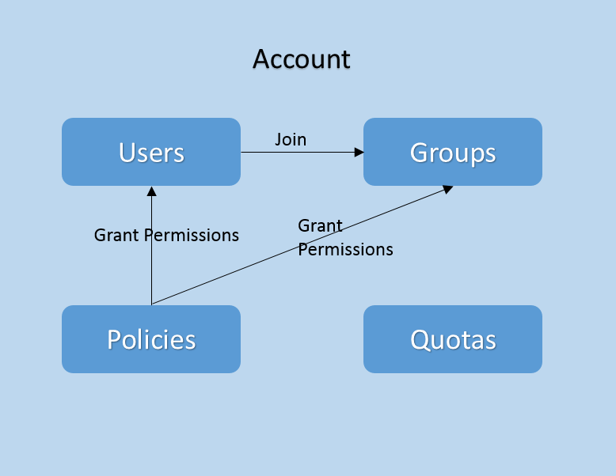
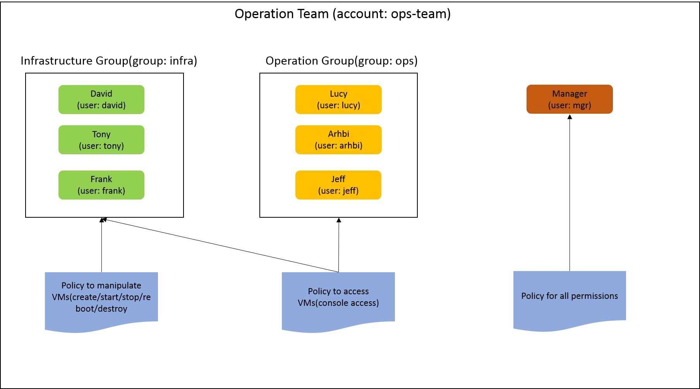

.. _identity:

===================
身份认证（Identity）
===================

.. contents:: `目录`
   :depth: 6

---------------
概览（Overview）
---------------

ZStack的身份认证服务（identity service）负责提供ZStack资源的访问控制（ access control）. 系统中定义了账户（account）, 用户（user）, 组（group）, 策略（policy）, 和配额（quota）等概念. 身份认证系统的整体结构如图所示:

.. _account:

账户（Account）
==============

人们需要创建作为拥有所有他们资源的根身份认证（root identity）的账户, 才能对资源实施操作. 有两种账户类型: 管理员（admin）和普通用户（normal）. 
管理员账户拥有不受限的权限, 通常由系统管理管理员拥有.
普通用户账户, 只能对虚拟机, 计算规格（instance offerings）, 云盘规格（disk offerings）, L3网络, 镜像（images）等资源的权限, 普通用户账户是由管理员账户创建的，从而使他们可以操作他们的资源.

API被分为了管理员权限（admin-only）API和非管理员权限（non-admin）API两类. 在:ref:`admin-only APIs <admin-only APIs>`章节中可以查看到管理员权限API的列表,
在:ref:`non-admin APIs <non-admin APIs>`中可以找到非管理员权限API的列表.

账户的清单（Account Inventory）
------------------------------

.. list-table::
   :widths: 20 40 10 20 10
   :header-rows: 1

   * - 名字
     - 描述
     - 可选的
     - 可选的参数值
     - 起始支持版本
   * - **uuid**
     - 请参见 :ref:`resource properties`
     -
     -
     - 0.8
   * - **name**
     - 账户的名字. 请参见 :ref:`resource properties`
     -
     -
     - 0.8
   * - **description**
     - 请参见 :ref:`resource properties`
     - 是
     -
     - 0.8
   * - **createDate**
     - 请参见 :ref:`resource properties`
     -
     -
     - 0.8
   * - **lastOpDate**
     - 请参见 :ref:`resource properties`
     -
     -
     - 0.8

.. 注意:: 出于安全原因，不会在API返回看到口令信息（password）

示例
----

::

  {
    "inventory": {
        "createDate": "Jul 22, 2015 10:18:34 AM",
        "lastOpDate": "Jul 22, 2015 10:18:34 AM",
        "name": "frank",
        "uuid": "3153a08ab21f46ca9e8b40ecfeec4255"
    }
  }

用户（Users）
============

由于非管理员权限账户拥有对其所拥有资源的不受限权限, 创建的用户可以用来实现更细粒度（finely-grained）的权限控制. 
用户只可以使用:ref:`policies <policy>`中指派（assigned）的API.

用户的清单（User Inventory）
---------------------------

.. list-table::
   :widths: 20 40 10 20 10
   :header-rows: 1

   * - 名字
     - 描述
     - 可选的
     - 可选的参数值
     - 起始支持版本
   * - **uuid**
     - 请参见 :ref:`resource properties`
     -
     -
     - 0.8
   * - **name**
     - 用户的名字, 请参见 :ref:`resource properties`
     -
     -
     - 0.8
   * - **description**
     - 请参见 :ref:`resource properties`
     - 是
     -
     - 0.8
   * - **accountUuid**
     - 拥有该用户的账户的uuid
     -
     -
     - 0.8
   * - **createDate**
     - 请参见 :ref:`resource properties`
     -
     -
     - 0.8
   * - **lastOpDate**
     - 请参见 :ref:`resource properties`
     -
     -
     - 0.8

.. 注意:: 出于安全原因，不会在API返回看到口令信息.

示例
----

::

  {
    "inventory": {
        "accountUuid": "36c27e8ff05c4780bf6d2fa65700f22e",
        "createDate": "Jul 22, 2015 10:21:50 AM",
        "lastOpDate": "Jul 22, 2015 10:21:50 AM",
        "name": "user1",
        "uuid": "68ebcf6260c94adab9dcce9e059e0025"
    }
  }

组（Groups）
===========

账户可以创建组来管理用户. 通过给组指定策略, 账户可以为一个组的用户设置相同的权限.

组的清单（Group Inventory）
--------------------------

.. list-table::
   :widths: 20 40 10 20 10
   :header-rows: 1

   * - 名字
     - 描述
     - 可选的
     - 可选的参数值
     - 起始支持版本
   * - **uuid**
     - 请参见 :ref:`resource properties`
     -
     -
     - 0.8
   * - **name**
     - 组的名字, 请参见 :ref:`resource properties`
     -
     -
     - 0.8
   * - **description**
     - 请参见 :ref:`resource properties`
     - 是
     -
     - 0.8
   * - **accountUuid**
     - 拥有该组的账户的uuid
     -
     -
     - 0.8
   * - **createDate**
     - 请参见 :ref:`resource properties`
     -
     -
     - 0.8
   * - **lastOpDate**
     - 请参见 :ref:`resource properties`
     -
     -
     - 0.8

示例
----

::

  {
    "inventory": {
        "accountUuid": "36c27e8ff05c4780bf6d2fa65700f22e",
        "createDate": "Jul 22, 2015 10:23:02 AM",
        "name": "group1",
        "uuid": "0939fc6f772d44d6a8f9d45c89c2a716"
    }
  }

策略（Policies）
===============

策略是定义了用户可以使用哪些API的权限信息. 一个策略包含了由申明（:ref:`statements <statements>`）组成的数组，每个申明又定义了访问API的权限信息.

策略的清单（Policy Inventory）
-----------------------------

.. list-table::
   :widths: 20 40 10 20 10
   :header-rows: 1

   * - 名字
     - 描述
     - 可选的
     - 可选的参数值
     - 起始支持版本
   * - **uuid**
     - 请参见 :ref:`resource properties`
     -
     -
     - 0.8
   * - **name**
     - 策略的名字, 请参见 :ref:`resource properties`
     -
     -
     - 0.8
   * - **description**
     - 请参见 :ref:`resource properties`
     - 是
     -
     - 0.8
   * - **accountUuid**
     - 拥有该组的账户的uuid, 请参见 :ref:`account <account>`
     -
     -
     - 0.8
   * - **statements**
     - 定义API权限的:ref:`statements <statements>`列表
     -
     -
     - 0.8
   * - **createDate**
     - 请参见 :ref:`resource properties`
     -
     -
     - 0.8
   * - **lastOpDate**
     - 请参见 :ref:`resource properties`
     -
     -
     - 0.8

示例
----

::

  {
    "inventories": [
        {
            "accountUuid": "3153a08ab21f46ca9e8b40ecfeec4255",
            "name": "DEFAULT-READ-3153a08ab21f46ca9e8b40ecfeec4255",
            "statements": [
                {
                    "actions": [
                        ".*:read"
                    ],
                    "effect": "Allow",
                    "name": "read-permission-for-account-3153a08ab21f46ca9e8b40ecfeec4255"
                }
            ],
            "uuid": "b5169828533b47988a0d09f262b5769c"
        }
    ]
  }

.. _statements:

申明（Statements）
-----------------

申明是一个JSON文本, 其中包含了用于匹配API标识（API identities）的字符串以及对应的权限信息: *Allow* or *Deny*. 例如:

::

  {
    "actions": [
        ".*:read",
        "instance:APICreateVmInstanceMsg"
    ],
    "effect": "Allow",
    "name": "read-permission-for-account-3153a08ab21f46ca9e8b40ecfeec4255"
  }

**actions**是一个用于匹配一个或多个标识的动作字符串（action strings）组成的列表. API标识是唯一标识一个API的字符串，其格式为***api_category:api_name***. 
动作字符串可以是唯一识别单个API的完整的标识如*instance:APICreateVmInstanceMsg*, 也可以是一个匹配很多个API的正则表达式（regular expression）, 例如, ***instance:.**** 会和所有***instance***类别下的API匹配.
大多数的API只有一个***api_category:api_name***格式的标识; 但有些API拥有多个标识，因此可以使用正则表达式来匹配这些API.

**effect** 指示API调用匹配一个操作字符串时对应的决定是什么, 允许（allow）还是拒绝（deny）.

.. 注意:: 当前版本中, 所有的只读类型的（***read*** ）API都有一个额外的格式为***api_category:read***的标识, 例如, instance:read.
          只读类型的API是只从ZStack获取信息而不执行任何操作的API. 例如, 所有的查询API都是只读类型的API; 例如, APIQueryVmInstanceMsg拥有默认的标识*instance:APIQueryVmInstanceMsg*, 以及一个额外的*instance:read*作为标识.

          一个类别可能有多个只读类型的API. 例如, 虚拟机类别('instance') 里有APIQueryVmInstanceMsg, APIQueryVmNicMsg,
          APIGetVmAttachableDataVolumeMsg等只读类型的API. 并且他们都拥有同样的API标识***instance:read***. 因此如果一个申明中的动作字符串包含了这样的API标识会使对应的用户和组拥有所有虚拟机类别中的只读类型API的访问权限.

在:ref:`API identities <API identities>`中可以找到API标识的列表.

申明的清单（Statement Inventory）
++++++++++++++++++++++++++++++++

.. list-table::
   :widths: 20 40 10 20 10
   :header-rows: 1

   * - 名字
     - 描述
     - 可选的
     - 可选的参数值
     - 起始支持版本
   * - **name**
     - 申明的名字
     -
     -
     - 0.8
   * - **effect**
     - 决定访问权限（permission decision）
     -
     - - Allow
       - Deny
     - 0.8
   * - **actions**
     - 匹配API标识的字符串列表
     -
     -
     - 0.8

配额（Quota）
============

管理员账户可以使用配额来限制非管理员账户可以创建多少资源. ZStack会在创建非管理员账户时自动给它设定默认的配额, 管理员可以使用API :ref:`UpdateQuota <update quota>`来改变这个默认值. 可以在:ref:`default quotas <default quotas>`中找到默认配额的信息.

-----------------------------
权限控制（Permission Control）
-----------------------------

身份认证系统最让人激动的功能是可以控制API的访问权限, 可以控制什么人可以访问什么. 当用户登录进入ZStack时, 根据他们登录方式的不同, 会获得不同的API访问权限.

**管理员（Administrators）**: 以管理员账户登录后, 可以调用所有的API.

**非管理员账户（Non-admin Account）**: 以非管理员账户登录时, 只能执行管理员权限的API.

**用户（User）**: 以账户所属的用户登陆后, 只能执行挂载到该用户上或通过组作用到该用户上的策略赋予的权限的API.

使用用户和组（Using users and groups）
=====================================

在ZStack中最好的控制访问权限的方法是是允许登录为用户. 假设你是一个团队的经理，并且你需要从你公司的IT部门申请一些由ZStack管理的虚拟机. 首先你需要让ZStack管理员为你创建非管理员账户;
有了这个账户后, 你可以创建一些用户和组并挂载合适的策略; 这时你可以将这些用户提供给你的团队成员，他们可以使用这些用户依照你创建的权限策略操作ZStack中的资源.

用一个实例来做说明, 假设你想在你的团队中创建下面这样的组织结构:

在这个组织结构中, 你有一个负责管理虚拟机的基础设施小组; 这个组有三个成员: David, Tony, Frank; 你还有另一个工作小组在这些虚拟机上实施他们的工作, 这个小组同样有三个成员: Lucy, Arhbi, Jeff. 
基础设施小组拥有管理虚拟机生命周期的权限而另一个工作小组只能通过虚拟机的终端访问并使用这些虚拟机.
此外, 作为经理的你拥有所有的你的团队账户的API访问权限. 要创建这样一个组织结构:

**创建账户ops-team**::

    >>>CreateAccount name=ops-team password=password

.. 注意:: 请确保你使用管理员账户登录，这样才能创建账户

**使用账户ops-team登录**::

    >>>LogInByAccount accountName=ops-team password=password

**创建用户**::

    >>>CreateUser name=david password=password

对所有的用户重复以上操作 (tony, frank, lucy, arhbi, jeff, mgr)

**创建组**::

    >>>CreateUserGroup name=infra

队另一个组重复上面这个操作(ops)

**添加用户到组中**::

    >>>AddUserToGroup userUuid=d7646ae8af2140c0a3ccef2ad8da816d groupUuid=92c523a43651442489f8d2d598c7c3da

.. 注意:: 在你创建用户和组时, 屏幕上会返回userUuid和groupUuid信息

重复上面的操作，将所有用户添加到对应的组中. infra组(david, tony, frank), ops组(lucy, arhbi, jeff).

**创建策略**

创建第一个策略, 允许调用所有的虚拟机相关的API::

    >>>CreatePolicy name=vm-management statements='[{"actions":["instance:.*"], "effect":"Allow"}]'

创建第二个策略, 允许访问虚拟机的终端::

    >>>CreatePolicy name=vm-console statements='[{"actions":["instance:APIRequestConsoleAccessMsg"], "effect":"Allow"}]'

创建第三个策略, 允许访问使用的AP::

    >>>CreatePolicy name=all statements='[{"actions":[".*"], "effect":"Allow"}]'

.. 警告:: 请注意*statements*域是一个使用但**引号（single quotes**）围起来的JSON字符串, 而其中的内容使用**双引号（double quotes**）. 请遵守这个格式JSON字符串可能不能被正确的解析.

**挂载策略到组上（Attach policies to groups）**

将策略*vm-management*挂载到基础设施小组::

    >>>AttachPolicyToUserGroup groupUuid=92c523a43651442489f8d2d598c7c3da policyUuid=afb3bfbb911a42e0a662286728e49891

将策略*vm-console*挂载到另一个工作小组::

    >>>AttachPolicyToUserGroup groupUuid=0939fc6f772d44d6a8f9d45c89c2a716 policyUuid=3bddf41e2ba6469881a65287879e5d58

.. 注意:: 在你创建策略和组时, 屏幕上会返回policyUuid和groupUuid信息

**挂载策略到经理的用户(mgr)**

挂载策略*all*到经理的用户(user: mgr)::

    >>>AttachPolicyToUser userUuid=d55c5fba4d1b4533961db9952dc15b00 policyUuid=36c27e8ff05c4780bf6d2fa65700f22e

.. 注意:: 在你创建策略和用户时, 屏幕上会返回policyUuid和userUuid信息

到这里，你的组织结构就创建完成了, 你的组员可以使用他们的用户名口令登录.

权限判断（Permission Evaluation）
=====================

一个策略中包含了由申明组成的列表，而每个申明又定义了对于API的访问权限（允许或拒绝）; 用户可以挂载多个策略, 可以挂载到用户上或者他们所在的组上. 
当用户访问API的时候, 总会优先从用户上挂载的策略开始做判断，之后是他们所属的组上挂载的策略，直到权限被确定(允许或者拒绝). 默认会拒绝没有匹配任何策略的API访问.

.. image:: identity3.png
   :align: center

默认只读权限策略（Default Read Policy）
===================

当用户被创建时, 一个默认的只读权限策略 **(action: .*:read, effect: Allow)** 会被挂载到新用户上, 因此用户可以查询资源(例如虚拟机, L3网络).

-------------
管理员账户（Admin Account）
-------------

在安装好ZStack之后, 默认会创建一个管理员账户(账户名: admin, 口令: password). 系统管理员可以使用这个账户来创建管理员用户, 这些用户拥有和管理员一样的不受限的访问权限, 这样可以允许不同的管理员用他们自己的账号口令登录.
管理员账户的口令可是使用API*UpdateAccount*来更改.

----------------
共享资源（Shared Resources）
----------------

一个账户可以共享资源给其他账户. 这对于公有云特别有用, 例如管理员账户可以预定义一些模板 (例如镜像, 计算规格, 云盘规格, l3网络), 这样非管理员账户(通常是客户注册的) 可以使用这些模板来创建虚拟机. 请参见API :ref:`ShareResource <share resources>`.

资源可以共享至指定的账户或者所有账户. 当调用API:ref:`ShareResource <share resources>`并将参数*toPublic*设置为true时, 通过*resourceUuids指定的资源会对所有账户共享, 否则
这些资源仅会被共享给*accountUuids*指定的账户. 当你通过API :ref:`RevokeSharing <revoke sharing>`召回资源时, 可以通过指定*accountUuids*来从指定的账户召回资源, 或者将*toPublic*设置为true进而从所有用户那里召回这个资源.

.. 注意:: 当前版本中还没有支持*角色（role）*的概念, 因此其他账户只能读取这些共享的资源.
          也就是说, 其他账户可以查询共享资源并使用他们 (例如使用镜像创建虚拟机)但不能在在这些共享资源上执行操作, 例如, 其他账户不能删除一个共享的镜像.

----------
操作（Operations）
----------

.. _create account:

创建账户（Create Account）
==============

管理员账户登陆后可以使用CreateAccount创建非管理员账户. 例如::

    CreateAccount name=frank password=123456

参数（Parameters）
----------

.. list-table::
   :widths: 20 40 10 20 10
   :header-rows: 1

   * - 名字
     - 描述
     - 可选的
     - 可选的参数值
     - 起始支持版本
   * - **name**
     - 资源的名字, 请参见 :ref:`resource properties`
     -
     -
     - 0.8
   * - **resourceUuid**
     - 资源的uuid, 请参见 :ref:`create resource`
     - 是
     -
     - 0.8
   * - **description**
     - 资源的描述, 请参见 :ref:`resource properties`
     - 是
     -
     - 0.8
   * - **name**
     - 账户的名字
     -
     -
     - 0.8
   * - **password**
     - 账户的口令
     -
     -
     - 0.8

.. _reset account password:

创建用户（Create Users）
============

一个账户可以使用CreateUser来创建一个用户. 例如::

    >>>CreateUser name=david password=123456

参数（Parameters）
----------

.. list-table::
   :widths: 20 40 10 20 10
   :header-rows: 1

   * - 名字
     - 描述
     - 可选的
     - 可选的参数值
     - 起始支持版本
   * - **name**
     - 资源的名字, 请参见 :ref:`resource properties`
     -
     -
     - 0.8
   * - **resourceUuid**
     - 资源的uuid, 请参见 :ref:`create resource`
     - 是
     -
     - 0.8
   * - **description**
     - 资源的描述, 请参见 :ref:`resource properties`
     - 是
     -
     - 0.8
   * - **name**
     - 用户的名字
     -
     -
     - 0.8
   * - **password**
     - 用户的口令
     -
     -
     - 0.8

.. _create group:

创建组（Create Groups）
=============

一个账户可以使用CreateUserGroup来创建一个组. 例如::

    >>>CreateUserGroup name=group

参数（Parameters）
----------

.. list-table::
   :widths: 20 40 10 20 10
   :header-rows: 1

   * - 名字
     - 描述
     - 可选的
     - 可选的参数值
     - 起始支持版本
   * - **name**
     - 资源的名字, 请参见 :ref:`resource properties`
     -
     -
     - 0.8
   * - **resourceUuid**
     - 资源的uuid, 请参见 :ref:`create resource`
     - 是
     -
     - 0.8
   * - **description**
     - 资源的描述, 请参见 :ref:`resource properties`
     - 是
     -
     - 0.8
   * - **name**
     - 组的名字
     -
     -
     - 0.8

.. _create policy:

创建策略（Create Polices）
==============

一个账户可以使用CreatePolicy来创建一个策略. 例如::

    >>>CreatePolicy name=all statements='[{"actions":[".*"], "effect":"Allow"}]'

参数（Parameters）
----------

.. list-table::
   :widths: 20 40 10 20 10
   :header-rows: 1

   * - 名字
     - 描述
     - 可选的
     - 可选的额参数值
     - 起始支持版本
   * - **name**
     - 资源的名字, 请参见 :ref:`resource properties`
     -
     -
     - 0.8
   * - **resourceUuid**
     - 资源的uuid, 请参见 :ref:`create resource`
     - 是
     -
     - 0.8
   * - **name**
     - 策略的名字
     -
     -
     - 0.8
   * - **statements**
     - :ref:`statements <statements>`的JSON字符串
     -
     -
     - 0.8

添加用户到组中（Add Users into Groups）
=====================

一个账户可以使用AddUserToGroup来添加一个用户到组中. 例如::

    >>>AddUserToGroup userUuid=d7646ae8af2140c0a3ccef2ad8da816d groupUuid=92c523a43651442489f8d2d598c7c3da

参数（Parameters）
----------

.. list-table::
   :widths: 20 40 10 20 10
   :header-rows: 1

   * - 名字
     - 描述
     - 可选的
     - 可选的额参数值
     - 起始支持版本
   * - **userUuid**
     - 用户的uuid
     -
     -
     - 0.8
   * - **groupUuid**
     - 组的uuid
     -
     -
     - 0.8

挂载策略到组上（Attach Polices to Groups）
========================

一个账户可以使用AttachPolicyToUserGroup来挂载一个策略到组上. 例如::

    >>>AttachPolicyToUserGroup groupUuid=92c523a43651442489f8d2d598c7c3da policyUuid=afb3bfbb911a42e0a662286728e49891

参数（Parameters）
----------

.. list-table::
   :widths: 20 40 10 20 10
   :header-rows: 1

   * - 名字
     - 描述
     - 可选的
     - 可选的参数值
     - 起始支持版本
   * - **groupUuid**
     - 组的uuid
     -
     -
     - 0.8
   * - **policyUuid**
     - 策略的uuid
     -
     -
     - 0.8

挂载策略到用户上（Attach Polices to Users）
=======================

账户可以使用AttachPolicyToUser来挂载一个策略到用户上. 例如::

    >>>AttachPolicyToUser userUuid=d55c5fba4d1b4533961db9952dc15b00 policyUuid=36c27e8ff05c4780bf6d2fa65700f22e

参数（Parameters）
----------

.. list-table::
   :widths: 20 40 10 20 10
   :header-rows: 1

   * - 名字
     - 描述
     - 可选的
     - 可选的参数值
     - 起始支持版本
   * - **userUuid**
     - 用户的uuid
     -
     -
     - 0.8
   * - **policyUuid**
     - 策略的uuid
     -
     -
     - 0.8

Detach Polices from Groups
==========================

An account can use DetachPolicyFromUserGroup to detach a policy from a group. For example::

    >>>DetachPolicyFromUserGroup groupUuid=f1a092c6914840c9895c564abbc55375 policyUuid=afb3bfbb911a42e0a662286728e49891

Parameters
----------

.. list-table::
   :widths: 20 40 10 20 10
   :header-rows: 1

   * - Name
     - Description
     - Optional
     - Choices
     - Since
   * - **groupUuid**
     - group uuid
     -
     -
     - 0.8
   * - **policyUuid**
     - policy uuid
     -
     -
     - 0.8

Detach Polices from Users
=========================

An account can use DetachPolicyFromUser to detach a policy from a user. For example::

    >>>DetachPolicyFromUser policyUuid=36c27e8ff05c4780bf6d2fa65700f22e userUuid=d7646ae8af2140c0a3ccef2ad8da816d

Parameters
----------

.. list-table::
   :widths: 20 40 10 20 10
   :header-rows: 1

   * - Name
     - Description
     - Optional
     - Choices
     - Since
   * - **policyUuid**
     - policy uuid
     -
     -
     - 0.8
   * - **userUuid**
     - user uuid
     -
     -
     - 0.8

Reset Account Password
======================

An account can use UpdateAccount to reset its password. For example::

    >>>UpdateAccount password=password

Parameters
----------

.. list-table::
   :widths: 20 40 10 20 10
   :header-rows: 1

   * - Name
     - Description
     - Optional
     - Choices
     - Since
   * - **password**
     - the new password
     -
     -
     - 0.8
   * - **uuid**
     - the uuid of account to reset the password. It's mainly used by the admin account to reset passwords of other
       accounts. For non-admin accounts, this field is ignored as ZStack can figure out the account uuid by the
       current session.
     - true
     -
     - 0.8

Reset User Password
===================

An account or a user can use UpdateUser to reset the password. For example::

    >>>UpdateUser password=password

Parameters
----------

.. list-table::
   :widths: 20 40 10 20 10
   :header-rows: 1

   * - Name
     - Description
     - Optional
     - Choices
     - Since
   * - **password**
     - the new password
     -
     -
     - 0.8
   * - **uuid**
     - the user uuid. It's mainly used by the account to change passwords of users. For user changing own
       password, this field is ignored as ZStack can figure out the user uuid by the current session.
     - true
     -
     - 0.8

Delete Groups
=============

An account can use DeleteUserGroup to delete a group. For example::

    >>>DeleteUserGroup uuid=bb0e50fe0cfa4ec1af1835f9c210ae8e

Parameters
----------

.. list-table::
   :widths: 20 40 10 20 10
   :header-rows: 1

   * - Name
     - Description
     - Optional
     - Choices
     - Since
   * - **deleteMode**
     - see :ref:`delete resource`
     - true
     - - Permissive
       - Enforcing
     - 0.8
   * - **uuid**
     - group uuid
     -
     -
     - 0.8

Delete Users
============

An account can use DeleteUser to delete a user. For example::

    >>>DeleteUser uuid=fa4ec1af1835f9c210ae8e

Parameters
----------

.. list-table::
   :widths: 20 40 10 20 10
   :header-rows: 1

   * - Name
     - Description
     - Optional
     - Choices
     - Since
   * - **deleteMode**
     - see :ref:`delete resource`
     - true
     - - Permissive
       - Enforcing
     - 0.8
   * - **uuid**
     - user uuid
     -
     -
     - 0.8

Delete Policies
===============

An account can use DeletePolicy to delete a policy. For example::

    >>>DeletePolicy uuid=bb0e50fe0cfa4ec1af1835f9c210ae8e

Parameters
----------

.. list-table::
   :widths: 20 40 10 20 10
   :header-rows: 1

   * - Name
     - Description
     - Optional
     - Choices
     - Since
   * - **deleteMode**
     - see :ref:`delete resource`
     - true
     - - Permissive
       - Enforcing
     - 0.8
   * - **uuid**
     - policy uuid
     -
     -
     - 0.8

Delete Accounts
===============

The admin account can use DeleteAccount to delete an non-admin account. For example::

    >>>DeleteAccount uuid=bb0e50fe0cfa4ec1af1835f9c210ae8e

Parameters
----------

.. list-table::
   :widths: 20 40 10 20 10
   :header-rows: 1

   * - Name
     - Description
     - Optional
     - Choices
     - Since
   * - **deleteMode**
     - see :ref:`delete resource`
     - true
     - - Permissive
       - Enforcing
     - 0.8
   * - **uuid**
     - account uuid
     -
     -
     - 0.8

.. warning:: After deleting, all resources owned by the account will be deleted as well

.. _update quota:

Update Account Quota
====================

The admin account can use UpdateQuota to update an account's quotas. For example::

    >>>UpdateQuota identityUuid=bb0e50fe0cfa4ec1af1835f9c210ae8e name=vm.num value=100

Parameters
----------

.. list-table::
   :widths: 20 40 10 20 10
   :header-rows: 1

   * - Name
     - Description
     - Optional
     - Choices
     - Since
   * - **identityUuid**
     - the account uuid
     -
     -
     - 0.8
   * - **name**
     - quota name
     -
     - - vip.num
       - securityGroup.num
       - l3.num
       - portForwarding.num
       - vm.num
       - vm.cpuNum
       - vm.memorySize
       - volume.data.num
       - volume.capacity
       - eip.num
     - 0.8

.. _share resources:

Share Resources
===============

An account can use ShareResource to share resources to other accounts. For example::

    ShareResource accountUuids=bb0e50fe0cfa4ec1af1835f9c210ae8e,bb0e50fe0cfa4ec1af1835f9c210ae8e resourceUuids=b0662d80cc4945f8abaf6d1096da9eb5,d55c5fba4d1b4533961db9952dc15b00

Parameters
----------

.. list-table::
   :widths: 20 40 10 20 10
   :header-rows: 1

   * - Name
     - Description
     - Optional
     - Choices
     - Since
   * - **accountUuids**
     - a list of account uuids to which the resources are shared. If omitted, the *toPublic* must be set to true
     - true
     -
     - 0.8
   * - **resourceUuids**
     - a list of resource uuids
     -
     -
     - 0.8
   * - **toPublic**
     - if set to true, resources are shared to all accounts
     - true
     - - true
       - false
     - 0.8

.. _revoke sharing:

Revoke Shared Resources
=======================

An account can use RevokeResourceSharing to revoke shared resources from accounts. For example::

    RevokeResourceSharing accountUuids=bb0e50fe0cfa4ec1af1835f9c210ae8e resourceUuids=b0662d80cc4945f8abaf6d1096da9eb5,d55c5fba4d1b4533961db9952dc15b00

::

    RevokeResourceSharing all=true accountUuids=bb0e50fe0cfa4ec1af1835f9c210ae8e

::

    RevokeResourceSharing resourceUuids=b0662d80cc4945f8abaf6d1096da9eb5 toPublic=true

Parameters
----------

.. list-table::
   :widths: 20 40 10 20 10
   :header-rows: 1

   * - Name
     - Description
     - Optional
     - Choices
     - Since
   * - **accountUuids**
     - the accounts from which the shared resources are revoked. When field *all* is set, this field is ignored,
       as the resources will be revoked from all accounts to which the resources have been shared.
     - true
     -
     - 0.6
   * - **resourceUuids**
     - resources to be revoked from accounts
     -
     -
     - 0.6
   * - **all**
     - if set, the resources will be revoked from all accounts to which the resources have been shared.
     - true
     - - true
       - false
     - 0.6
   * - **toPublic**
     - if the resources are shared with 'toPublic = true' when calling ShareResource, this field must be also set
       to true when revoking.
     - true
     - - true
       - false
     - 0.6

Query Accounts
==============

An account can use QueryAccount query its own, or the admin account can query all accounts. For example::

    >>>QueryAccount name=test

::

    >>>QueryAccount group.name=group1

Primitive Fields of Query
+++++++++++++++++++++++++

see :ref:`account inventory <account inventory>`

Nested And Expanded Fields of Query
+++++++++++++++++++++++++++++++++++

.. list-table::
   :widths: 20 30 40 10
   :header-rows: 1

   * - Field
     - Inventory
     - Description
     - Since
   * - **group**
     - :ref:`group inventory <group inventory>`
     - child group
     - 0.6
   * - **user**
     - :ref:`user inventory <user inventory>`
     - child user
     - 0.6
   * - **policy**
     - :ref:`policy inventory <policy inventory>`
     - child policy
     - 0.6
   * - **quota**
     -
     - child quota
     - 0.6

Query Users
===========

An account can use QueryUser to query users. For example::

    >>>QueryUser name=frank

::

    >>>QueryUser name=frank policy.name=allow

Primitive Fields of Query
+++++++++++++++++++++++++

see :ref:`user inventory <user inventory>`

Nested And Expanded Fields of Query
+++++++++++++++++++++++++++++++++++

.. list-table::
   :widths: 20 30 40 10
   :header-rows: 1

   * - Field
     - Inventory
     - Description
     - Since
   * - **account**
     - see :ref:`account inventory <account inventory>`
     - the parent account
     - 0.6
   * - **group**
     - see :ref:`group inventory <group inventory>`
     - the group the user is in
     - 0.6
   * - **policy**
     - see :ref:`policy inventory <policy inventory>`
     - the policy attached to the user
     - 0.6

Query Policy
============

An account can use QueryPolicy to query policies. For example::

    >>>QueryPolicy name=vm-management

::

    >>>QueryPolicy user.name=frank

Primitive Fields of Query
+++++++++++++++++++++++++

see :ref:`policy inventory <policy inventory>`

Nested And Expanded Fields of Query
+++++++++++++++++++++++++++++++++++

.. list-table::
   :widths: 20 30 40 10
   :header-rows: 1

   * - Field
     - Inventory
     - Description
     - Since
   * - **account**
     - see :ref:`account inventory <account inventory>`
     - the parent account
     - 0.6
   * - **group**
     - see :ref:`group inventory <group inventory>`
     - groups the policy attached
     - 0.6
   * - **user**
     - see :ref:`user inventory <user inventory>`
     - users the policy attached
     - 0.6

Query Groups
============

An account can use QueryUserGroup to query groups. For example::

    >>>QueryUserGroup name=group1

::

    >>>QueryUserGroup user.name=frank

Primitive Fields of Query
+++++++++++++++++++++++++

see :ref:`group inventory <group inventory>`

Nested And Expanded Fields of Query
+++++++++++++++++++++++++++++++++++

.. list-table::
   :widths: 20 30 40 10
   :header-rows: 1

   * - Field
     - Inventory
     - Description
     - Since
   * - **account**
     - see :ref:`account inventory <account inventory>`
     - the parent account
     - 0.6
   * - **user**
     - see :ref:`user inventory <user inventory>`
     - users in the group
     - 0.6
   * - **policy**
     - see :ref:`policy inventory <policy inventory>`
     - the policy attached to the group
     - 0.6

---------
Reference
---------

.. _admin-only APIs:

Admin-only APIs
===============

::

    QueryGlobalConfig
    GetGlobalConfig
    UpdateGlobalConfig
    GetHostAllocatorStrategies
    GetCpuMemoryCapacity
    ChangeInstanceOffering
    IsReadyToGo
    GetPrimaryStorageTypes
    AttachPrimaryStorageToCluster
    GetPrimaryStorageCapacity
    UpdatePrimaryStorage
    QueryPrimaryStorage
    ChangePrimaryStorageState
    SyncPrimaryStorageCapacity
    DeletePrimaryStorage
    ReconnectPrimaryStorage
    DetachPrimaryStorageFromCluster
    GetPrimaryStorageAllocatorStrategies
    GetVolumeSnapshotTree
    QueryBackupStorage
    AttachBackupStorageToZone
    GetBackupStorageTypes
    ChangeBackupStorageState
    GetBackupStorageCapacity
    DetachBackupStorageFromZone
    UpdateBackupStorage
    DeleteBackupStorage
    AddNetworkServiceProvider
    AttachNetworkServiceProviderToL2Network
    DetachNetworkServiceProviderFromL2Network
    AttachL2NetworkToCluster
    QueryL2VlanNetwork
    CreateL2VlanNetwork
    DetachL2NetworkFromCluster
    DeleteL2Network
    CreateL2NoVlanNetwork
    UpdateL2Network
    GetL2NetworkTypes
    DeleteSearchIndex
    SearchGenerateSqlTrigger
    CreateSearchIndex
    QueryManagementNode
    CreateMessage
    QueryCluster
    DeleteCluster
    UpdateCluster
    CreateCluster
    ChangeClusterState
    CreateAccount
    LogInByUser
    SessionMessage
    UpdateQuota
    QueryAccount
    LogInByAccount
    ValidateSession
    LogOut
    UpdateZone
    DeleteZone
    CreateZone
    QueryZone
    ChangeZoneState
    ChangeHostState
    ReconnectHost
    UpdateHost
    DeleteHost
    GetHypervisorTypes
    QueryHost
    QueryApplianceVm
    AddIscsiFileSystemBackendPrimaryStorage
    QueryIscsiFileSystemBackendPrimaryStorage
    UpdateIscsiFileSystemBackendPrimaryStorage
    AddLocalPrimaryStorage
    UpdateKVMHost
    AddKVMHost
    AddNfsPrimaryStorage
    QuerySftpBackupStorage
    ReconnectSftpBackupStorage
    UpdateSftpBackupStorage
    AddSftpBackupStorage

.. _non-admin APIs:

Non-admin APIs
==============

::

    UpdateVmInstance
    GetVmAttachableL3Network
    MigrateVm
    StopVmInstance
    GetVmAttachableDataVolume
    QueryVmNic
    AttachL3NetworkToVm
    DestroyVmInstance
    GetVmMigrationCandidateHosts
    QueryVmInstance
    DetachL3NetworkFromVm
    RebootVmInstance
    CreateVmInstance
    StartVmInstance
    ChangeImageState
    UpdateImage
    DeleteImage
    CreateDataVolumeTemplateFromVolume
    CreateRootVolumeTemplateFromRootVolume
    QueryImage
    CreateRootVolumeTemplateFromVolumeSnapshot
    AddImage
    RequestConsoleAccess
    BackupDataVolume
    AttachDataVolumeToVm
    UpdateVolume
    QueryVolume
    CreateDataVolumeFromVolumeSnapshot
    CreateDataVolumeFromVolumeTemplate
    DetachDataVolumeFromVm
    CreateDataVolume
    GetDataVolumeAttachableVm
    GetVolumeFormat
    DeleteDataVolume
    CreateVolumeSnapshot
    ChangeVolumeState
    DeleteDiskOffering
    QueryInstanceOffering
    UpdateInstanceOffering
    CreateInstanceOffering
    CreateDiskOffering
    DeleteInstanceOffering
    ChangeInstanceOfferingState
    QueryDiskOffering
    UpdateDiskOffering
    ChangeDiskOfferingState
    QueryVolumeSnapshotTree
    DeleteVolumeSnapshot
    UpdateVolumeSnapshot
    DeleteVolumeSnapshotFromBackupStorage
    QueryVolumeSnapshot
    RevertVolumeFromSnapshot
    BackupVolumeSnapshot
    AddDnsToL3Network
    CreateL3Network
    GetFreeIp
    UpdateL3Network
    DeleteIpRange
    ChangeL3NetworkState
    AddIpRange
    GetL3NetworkTypes
    AddIpRangeByNetworkCidr
    QueryIpRange
    RemoveDnsFromL3Network
    GetIpAddressCapacity
    DeleteL3Network
    UpdateIpRange
    QueryL3Network
    AttachNetworkServiceToL3Network
    QueryNetworkServiceL3NetworkRef
    QueryNetworkServiceProvider
    GetNetworkServiceTypes
    QueryL2Network
    QueryUserTag
    QuerySystemTag
    DeleteTag
    CreateUserTag
    CreateSystemTag
    QueryTag
    AttachPolicyToUserGroup
    RemoveUserFromGroup
    AttachPolicyToUser
    UpdateUser
    AddUserToGroup
    QueryQuota
    ShareResource
    DeleteAccount
    CreateUserGroup
    CreateUser
    DetachPolicyFromUserGroup
    QueryPolicy
    QueryUser
    DeletePolicy
    RevokeResourceSharing
    UpdateAccount
    DeleteUser
    DeleteUserGroup
    CreatePolicy
    DetachPolicyFromUser
    QueryUserGroup
    ReconnectVirtualRouter
    QueryVirtualRouterOffering
    CreateVirtualRouterOffering
    QueryVirtualRouterVm
    AttachPortForwardingRule
    DetachPortForwardingRule
    GetPortForwardingAttachableVmNics
    ChangePortForwardingRuleState
    UpdatePortForwardingRule
    CreatePortForwardingRule
    QueryPortForwardingRule
    DeletePortForwardingRule
    DetachEip
    GetEipAttachableVmNics
    UpdateEip
    QueryEip
    ChangeEipState
    DeleteEip
    CreateEip
    AttachEip
    ChangeSecurityGroupState
    DetachSecurityGroupFromL3Network
    DeleteSecurityGroupRule
    CreateSecurityGroup
    QueryVmNicInSecurityGroup
    QuerySecurityGroup
    AddSecurityGroupRule
    QuerySecurityGroupRule
    DeleteSecurityGroup
    UpdateSecurityGroup
    DeleteVmNicFromSecurityGroup
    GetCandidateVmNicForSecurityGroup
    AttachSecurityGroupToL3Network
    AddVmNicToSecurityGroup
    DeleteVip
    UpdateVip
    ChangeVipState
    CreateVip
    QueryVip

.. _api identities:

API Identities
==============

::

    ReconnectVirtualRouter: virtualRouter:APIReconnectVirtualRouterMsg

    GetNetworkServiceProvider: l2Network:read, l2Network:APIGetNetworkServiceProviderMsg

    AddDnsToL3Network: l3Network:APIAddDnsToL3NetworkMsg

    DeleteSecurityGroup: securityGroup:APIDeleteSecurityGroupMsg

    AddImage: image:APIAddImageMsg

    QueryUser: identity:read, identity:APIQueryUserMsg

    GetL3NetworkTypes: l3Network:read, l3Network:APIGetL3NetworkTypesMsg

    ShareResource: identity:APIShareResourceMsg

    QueryVirtualRouterOffering: virtualRouter:read, virtualRouter:APIQueryVirtualRouterOfferingMsg

    QueryIpRange: l3Network:read, l3Network:APIQueryIpRangeMsg

    AttachDataVolumeToVm: volume:APIAttachDataVolumeToVmMsg

    QueryUserGroup: identity:read, identity:APIQueryUserGroupMsg

    QueryVmNicInSecurityGroup: securityGroup:read, securityGroup:APIQueryVmNicInSecurityGroupMsg

    CreateSystemTag: tag:APICreateSystemTagMsg

    CreateVip: vip:APICreateVipMsg

    DeleteDiskOffering: configuration:APIDeleteDiskOfferingMsg

    StartVmInstance: instance:APIStartVmInstanceMsg

    GetVmAttachableL3Network: instance:read, instance:APIGetVmAttachableL3NetworkMsg

    DeleteVip: vip:APIDeleteVipMsg

    GetDataVolumeAttachableVm: volume:read, volume:APIGetDataVolumeAttachableVmMsg

    QuerySystemTag: tag:read, tag:APIQuerySystemTagMsg

    AttachL3NetworkToVm: instance:APIAttachL3NetworkToVmMsg

    CreateUserTag: tag:APICreateUserTagMsg

    CreateVmInstance: instance:APICreateVmInstanceMsg

    CreateSecurityGroup: securityGroup:APICreateSecurityGroupMsg

    UpdateVolumeSnapshot: volumeSnapshot:APIUpdateVolumeSnapshotMsg

    QueryDiskOffering: configuration:read, configuration:APIQueryDiskOfferingMsg

    StopVmInstance: instance:APIStopVmInstanceMsg

    CreateEip: eip:APICreateEipMsg

    ChangePortForwardingRuleState: portForwarding:APIChangePortForwardingRuleStateMsg

    UpdateL3Network: l3Network:APIUpdateL3NetworkMsg

    ChangeDiskOfferingState: configuration:APIChangeDiskOfferingStateMsg

    MigrateVm: instance:APIMigrateVmMsg

    ChangeVipState: vip:APIChangeVipStateMsg

    AddIpRange: l3Network:APIAddIpRangeMsg

    CreateDataVolume: volume:APICreateDataVolumeMsg

    CreateDataVolumeFromVolumeSnapshot: volume:APICreateDataVolumeFromVolumeSnapshotMsg

    UpdateImage: image:APIUpdateImageMsg

    QueryVmNic: instance:read, instance:APIQueryVmNicMsg

    QueryTag: tag:read, tag:APIQueryTagMsg

    GetPortForwardingAttachableVmNics: portForwarding:APIGetPortForwardingAttachableVmNicsMsg

    DeleteInstanceOffering: configuration:APIDeleteInstanceOfferingMsg

    AttachPortForwardingRule: portForwarding:APIAttachPortForwardingRuleMsg

    DeletePortForwardingRule: portForwarding:APIDeletePortForwardingRuleMsg

    CreatePortForwardingRule: portForwarding:APICreatePortForwardingRuleMsg

    UpdateIpRange: l3Network:APIUpdateIpRangeMsg

    GetFreeIp: l3Network:read, l3Network:APIGetFreeIpMsg

    ChangeL3NetworkState: l3Network:APIChangeL3NetworkStateMsg

    QueryVip: vip:read, vip:APIQueryVipMsg

    UpdateEip: eip:APIUpdateEipMsg

    QueryVolumeSnapshotTree: volumeSnapshot:read, volumeSnapshot:APIQueryVolumeSnapshotTreeMsg

    DetachDataVolumeFromVm: volume:APIDetachDataVolumeFromVmMsg

    RebootVmInstance: instance:APIRebootVmInstanceMsg

    UpdateInstanceOffering: configuration:APIUpdateInstanceOfferingMsg

    DestroyVmInstance: instance:APIDestroyVmInstanceMsg

    UpdateUser: identity:APIUpdateUserMsg

    QueryNetworkServiceL3NetworkRef: l3Network:read, l3Network:APIQueryNetworkServiceL3NetworkRefMsg

    CreateL3Network: l3Network:APICreateL3NetworkMsg

    GetNetworkServiceTypes: l3Network:read, l3Network:APIGetNetworkServiceTypesMsg

    GetVmAttachableDataVolume: instance:read, instance:APIGetVmAttachableDataVolumeMsg

    QueryL3Network: l3Network:read, l3Network:APIQueryL3NetworkMsg

    CreateDataVolumeTemplateFromVolume: image:APICreateDataVolumeTemplateFromVolumeMsg

    DeleteSecurityGroupRule: securityGroup:APIDeleteSecurityGroupRuleMsg

    QueryUserTag: tag:read, tag:APIQueryUserTagMsg

    DeleteVolumeSnapshotFromBackupStorage: volumeSnapshot:APIDeleteVolumeSnapshotFromBackupStorageMsg

    CreateDiskOffering: configuration:APICreateDiskOfferingMsg

    QuerySecurityGroup: securityGroup:read, securityGroup:APIQuerySecurityGroupMsg

    QueryVolumeSnapshot: volumeSnapshot:read, volumeSnapshot:APIQueryVolumeSnapshotMsg

    QueryPortForwardingRule: portForwarding:read, portForwarding:APIQueryPortForwardingRuleMsg

    UpdateDiskOffering: configuration:APIUpdateDiskOfferingMsg

    GetCandidateVmNicForSecurityGroup: securityGroup:read, securityGroup:APIGetCandidateVmNicForSecurityGroupMsg

    QueryPolicy: identity:read, identity:APIQueryPolicyMsg

    GetEipAttachableVmNics: eip:APIGetEipAttachableVmNicsMsg

    CreateInstanceOffering: configuration:APICreateInstanceOfferingMsg

    AddIpRangeByNetworkCidr: l3Network:APIAddIpRangeByNetworkCidrMsg

    UpdateVmInstance: instance:APIUpdateVmInstanceMsg

    QueryVirtualRouterVm: virtualRouter:read, virtualRouter:APIQueryVirtualRouterVmMsg

    RequestConsoleAccess: console:APIRequestConsoleAccessMsg

    ChangeEipState: eip:APIChangeEipStateMsg

    QuerySecurityGroupRule: securityGroup:read, securityGroup:APIQuerySecurityGroupRuleMsg

    DetachSecurityGroupFromL3Network: securityGroup:APIDetachSecurityGroupFromL3NetworkMsg

    CreateDataVolumeFromVolumeTemplate: volume:APICreateDataVolumeFromVolumeTemplateMsg

    DeleteDataVolume: volume:APIDeleteDataVolumeMsg

    AddVmNicToSecurityGroup: securityGroup:APIAddVmNicToSecurityGroupMsg

    DeleteVolumeSnapshot: volumeSnapshot:APIDeleteVolumeSnapshotMsg

    DetachEip: eip:APIDetachEipMsg

    DetachPortForwardingRule: portForwarding:APIDetachPortForwardingRuleMsg

    CreateVirtualRouterOffering: virtualRouter:APICreateVirtualRouterOfferingMsg

    RevertVolumeFromSnapshot: volumeSnapshot:APIRevertVolumeFromSnapshotMsg

    DeleteIpRange: l3Network:APIDeleteIpRangeMsg

    UpdateVip: vip:APIUpdateVipMsg

    AttachNetworkServiceToL3Network: l3Network:APIAttachNetworkServiceToL3NetworkMsg

    DeleteTag: tag:APIDeleteTagMsg

    RemoveDnsFromL3Network: l3Network:APIRemoveDnsFromL3NetworkMsg

    DeleteL3Network: l3Network:APIDeleteL3NetworkMsg

    UpdatePortForwardingRule: portForwarding:APIUpdatePortForwardingRuleMsg

    ChangeVolumeState: volume:APIChangeVolumeStateMsg

    QueryVmInstance: instance:read, instance:APIQueryVmInstanceMsg

    GetVmMigrationCandidateHosts: instance:read, instance:APIGetVmMigrationCandidateHostsMsg

    UpdateVolume: volume:APIUpdateVolumeMsg

    QueryL2Network: l2Network:read, l2Network:APIQueryL2NetworkMsg

    BackupVolumeSnapshot: volumeSnapshot:APIBackupVolumeSnapshotMsg

    QueryQuota: identity:read, identity:APIQueryQuotaMsg

    QueryImage: image:read, image:APIQueryImageMsg

    RevokeResourceSharing: identity:APIRevokeResourceSharingMsg

    UpdateSecurityGroup: securityGroup:APIUpdateSecurityGroupMsg

    ChangeImageState: image:APIChangeImageStateMsg

    AddSecurityGroupRule: securityGroup:APIAddSecurityGroupRuleMsg

    QueryVolume: volume:read, volume:APIQueryVolumeMsg

    AttachSecurityGroupToL3Network: securityGroup:APIAttachSecurityGroupToL3NetworkMsg

    DeleteEip: eip:APIDeleteEipMsg

    QueryEip: eip:read, eip:APIQueryEipMsg

    DeleteImage: image:APIDeleteImageMsg

    GetIpAddressCapacity: l3Network:read, l3Network:APIGetIpAddressCapacityMsg

    ChangeInstanceOfferingState: configuration:APIChangeInstanceOfferingStateMsg

    DeleteVmNicFromSecurityGroup: securityGroup:APIDeleteVmNicFromSecurityGroupMsg

    CreateVolumeSnapshot: volumeSnapshot:APICreateVolumeSnapshotMsg

    CreateRootVolumeTemplateFromRootVolume: image:APICreateRootVolumeTemplateFromRootVolumeMsg

    GetVolumeFormat: volume:read, volume:APIGetVolumeFormatMsg

    BackupDataVolume: volume:APIBackupDataVolumeMsg

    CreateRootVolumeTemplateFromVolumeSnapshot: image:APICreateRootVolumeTemplateFromVolumeSnapshotMsg

    QueryInstanceOffering: configuration:read, configuration:APIQueryInstanceOfferingMsg

    ChangeSecurityGroupState: securityGroup:APIChangeSecurityGroupStateMsg

    QueryNetworkServiceProvider: l3Network:read, l3Network:APIQueryNetworkServiceProviderMsg

    AttachEip: eip:APIAttachEipMsg

    DetachL3NetworkFromVm: instance:APIDetachL3NetworkFromVmMsg

.. _default quotas:

Default Quotas
==============

.. list-table::
   :widths: 20 40 20 20
   :header-rows: 1

   * - Name
     - Description
     - Value
     - Since
   * - **vip.num**
     - max number of VIPs
     - 20
     - 0.8
   * - **securityGroup.num**
     - max number of security groups
     - 20
     - 0.8
   * - **l3.num**
     - max number of L3 networks
     - 20
     - 0.8
   * - **portForwarding.num**
     - max number of port forwarding rules
     - 20
     - 0.8
   * - **vm.num**
     - max number of VMs
     - 20
     - 0.8
   * - **vm.cpuNum**
     - max number of VCPU cores
     - 80
     - 0.8
   * - **vm.memorySize**
     - total size of memory
     - 85899345920 bytes (80G)
     - 0.8
   * - **volume.data.num**
     - max number of data volumes
     - 40
     - 0.8
   * - **volume.capacity**
     - total volume capacity of both data volumes and root volumes
     - 10995116277760 bytes (10T)
     - 0.8
   * - **eip.num**
     - max number of EIPs
     - 20
     - 0.8
