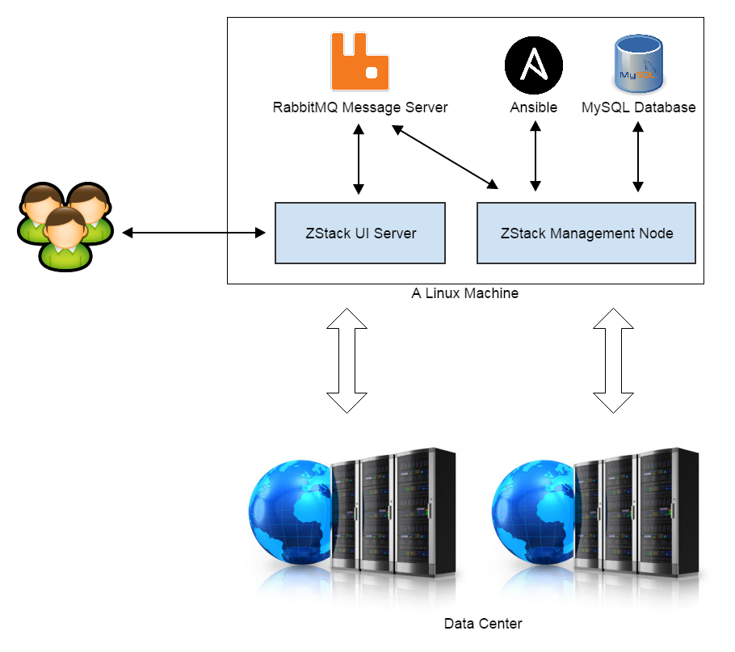
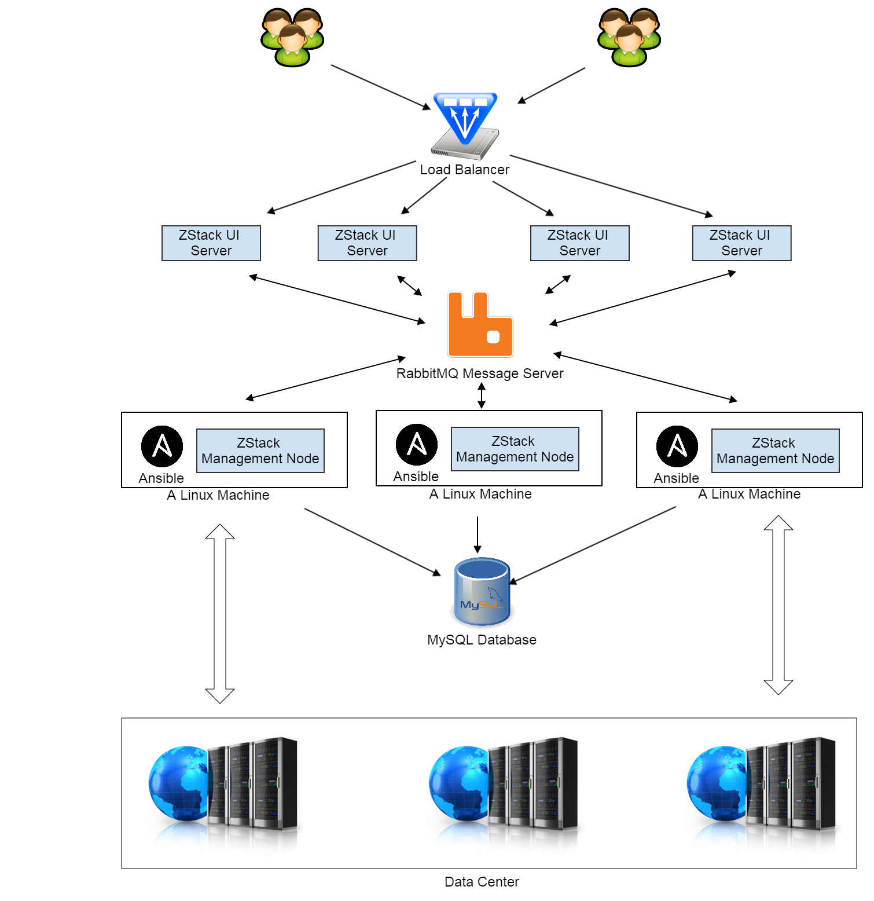
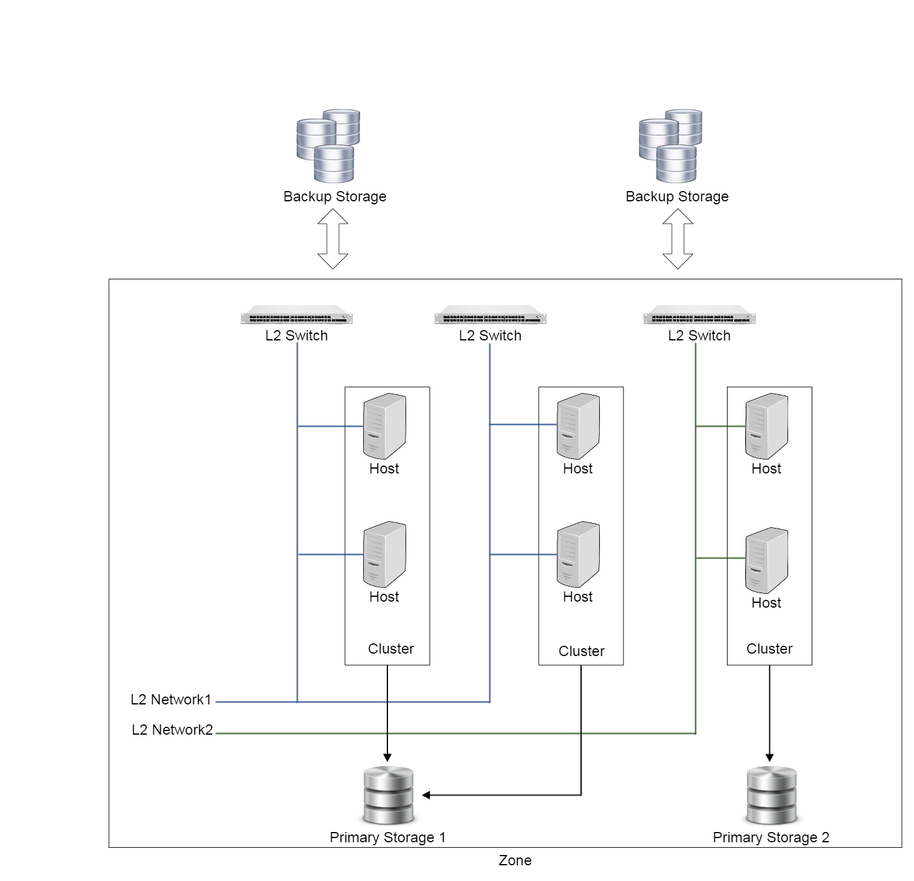
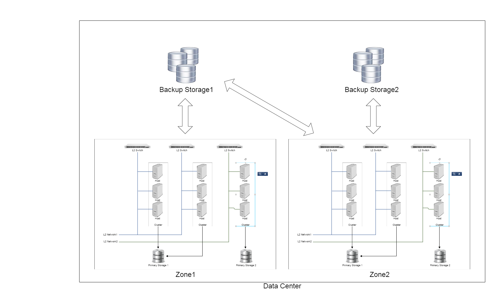

.. _前言:

============
前言
============

.. contents:: `目录`
   :depth: 6

--------
概览
--------

根据云的规模，ZStack可以部署在一台独立的Linux机器上，也可以是运行多个ZStack管理节点的Linux服务器集群.

单一管理节点部署
=====================================

在最简单的情况下，所有的ZStack软件组件和第三方依赖都安装在一个单独的Linux服务器上。一个典型的安装中包含五个部分:

- `RabbitMQ 消息服务器 <http://www.rabbitmq.com/>`_: ZStack服务用作通信的核心消息总线.
- `MySQL数据库 <http://www.mysql.com/>`_: ZStack通过数据库存储云资源的后台数据.
- `Ansible <http://www.ansible.com/home>`_: ZStack使用配置管理工具进行远程部署和代理程序升级.
- ZStack管理节点: 包含所有ZStack服务的主进程.
- ZStack用户界面服务: 提供给最终用户界面的网路服务器.

除此以外，一些需要在运行时部署到本地或远程的Python代理程序（Agent）被打包成ZStack管理节点的WAR文件，并通过Ansible部署.

因为ZStack基于异步架构，通常一个独立的管理节点可以处理数万条并发的API访问请求，这可以满足同时管理数万台服务器和数十万台虚拟机（云主机，在后面的章节讲直接简称为VM）的需求。然而，需要高可用性或者需要扩展至超大规模的云时，就需要部署多个管理节点.

多管理节点的部署
=========================================

在多管理节点部署中，RabbitMQ服务和MySQL数据库服务都被独立出来放到独立的服务器上；ZStack管理节点和Ansible被安装在所有的Linux管理服务器上； 多个管理节点分享同一个RabbitMQ消息服务器和MySQL数据库。ZStack用户界面服务,也通过RabbitMQ发送API请求至管理节点，它被部署在负载均衡后面，而后者会分发用户的访问请求.

对于RabbitMQ和MySQL集群而言, 管理员可以部署两个RabbitMQ服务器和一个额外的MySQL从数据库服务器.

ZStack云架构
==============================

IaaS软件通常使用诸如'zone', 'cluster'来描述数据中心中设施的构成，ZStack也采取同样的方式.
为了便于理解和减少误解，ZStack尽可能的使用已有的IaaS和数据中心的术语.

下图示例说明了ZStack如何定义数据中心的设施.

一个数据中心, 在ZStack的定义中按以下方式组织:

- **区域（Zone）**:

  一个区域是一些资源的逻辑组合，例如集群（clusters)，L2网络，主存储（primary storage）. ZStack使用区域来定义资源的访问边界.
  例如, 一个区域B中的集群不能访问在区域A中的一个主存储. 实践中，区域也可以用来划分域以达到容错的目的, 例如
  Amazon EC2中的可用性区域（availability zones）.

- **集群（Cluster）**:

  一个集群是一组物理主机的逻辑集合. 一个集群中的主机必须有相同的操作系统(hypervisor)和网络配置. 集群在其他一些IaaS软件中也被称为主机聚合或主机池.

- **主机（Host）**:

  一个主机是一个安装了操作系统（或者hypervisor）的物理服务器，其上面运行虚拟机.

- **L2网络**:

  一个L2网络是二层广播域的一个抽象. 任何提供二层广播域的技术都可以是ZStack中的L2网络。例如，VLAN, VxLan, 或者基于三层网络创建二层叠加（overlay）网络的SDN技术.

- **主存储（Primary Storage）**:

  主存储为虚拟机运行时会访问的云盘（volume）提供磁盘存储. 主存储可以是类似NFS的文件系统也可以是类似ISCSI的块存储。

- **备份存储（Backup Storage）**:

  备份存储为存储映像（images）和云盘快照（volume snapshots）提供磁盘存储，两者都可以用于创建云盘. 备份存储上的文件并不被虚拟机直接访问; 在被使用之前，他们需要被下载到主存储。备份存储可以基于文件系统或者对象存储（object storage）.

ZStack使用一种称为挂载策略（attaching strategy）来描述资源之间的关系, 例如, 一个集群可以被挂载于多个主存储和L2网络，反之亦然.
相关章节(主存储, L2网络)有更详细的介绍.

一个数据中心可以有一个或者多个区域。多个区域的图如下:

.. 注意:: 出于简化, 图中忽略了一些设施例如汇聚交换机（aggregation switches）, 核心交换机（core switches）, 路由器（routers）, 负载均衡器（load balancer）, 防火墙（Firewalls），。。。.

除以上描述数据中心设施的术语外，还有其他一些术语诸如虚拟机（VM），实例方案（instance offering）, 云盘规格（disk offering）, 他们描述虚拟资源；在相关章节中有更详细的描述.
