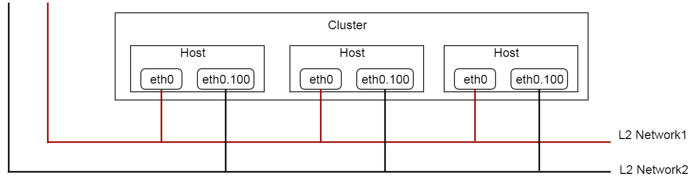
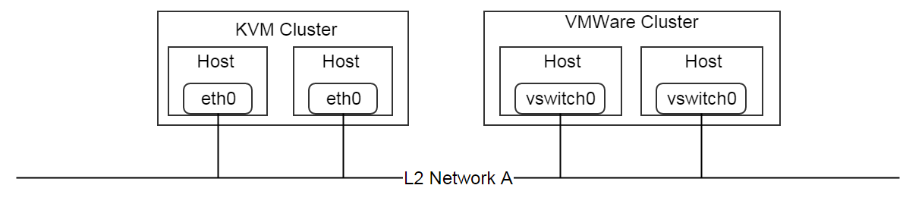
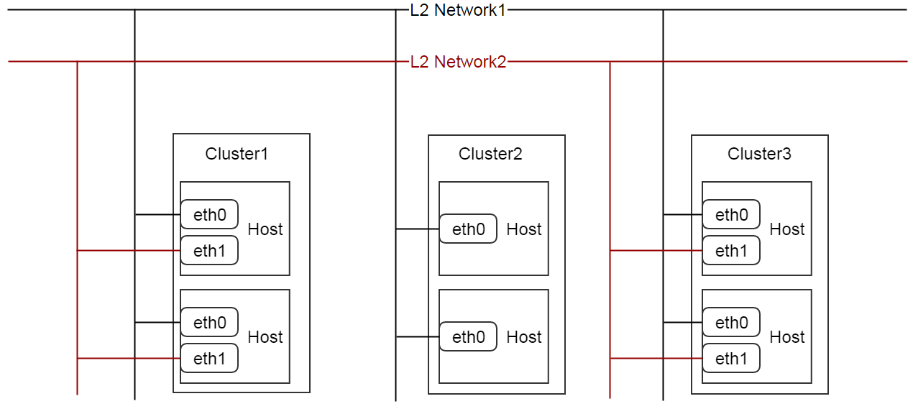
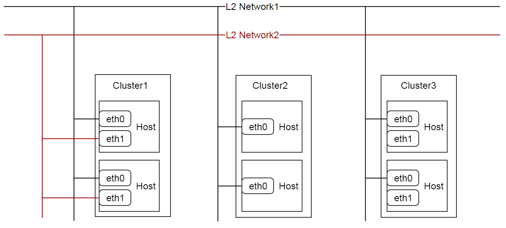
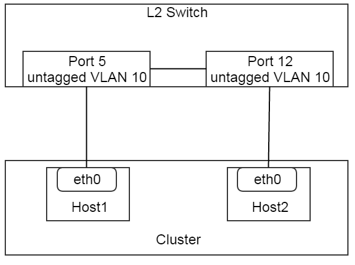
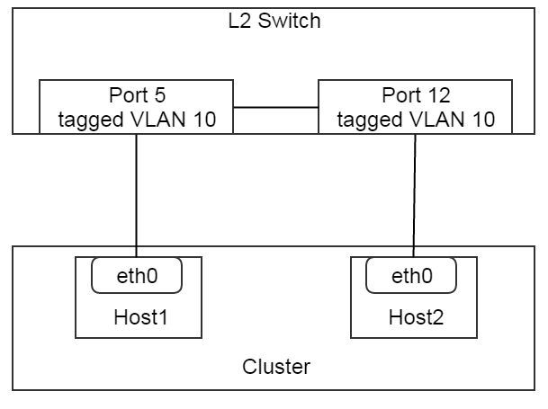

.. _l2Network:

==========
L2网络（L2 Network）
==========

.. contents:: `目录`
   :depth: 6

--------
概览（Overview）
--------

L2网络在数据中心中代表了一个二层广播域（layer2 broadcast domain <http://en.wikipedia.org/wiki/Broadcast_domain>）. 
也就是说，除了传统的OSI数据链路层（data link layer）以外所有能提供二层隔离（layer 2 isolation）的技术都可以在ZStack中作为L2网络.
例如, VLAN, VxLAN, 或者SDN可以创建二层叠加网络（layer 2 overlay networks）. 在ZStack中, L2网络负责为L3网络提供二层隔离.

L2网络可以挂载到同一个区域中的集群（sibling clusters）.

.. _l2Network inventory:

---------
清单（Inventory）
---------

.. _l2Network properties:

属性（Properties）
==========

.. list-table::
   :widths: 20 40 10 20 10
   :header-rows: 1

   * - 名字
     - 描述
     - 可选的
     - 可选的参数值
     - 起始支持版本
   * - **uuid**
     - 请参见 :ref:`resource properties`
     -
     -
     - 0.6
   * - **name**
     - 请参见 :ref:`resource properties`
     -
     -
     - 0.6
   * - **description**
     - 请参见 :ref:`resource properties`
     - 是
     -
     - 0.6
   * - **zoneUuid**
     - 父区域的uuid, 请参见 :ref:`zone <zone>`
     -
     -
     - 0.6
   * - **physicalInterface**
     - 请参见 :ref:`physical interface <l2Network physical interface>`
     -
     -
     - 0.6
   * - **type**
     - L2网络类型
     -
     - - L2NoVlanNetwork
       - L2VlanNetwork
     - 0.6
   * - **attachedClusterUuids**
     - L2网络挂载的集群的列表, 请参见 :ref:`attach cluster <l2Network attach cluster>`
     -
     -
     - 0.6
   * - **createDate**
     - 请参见 :ref:`resource properties`
     -
     -
     - 0.6
   * - **lastOpDate**
     - 请参见 :ref:`resource properties`
     -
     -
     - 0.6

.. _l2Network physical interface:

物理接口（Physical Interface）
==================

物理接口是一个字符串（例如eth0）。它代表了数据中心里二层网络（L2）的信息.
不同L2网络类型和不同虚拟机管理程序类型通常会有不同的物理接口. 
这听起来稍有些复杂. 这主要归结于虚拟机管理程序会使用它自己的标记方式（notations）来描述L2网络, 并且L2网络可以被同时挂载到多个拥有不同虚拟机管理系统的集群上.
下面的一个实际可能可以帮助理解.

假设数据中心有一个L2网络(l2Network A)，这个L2网络跨越两个集群, 一个是KVM集群, 另一个是VMWare集群. 在KVM中,
L2网络是使用Linux操作系统中的以太网设备（ethernet device）实现的; 在这个例子中，假设每个KVM主机通过eth0连接到L2网络. 
在VMWare集群中, L2网络是使用vswitch实现的; 在这个例子中, 假设VMWare集群使用vswitch0连接到L2网络; 这样，整个拓扑结构如下图所示:

就像:ref:`host <host>`章节中提到的那样, 很多看似应用到区域和集群上的操作，实际都被指派到对应的主机上了;
这里, 当挂载L2网络A到KVM集群和VMWare集群的时候, ZStack必须能够理解在这些集群中虚拟机管理程序是如何使用标记描述L2网络; 
在这种情况下, ZStack必须知道在KVM主机上eth0代表了L2网络，而在VMWare主机上vswitch0代表了L2网络. 
所以物理接口的名字也反映了不同的虚拟机管理程序.

.. 注意:: 由于ZStack当前版本仅支持KVM, 我们将暂不讨论L2网络在VMWare中的细节. 上面的例子只是为了方便理解物理接口的设计.

.. _l2Network attach cluster:

挂载集群（Attaching Cluster）
=================

挂载集群是为了将L2网络和同一个区域中的集群（sibling clusters）关联起来, 它提供了一种灵活的方式来维护数据中心中主机和二层网络（layer 2 networks）之间的关系. 我们来看一个实际的例子.

假设你的数据中心中的网络拓扑结构如上图所示. 所有集群中的主机的eth0都连接在同一个称为L2 Network1的二层网络上; 集群cluster1和cluster3中主机的eth1都连接在另一个称为L2 network2的二层网络上. 为了ZStack中描述这个拓扑结构, 你可以将L2 network1挂载到所有三个集群上，同时只将L2 network2挂载到集群cluster1和cluster3上.

几个月之后, 由于一些业务的需求网络拓扑结构需要作一些改变, 因此你将集群cluster3中的主机上eth1所连接的网线从机架交换机（rack switch）上断开, 这样集群cluster3就不再和L2 network2相连了;
你可以通过将L2 network2从cluster3上卸载来通知ZStack网络拓扑结构发生了改变.

L2NoVlanNetwork
===============

L2NoVlanNetwork是L2网络的基本类型，它的属性被列举在:ref:`properties <l2Network properties>`.
名字中的'NoVlan'并不表示不可以使用VLAN技术, 它仅仅表示ZStack自己不会主动使用VLAN来创建一个二层广播域. 下面两个图例可以帮助理解:

在上图这个配置中, 交换机的两个端口5和12是不带VLAN 10标签（untagged VLAN 10）的端口(Cisco中的VLAN 10访问端口，即access port), 并且分别连接到host1和host2的eth0.
这对于L2NoVlanNetwork是一个有效的配置. 管理员可以使用'physicalInterface' = 'eth0'创建L2NoVlanNetwork，并将它挂载到集群上.

.. image:: l2NoVlanNetwork2.png
   :align: center
   :width: 500px
   :height: 400px

在上图这个配置中, 交换机的两个端口5和12是带VLAN 10标签（tagged VLAN 10）的端口(Cisco中的VLAN 10干线端口，即trunk port), 并且分别连接到host1和host2上预先创建好的VLAN设备eth0.10. 
对于L2NoVlanNetwork来说，这同样是一个有效的配置. 管理员可以使用'physicalInterface' = 'eth0.10'创建L2NoVlanNetwork，并将它挂载到集群上.

现在大家应该可以理解，一个L2NoVlanNetwork对应了一个预先创建好的二层广播域; ZStack不会为L2NoVlanNetwork创建任何新的广播域.

KVML2NoVlanNetwork注意事项（L2NoVlanNetwork KVM Specific）
++++++++++++++++++++++++++++

当挂载一个L2NoVlanNetwork到KVM集群时, :ref:`physicalInterface <l2Network physical interface>`应该是一个Linux操作系统中的以太网设备名（ethernet device name）; 例如,
eth0, eth0.10, em1. 当ZStack使用brctl创建网桥（bridge）时会使用'physicalInterface'作为设备名. 伪代码如下::

    Assuming physicalInterface = eth0

    brctl create br_eth0
    brctl addif br_eth0 eth0

.. 注意:: 如果你有多个不同集群中的主机连接到同一个L2网络, 并且你想把这个L2网络挂载到这些集群上,
          请确保所有这些主机的Linux操作系统上使用相同的以太网设备名. 例如, 将所有的以太网设备命名为eth0.
          最好的办法还是在所有这些集群中安装相同的Linux操作系统, 或者使用udev将所有的这些以太网设备配置成相同的名字.

L2NoVlanNetwork清单示例（L2NoVlanNetwork Inventory Example）
+++++++++++++++++++++++++++++++++

::

    {
      "inventory": {
        "uuid": "f685ff94513542bbb8e814027f8deb13",
        "name": "l2-basic",
        "description": "Basic L2 Test",
        "zoneUuid": "45a2864b6ddf4d2fb9b4c3736a923dcb",
        "physicalInterface": "eth0",
        "type": "L2NoVlanNetwork",
        "createDate": "Jun 1, 2015 12:58:35 PM",
        "lastOpDate": "Jun 1, 2015 12:58:35 PM",
        "attachedClusterUuids": []
      }
    }

L2VlanNetwork
=============

L2VlanNetwork是ZStack会为其主动使用VLAN创建二层广播域的L2网络. 根据集群中虚拟机管理程序的不同, ZStack创建L2网络对应的二层广播域的方式也不同.
相比:ref:`properties <l2Network properties>`, L2VlanNetwork还有一个额外的属性:

.. list-table::
   :widths: 20 40 10 20 10
   :header-rows: 1

   * - 名字
     - 描述
     - 可选的
     - 可选的参数值
     - 起始支持版本
   * - **vlan**
     - 用来创建二层广播域的VLAN号(VLAN id)
     -
     - [0, 4095]
     - 0.6

当挂载L2VlanNetwork到集群的时候, ZStack会配合使用'vlan'属性和'physicalInterface'属性在集群中的主机上创建vlan设备; 为了使这种方式工作,
'physicalInterface'所指定的以太网设备所连接的交换机端口必须是带相应'vlan'标签的. 例如:

在上图这个配置中, 交换机的两个端口5和12是带VLAN 10标签（tagged VLAN 10）的端口, 这样管理员就可以使用'physicalInterface' = 'eth0'和'vlan' = 10创建L2VlanNetwork，并将它挂载到集群上.

L2VlanNetwork KVM注意事项（L2VlanNetwork KVM Specific）
++++++++++++++++++++++++++

当挂载L2VlanNetwork到KVM集群时, ZStack会在集群中的所有主机上创建VLAN设备并创建网桥. 伪代码如下::

    Assuming physicalInterface = eth0, vlan = 10

    vconfig add eth0 10
    brctl create br_eth0_10
    brctl addif br_eth0_10 eth0.10

.. 注意:: 类似L2NoVlanNetwork, 请确保所有这些即将挂载同一个L2VlanNetwork网络的主机的Linux操作系统上使用相同的以太网设备名.

L2VlanNetwork清单示例（L2VlanNetwork Inventory Example）
+++++++++++++++++++++++++++++++

::

    {
        "inventory": {
          "vlan": 10,
          "uuid": "14a01b0978684b2ea6e5a355c7c7fd73",
          "name": "TestL2VlanNetwork",
          "description": "Test",
          "zoneUuid": "c74f8ff8a4c5456b852713b82c034074",
          "physicalInterface": "eth0",
          "type": "L2VlanNetwork",
          "createDate": "Jun 1, 2015 4:31:47 PM",
          "lastOpDate": "Jun 1, 2015 4:31:47 PM",
          "attachedClusterUuids": []
        }
    }

----------
操作（Operations）
----------

创建L2网络（Create L2 Network）
=================

两种L2网络创建的命令不同.

创建L2NoVlanNetwork（Create L2NoVlanNetwork）
======================

管理员可以使用CreateL2NoVlanNetwork来创建L2NoVlanNetwork. 例如::

    CreateL2NoVlanNetwork name=management-network physicalInterface=eth0 zoneUuid=9a94e647a9f64bb392afcdc5396cc1e4

参数（Parameters）
++++++++++

.. list-table::
   :widths: 20 40 10 20 10
   :header-rows: 1

   * - 名字
     - 描述
     - 可选的
     - 可选的参数值
     - 起始支持版本
   * - **name**
     - 资源名, 请参见 :ref:`resource properties`
     -
     -
     - 0.6
   * - **resourceUuid**
     - 资源的uuid, 请参见 :ref:`create resource`
     - 是
     -
     - 0.6
   * - **description**
     - 资源的描述, 请参见 :ref:`resource properties`
     - 是
     -
     - 0.6
   * - **zoneUuid**
     - 父区域的uuid, 请参见 :ref:`zone <zone>`
     -
     -
     - 0.6
   * - **physicalInterface**
     - 请参见 :ref:`physical interface <l2Network physical interface>`
     -
     -
     - 0.6

删除L2网络（Delete L2 Network）
=================

管理员可以使用DeleteL2Network来删除一个L2网络. 例如::

    DeleteL2Network uuid=a5535531eb7346ce89cfd7e643ad1ef8

.. 危险:: 删除一个L2网络会导致所有它的子L3网络被删除. 对于删除L3网络的后果,
            请参见 :ref:`delete l3Network`. 没有办法可以恢复一个删除了的L2网络.

参数（Parameters）
++++++++++

.. list-table::
   :widths: 20 40 10 20 10
   :header-rows: 1

   * - 名字
     - 描述
     - 可选的
     - 可选的参数值
     - 起始支持版本
   * - **deleteMode**
     - 请参见 :ref:`delete resource`
     - 是
     - - Permissive
       - Enforcing
     - 0.6
   * - **uuid**
     - L2网络的uuid
     -
     -
     - 0.6

挂载集群（Attach Cluster）
==============

请参见 :ref:`cluster attach L2 network`.

卸载集群（Detach Cluster）
==============

请参见 :ref:`cluster detach L2 network`.

查询L2网络（Query L2 Network）
================

管理员可以使用QueryL2Network来查询L2网络. 例如::

    QueryL2Network physicalInterface=eth0

::

    QueryL2Network l3Network.ipRanges.startIp=192.168.0.2

原生域查询（Primitive Fields of Query）
+++++++++++++++++++++++++

请参见 :ref:`L2 network inventory <l2Network inventory>`.

嵌套和扩展域查询（Nested and Expanded Fields of Query）
+++++++++++++++++++++++++++++++++++

.. list-table::
   :widths: 20 30 40 10
   :header-rows: 1

   * - 域（Field）
     - 清单（Inventory）
     - 描述
     - 起始支持版本
   * - **l3Network**
     - :ref:`L3 network inventory <l3Network inventory>`
     - 属于这个L2网络的L3网络
     - 0.6
   * - **cluster**
     - :ref:`cluster inventory <cluster inventory>`
     - 该L2网络挂载的所有集群
     - 0.6
   * - **zone**
     - :ref:`zone inventory <zone inventory>`
     - 父区域（parent zone）
     - 0.6

----
标签（Tags）
----

管理员可以使用resourceType=L2NetworkVO在L2网络上创建用户标签. 例如::

    CreateUserTag resourceType=L2NetworkVO tag=publicL2 resourceUuid=cff4be8694174b0fb831a9fe53b1d62b
