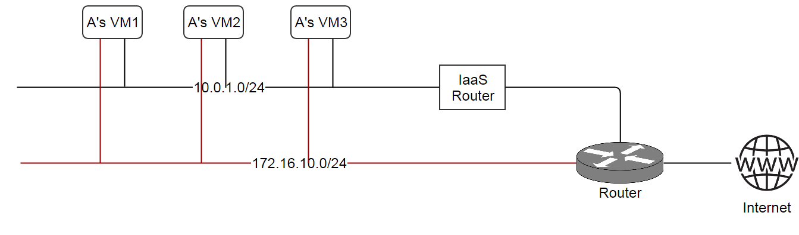

.. _l3Network:

==========
L3网络（L3 Network）
==========

.. contents:: `目录`
   :depth: 6

--------
概览（Overview）
--------

L3网络是由子网（subnet）以及一系列网络服务（network services）组成, :ref:`L2 network <l2Network>`负责为其提供隔离方法. 
网络服务提供模块（network service providers）提供的网络服务, 通常是OSI三层到七层协议的软件实现.

.. _l3Network subnet:

子网（Subnet）
======

一个L3网络中的子网可以是一个连续的IP范围（consecutive IP range）或多个分割的IP范围（split IP ranges）. 对于需要保留一部分IP地址的子网，分割的IP地址范围特别有用. 
例如, 假设要创建一个拥有子网192.168.0.0/24的L3网络作为管理网络; 但是, IP地址192.168.0.50 ~ 192.168.0.100都已经被一些网络设备占用，因此你不希望ZStack使用这些地址, 所以你创建了两个分割的IP地址范围::

    IP Range1

    start IP: 192.168.0.2
    end IP: 192.168.0.49
    gateway: 192.168.0.1
    netmask: 255.255.255.0

    IP Range2

    start IP: 192.168.0.101
    end IP: 192.168.0.254
    gateway: 192.168.0.1
    netmask: 255.255.255.0

分割的IP范围没有数量限制, 只要他们属于同一个`CIDR <http://en.wikipedia.org/wiki/Classless_Inter-Domain_Routing>`_.

.. _l3Network network services:

网络服务（Network Services）
================

为了给L3网络上的虚拟机提供服务，网络服务实现了OSI三层到七层的协议. 和L3网络的父L2网络相关联的网络服务提供模块负责提供网络服务. 单个类型的网络服务可以有多个网络服务提供模块, 同时单个网络服务提供模块可以提供多种类型的服务.
用户可以在创建的L3网络上挂载网络服务并选择网络服务提供模块. 在ZStack当前版本中, 支持的服务/网络服务提供模块如下所示:

.. list-table::
   :widths: 30 30 30 10
   :header-rows: 1

   * - 网络服务（Network Service）
     - 网络服务提供模块（Provider）
     - 可以挂载的L2网络（Attachable L2 Network）
     - 起始支持版本
   * - DHCP
     - 虚拟路由器（Virtual Router）
     - - L2NoVlanNetwork
       - L2VlanNetwork
     - 0.6
   * - DNS
     - 虚拟路由器（Virtual Router）
     - - L2NoVlanNetwork
       - L2VlanNetwork
     - 0.6
   * - 源网络地址翻译（Source NAT，SNAT)
     - 虚拟路由器（Virtual Router）
     - - L2NoVlanNetwork
       - L2VlanNetwork
     - 0.6
   * - 端口转发（Port Forwarding）
     - 虚拟路由器（Virtual Router）
     - - L2NoVlanNetwork
       - L2VlanNetwork
     - 0.6
   * - 固定IP（Elastic IP，EIP)
     - 虚拟路由器（Virtual Router）
     - - L2NoVlanNetwork
       - L2VlanNetwork
     - 0.6
   * - 安全组（Security Group）
     - 安全组（Security Group）
     - - L2NoVlanNetwork
       - L2VlanNetwork
     - 0.6

表中, 可以挂载的L2网络列表明网络服务提供模块可以挂载到哪种L2网络. 网络服务提供模块不能为不可以挂载的L2网络的子L3网络提供服务.

.. _l3Network inventory:

---------
清单（Inventory)
---------

属性（Properties）
==========

.. list-table::
   :widths: 20 40 10 20 10
   :header-rows: 1

   * - 名字
     - 描述
     - 可选的
     - 可选的参数值
     - 起始支持版本
   * - **uuid**
     - 请参见 :ref:`resource properties`
     -
     -
     - 0.6
   * - **name**
     - 请参见 :ref:`resource properties`
     -
     -
     - 0.6
   * - **description**
     - 请参见 :ref:`resource properties`
     - 是
     -
     - 0.6
   * - **zoneUuid**
     - 所在区域的uuid, 请参见 :ref:`zone <zone>`
     -
     -
     - 0.6
   * - **l2NetworkUuid**
     - 父L2网络的uuid, 请参见 :ref:`L2 network <l2Network>`
     -
     -
     - 0.6
   * - **state**
     - 请参见 :ref:`state <l3Network state>`
     -
     - - Enabled
       - Disabled
     - 0.6
   * - **dnsDomain**
     - 请参见 :ref:`domain <l3Network dnsDomain>`
     - 是
     -
     - 0.6
   * - **ipRanges**
     - :ref:`IP ranges <l3Network IP range>`列表
     -
     -
     - 0.6
   * - **dns**
     - :ref:`DNS <l3Network DNS>`列表
     -
     -
     - 0.6
   * - **networkServices**
     - :ref:`network services references <l3Network network service reference>`列表
     -
     -
     - 0.6
   * - **type**
     - L3网络类型（L3 network type）
     -
     - - L3BasicNetwork
     - 0.6
   * - **createDate**
     - 请参见:ref:`resource properties`
     -
     -
     - 0.6
   * - **lastOpDate**
     - 请参见:ref:`resource properties`
     -
     -
     - 0.6

示例
=======

::

    {
      "inventory": {
        "uuid": "f73926eb4f234f8195c61c33d8db419d",
        "name": "GuestNetwork",
        "description": "Test",
        "type": "L3BasicNetwork",
        "zoneUuid": "732fbb4383b24b019f60d862995976bf",
        "l2NetworkUuid": "f1a092c6914840c9895c564abbc55375",
        "state": "Enabled",
        "createDate": "Jun 1, 2015 11:07:24 PM",
        "lastOpDate": "Jun 1, 2015 11:07:24 PM",
        "dns": [],
        "ipRanges": [
          {
            "uuid": "78b43f4b0a9745fab49c967e1c35beb1",
            "l3NetworkUuid": "f73926eb4f234f8195c61c33d8db419d",
            "name": "TestIpRange",
            "description": "Test",
            "startIp": "10.10.2.100",
            "endIp": "10.20.2.200",
            "netmask": "255.0.0.0",
            "gateway": "10.10.2.1",
            "createDate": "Jun 1, 2015 11:07:24 PM",
            "lastOpDate": "Jun 1, 2015 11:07:24 PM"
          }
        ],
        "networkServices": [
          {
            "l3NetworkUuid": "f73926eb4f234f8195c61c33d8db419d",
            "networkServiceProviderUuid": "bbb525dc4cc8451295d379797e092dba",
            "networkServiceType": "DHCP"
          }
        ]
      }
    }

.. _l3Network state:

可用状态（State）
=====

L3网络有两种可用状态:

- **Enabled**

  在这种状态下，允许创建新的虚拟机

- **Disabled**

  在这种状态下，不允许创建新的虚拟机

  .. 注意:: 在已经禁用的L3网络上的已存在的虚拟机（Existing VMs）仍然可以被停止，启动，重启，和删除.

.. _l3Network dnsDomain:

DNS域（DNS Domain）
==========

DNS域用来将L3网络中主机的机器名扩展为FQDNs(完全合格的域名，Full Qualified Domain Name);
例如, 如果虚拟机的主机名是'vm1'并且L3网络的DNS域是'zstack.org', 主机名最终会被展开为'vm1.zstack.org'.

.. _l3Network IP range:

IP地址范围（IP Range)
========

ZStack当前版本仅支持IPv4 IP地址范围.

.. _l3Network IP range inventory:

清单（Inventory）
+++++++++

属性（Properties）
----------

.. list-table::
   :widths: 20 40 10 20 10
   :header-rows: 1

   * - 名字
     - 描述
     - 可选的参数
     - 可选的参数值
     - 起始支持版本
   * - **uuid**
     - 请参见 :ref:`resource properties`
     -
     -
     - 0.6
   * - **name**
     - 请参见 :ref:`resource properties`
     -
     -
     - 0.6
   * - **description**
     - 请参见 :ref:`resource properties`
     - 是
     -
     - 0.6
   * - **startIp**
     - 地址范围的起始IP
     -
     -
     - 0.6
   * - **endIp**
     - 地址范围的结束IP
     -
     -
     - 0.6
   * - **netmask**
     - 子网掩码
     -
     -
     - 0.6
   * - **gateway**
     - 子网网关
     -
     -
     - 0.6
   * - **createDate**
     - 请参见 :ref:`resource properties`
     -
     -
     - 0.6
   * - **lastOpDate**
     - 请参见 :ref:`resource properties`
     -
     -
     - 0.6

示例
-------
::

    {
      "inventory": {
        "uuid": "b1cfcdeca4024d13ac82edbe8d959720",
        "l3NetworkUuid": "50e637dc68b7480291ba87cbb81d94ad",
        "name": "TestIpRange",
        "description": "Test",
        "startIp": "10.0.0.100",
        "endIp": "10.10.1.200",
        "netmask": "255.0.0.0",
        "gateway": "10.0.0.1",
        "createDate": "Jun 1, 2015 4:30:23 PM",
        "lastOpDate": "Jun 1, 2015 4:30:23 PM"
      }
    }

.. _l3Network DNS:

DNS
===

当DNS网络服务启用时，一个L3网络可以有一个或多个DNS起作用.

.. 注意:: 当前ZStack版本仅支持IPv4 DNS

L2网络和L3网络（L2 Networks and L3 Networks）
===========================

类似于一个二层广播域可以包含多个子网, 你可以在同一个L2网络中创建多个L3网络;
但由于这些L3网络被没有被互相隔离，仍然可以被监听; 这样使用有一定的风险.

.. _l3Network network service reference:

网络服务引用（Network Service References）
==========================

网络服务引用展现了L3网络上启用的网络服务以及他们的提供者.

清单（Inventory）
+++++++++

属性（Properties）
----------

.. list-table::
   :widths: 20 40 10 20 10
   :header-rows: 1

   * - 名字
     - 描述
     - 可选的
     - 可选的参数值
     - 起始支持版本
   * - **l3NetworkUuid**
     - L3网络Uuid
     -
     -
     - 0.6
   * - **networkServiceProviderUuid**
     - 网络服务提供模块的UUID
     -
     -
     - 0.6
   * - **networkServiceType**
     - 网络服务类型
     -
     - - DHCP
       - DNS
       - SNAT
       - PortForwarding
       - EIP
       - SecurityGroup
     - 0.6

示例
-------

::

    {
      "l3NetworkUuid": "f73926eb4f234f8195c61c33d8db419d",
      "networkServiceProviderUuid": "bbb525dc4cc8451295d379797e092dba",
      "networkServiceType": "PortForwarding"
    }

.. _l3Network typology:

----------------
网络拓扑结构（Network Typology）
----------------

在Iaas软件管理云中最常见的网络拓扑结构是:

- **扁平网络或共享网络（Flat Network or Shared Network）**:

  这种拓扑结构中, 所有的租客（tenants）共享一个子网; IaaS软件只提供DHCP, DNS服务; 数据中心的路由器将负责路由服务

  .. image:: l3Network1.png
     :align: center

- **私有网络或隔离网络（Private Network or Isolated Network）**:

  这种拓扑结构中, 每个租客都有自己的子网; IaaS软件负责为所有子网提供路由服务, 同时通常包含DHCP, DNS, 和NAT等服务.

  .. image:: l3Network2.png
     :align: center

- **虚拟专用网络（Virtual Private Network，VPC)**:

  这种拓扑结构中, 每个租客都可以有多个子网; IaaS软件负责提供路由服务协调所有子网; 租客们可以通过配置路由器的路由表（routing table）来控制子网间的连通.

  .. image:: l3Network3.png
     :align: center

此外，典型的拓扑结构可以组合成新的类型; 例如, 扁平网络和私有网络可以组合在一起, 如下图所示:

在ZStack中, 所有这些拓扑结构都可以通过组合L2网络, L3网络和网络服务来实现. 例如, 用户可以通过创建一个只启用了DHCP和DNS的L3网络来创建一个扁平网络;
用户可以通过在L2VlanNetwork上创建一个启用了DHCP, DNS, SNAT的L3网络来创建一个私有网络.

.. 注意:: ZStack当前版本还不支持VPC.

----------
操作（Operations）
----------

.. _create L3 network:

创建L3网络（Create L3 Network）
=================

用户可以使用CreateL3Network创建L3网络. 例如::

    CreateL3Network l2NetworkUuid=f1a092c6914840c9895c564abbc55375 name=GuestNetwork

参数（Parameters）
++++++++++

.. list-table::
   :widths: 20 40 10 20 10
   :header-rows: 1

   * - 名字
     - 描述
     - 可选的
     - 可选的参数值
     - 起始支持版本
   * - **name**
     - 资源名字, 请参见 :ref:`resource properties`
     -
     -
     - 0.6
   * - **resourceUuid**
     - 资源的uuid, 请参见 :ref:`create resource`
     - 是
     -
     - 0.6
   * - **description**
     - 资源的描述, 请参见 :ref:`resource properties`
     - 是
     -
     - 0.6
   * - **l2NetworkUuid**
     - 父L2网络的uuid, 请参见 :ref:`L2 network <l2Network>`
     -
     -
     - 0.6
   * - **dnsDomain**
     - 一个DNS域, 请参见 :ref:`domain <l3Network dnsDomain>`
     - 是
     -
     - 0.6
   * - **type**
     - L3网络类型, 请参见 :ref:`type <l3Network type>`
     - 是
     - - L3BasicNetwork
     - 0.6
   * - **system**
     - 指示这是否是一个系统L3网络(system L3 network), 请参见 :ref:`system l3Network`
     - 是
     - - true
       - false
     - 0.6

.. _l3Network type:

类型（Type）
====

ZStack当前版本仅支持L3BasicNetwork L3网络类型. 用户调用CreateL3NetworkUsers时可以不填'type'参数.

.. _system l3Network:

系统L3网络（System L3 Network）
=================

系统L3网络是ZStack保留使用的，用户不能使用它创建虚拟机. 系统L3网络通常被公有网络（public networks）和管理网络（management networks）使用. 
通常云中的用户虚拟机不应该有网卡连接在公网或管理网络上, 但特殊应用虚拟机（appliance VMs） (例如路由器虚拟机，router
VM)确实需要有网卡连接在这些网络上; 因此系统网络和公有网络可以创建为系统L3网络.

.. 注意:: 管理网络和公有网络可以被创建为非系统L3网络, 这样将允许用户虚拟机使用这些网络.
          在私有云（private clouds）中可以见到这样的应用; 例如, 创建一个拥有公网IP的用户虚拟机.

.. _delete l3Network:

删除L3网络（Delete L3 Network）
=================

用户可以使用DeleteL3Network来删除一个L3网络. 例如::

    DeleteL3Network uuid=f73926eb4f234f8195c61c33d8db419d

参数（Parameters）
++++++++++

.. list-table::
   :widths: 20 40 10 20 10
   :header-rows: 1

   * - 名字
     - 描述
     - 可选的
     - 可选的参数值
     - 起始支持版本
   * - **uuid**
     - L3网络的uuid
     -
     -
     - 0.6
   * - **deleteMode**
     - 请参见 :ref:`delete resource`
     - 是
     - - Permissive
       - Enforcing
     - 0.6

.. 危险:: 删除一个L3网络会停止所有连接在该网络上的虚拟机，并且这些虚拟机的相应网络接口也会被删除; 如果连接在该L3网络的网卡是虚拟机的唯一一个网卡，那么虚拟机也会被删除. 没有办法可以恢复一个已经删除了的L3网络.

添加IP地址范围（Add IP Ranges）
=============

添加分割的地址范围（Add Split Ranges）
++++++++++++++++

用户可以使用AddIpRange来添加一个IP地址范围到L3网络; 这个命令也可以用来添加分割的IP地址范围. 例如::

    AddIpRange name=ipr1 startIp=192.168.0.2 endIp=192.168.0.100 netmask=255.255.255.0 gateway=192.168.0.1 resourceUuid=50e637dc68b7480291ba87cbb81d94ad

参数（Parameters）
----------

.. list-table::
   :widths: 20 40 10 20 10
   :header-rows: 1

   * - 名字
     - 描述
     - 可选的
     - 可选的参数值
     - 起始支持版本
   * - **name**
     - 资源的名字, 请参见 :ref:`resource properties`
     -
     -
     - 0.6
   * - **resourceUuid**
     - 资源的uuid, 请参见 :ref:`create resource`
     - 是
     -
     - 0.6
   * - **description**
     - 资源的描述, 请参见 :ref:`resource properties`
     - 是
     -
     - 0.6
   * - **l3NetworkUuid**
     - 父L3网络的uuid
     -
     -
     - 0.6
   * - **startIp**
     -  IP地址范围的起始地址
     -
     -
     - 0.6
   * - **endIp**
     - IP地址范围的结束地址
     -
     -
     - 0.6
   * - **netmask**
     - 子网掩码
     -
     -
     - 0.6
   * - **gateway**
     - 子网网关
     -
     -
     - 0.6

添加CIDR（Add CIDR）
++++++++

用户可以使用AddIpRangeByNetworkCidr来添加一个IP地址范围. 例如::

    AddIpRangeByNetworkCidr name=ipr1 l3NetworkUuid=50e637dc68b7480291ba87cbb81d94ad networkCidr=10.0.1.0/24

参数（Parameters）
----------

.. list-table::
   :widths: 20 40 10 20 10
   :header-rows: 1

   * - 名字
     - 描述
     - 可选的
     - 可选的参数值
     - 起始支持版本
   * - **uuid**
     - 请参见 :ref:`resource properties`
     -
     -
     - 0.6
   * - **name**
     - 请参见 :ref:`resource properties`
     -
     -
     - 0.6
   * - **description**
     - 请参见 :ref:`resource properties`
     - 是
     -
     - 0.6
   * - **l3NetworkUuid**
     - 父L3网络的uuid
     -
     -
     - 0.6
   * - **networkCidr**
     - 网络CIDR; 必须按照格式::

            网络号/前缀长度（network-number/prefix-length)
     -
     -
     - 0.6

删除IP地址范围（Delete IP Range）
===============

用户可以使用DeleteIpRange来删除一个IP地址范围. 例如::

    DeleteIpRange uuid=b1cfcdeca4024d13ac82edbe8d959720

.. 警告:: 删除一个IP地址范围会导致所有拥有该范围IP地址的虚拟机都被停止.
             没有办法恢复一个已经被删除的IP地址范围.

参数（Parameters）
++++++++++

.. list-table::
   :widths: 20 40 10 20 10
   :header-rows: 1

   * - 名字
     - 描述
     - 可选的
     - 可选的参数
     - 起始支持版本
   * - **uuid**
     - IP地址范围的uuid
     -
     -
     - 0.6
   * - **deleteMode**
     - 请参见 :ref:`delete resource`
     - 是
     - - Permissive
       - Enforcing
     - 0.6

添加DNS（Add DNS）
=======

用户可以使用AddDnsToL3Network来在L3网络上添加DNS. 例如::

    AddDnsToL3Network l3NetworkUuid=50e637dc68b7480291ba87cbb81d94ad dns=8.8.8.8

参数（Parameters）
++++++++++

.. list-table::
   :widths: 20 40 10 20 10
   :header-rows: 1

   * - 名字
     - 描述
     - 可选的
     - 可选的参数值
     - 起始支持版本
   * - **l3NetworkUuid**
     - 父L3网络的uuid
     -
     -
     - 0.6
   * - **dns**
     - dns的IPv4地址
     -
     -
     - 0.6

.. _l3Network attach service:

挂载网络服务（Attach Network Service）
======================

在创建虚拟机之前，用户可以使用AttachNetworkServiceToL3Network来挂载网络服务到创建的L3网络上. 如果在网络服务挂载钱L3网络上已经有虚拟机运行, 这些已有的虚拟机需要重启才能开始使用新挂载的网络服务.

.. 注意:: ZStack当前版本不支持从L3网络卸载网络服务.

示例::

    AttachNetworkServiceToL3Network l3NetworkUuid=50e637dc68b7480291ba87cbb81d94ad networkServices='{"1d1d5ff248b24906a39f96aa3c6411dd": ["DHCP", "DNS", "SNAT", "EIP"]}'

参数（Parameters）
++++++++++

.. list-table::
   :widths: 20 40 10 20 10
   :header-rows: 1

   * - 名字
     - 描述
     - 可选的
     - 可选的参数值
     - 起始支持版本
   * - **l3NetworkUuid**
     - L3网络的uuid
     -
     -
     - 0.6
   * - **networkServices**
     - 网络服务提供模块UUID和网络服务类型列表之前的映射关系 (map)
     -
     -
     - 0.6

.. 注意:: 可以使用QueryNetworkServiceProvider来查询一个网络服务提供模块的UUID, 例如::

              QueryNetworkServiceProvider fields=uuid name=VirtualRouter

          如果你想查看一个网络服务提供模块提供的所有网络服务, 你可以去掉'field'参数, 例如::

              QueryNetworkServiceProvider name=VirtualRouter

查询L3网络（Query L3 Network）
================

用户可以使用QueryL3Network来查询L3网络. 例如::

    QueryL3Network dnsDomain=zstack.org

::

    QueryL3Network vmNic.ip=192.168.10.2

原生域查询（Primitive Fields of Query)
+++++++++++++++++++++++++

请参见 :ref:`L3 network inventory <l3Network inventory>`

嵌套和扩展域查询（Nested And Expanded Fields of Query)
+++++++++++++++++++++++++++++++++++

.. list-table::
   :widths: 20 30 40 10
   :header-rows: 1

   * - 域（Field）
     - 清单（Inventory）
     - 描述
     - 起始支持版本
   * - **ipRanges**
     - :ref:`IP range inventory <l3Network IP range inventory>`
     - 该L3网络包含的所有IP地址范围
     - 0.6
   * - **networkServices**
     - :ref:`l3Network network service reference <l3Network network service reference>`
     - 该L3网络挂载的所有网络服务
     - 0.6
   * - **l2Network**
     - :ref:`L2 network <l2Network>`
     - 父L2网络
     - 0.6
   * - **vmNic**
     - :ref:`VM nic inventory <vm nic inventory>`
     - 连在该L3网络上所有虚拟机网卡
     - 0.6
   * - **serviceProvider**
     - :ref:`network service provider inventory <network service provider inventory>`
     - 所有该L3网络挂载的服务的提供模块
     - 0.6
   * - **zone**
     - :ref:`zone inventory <zone inventory>`
     - 所在区域
     - 0.6

---------------
L3网络标签（L3 Network Tags）
---------------

用户可以使用resourceType=L3NetworkVO在L3网络上创建用户标签. 例如::

    CreateUserTag resourceType=L3NetworkVO tag=web-tier-l3 resourceUuid=f6be73fa384a419986fc6d1b92f95be9

-------------
IP地址范围标签（IP Range Tags）
-------------

用户可以使用resourceType=IpRangeVO在IP地址范围上创建用户标签. 例如::

    CreateUserTag resourceType=IpRangeVO tag=web-tier-IP resourceUuid=8191d946954940428b7d003166fa641e
