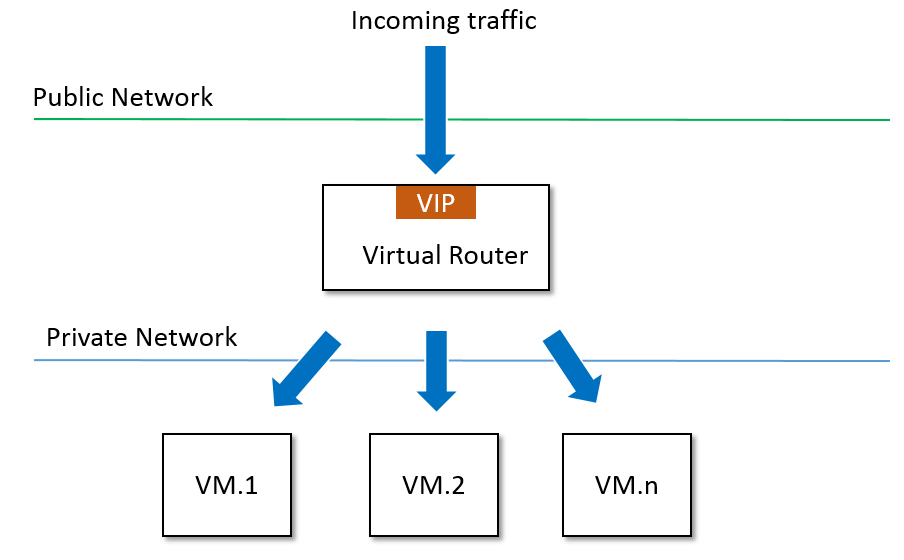
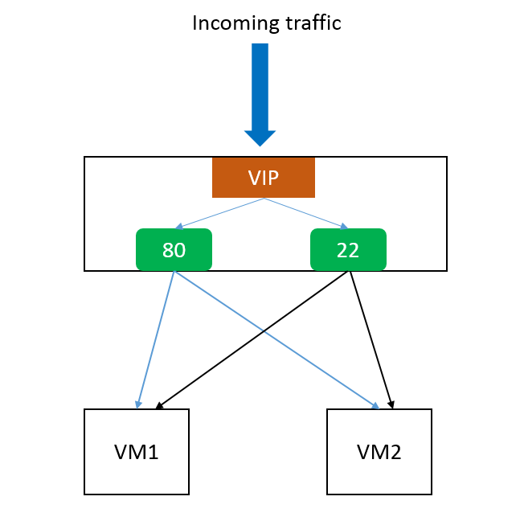

.. _lb:

=====================
动态负载均衡（Elastic Load Balancing）
=====================

.. contents:: `Table of contents`
   :depth: 6

--------
介绍
--------

动态负载均衡（Elastic Load Balancing）能自动的把访问用户应用的流量分发到预先设置的多个后端（Backend）云主机（虚拟机VM），来提供高可靠高并发的访问服务。
动态负载均衡可以自动探测用于分发的云主机的当前状态。它会将不可用的云主机（例如被用户停止、或是云主机宕机）从分发队列中移除，并可以在该云主机恢复正常功能后将其自动添加回来。

-------------
负载均衡
-------------

负载均衡使用一个 :ref:`VIP <vip>` 对外提供统一的IP地址。此外，它通过一个或者多个Listeners来定义负载均衡的属性：
负载均衡端口（instance port），负载均衡协议（protocol），健康检查配置（health-check configurations），以及用于分发的后端云主机网卡。

.. _load balancer inventory:

数据结构
=========

.. list-table::
   :widths: 20 40 10 20 10
   :header-rows: 1

   * - 变量名
     - 描述
     - 是否为和选项
     - 可选值
     - 最早支持版本
   * - **uuid**
     - 参见 :ref:`resource properties`
     -
     -
     - 0.9
   * - **name**
     - 参见 :ref:`resource properties`
     -
     -
     - 0.9
   * - **description**
     - 参见 :ref:`resource properties`
     - true
     -
     - 0.9
   * - **state**
     - reserved in 0.9 version, always Enabled
     -
     - - Enabled
       - Disabled
     - 0.9
   * - **vipUuid**
     - uuid of :ref:`VIP <vip>`
     -
     -
     - 0.9
   * - **listeners**
     - a list of :ref:`listener <load balancer listener>`
     -
     -
     - 0.9
   * - **createDate**
     - 参见 :ref:`resource properties`
     -
     -
     - 0.9
   * - **lastOpDate**
     - 参见 :ref:`resource properties`
     -
     -
     - 0.9

示例
=======

::

        {
            "listeners": [
                {
                    "createDate": "Aug 20, 2015 2:54:14 PM",
                    "instancePort": 80,
                    "lastOpDate": "Aug 20, 2015 2:54:14 PM",
                    "loadBalancerPort": 80,
                    "loadBalancerUuid": "0188cec6635845e0b2526a8e7e090e2a",
                    "name": "80",
                    "protocol": "http",
                    "uuid": "ba5f192472ab4fc4b36e5af873f0fec5",
                    "vmNicRefs": [
                        {
                            "createDate": "Aug 20, 2015 2:55:49 PM",
                            "id": 18,
                            "lastOpDate": "Aug 20, 2015 2:55:49 PM",
                            "listenerUuid": "ba5f192472ab4fc4b36e5af873f0fec5",
                            "status": "Active",
                            "vmNicUuid": "35b8aadef2f847d9836bdf06121e1c29"
                        },
                        {
                            "createDate": "Aug 20, 2015 2:55:49 PM",
                            "id": 19,
                            "lastOpDate": "Aug 20, 2015 2:55:49 PM",
                            "listenerUuid": "ba5f192472ab4fc4b36e5af873f0fec5",
                            "status": "Active",
                            "vmNicUuid": "df7d40a47cb640a9b40001f2f318989a"
                        }
                    ]
                },
                {
                    "createDate": "Aug 20, 2015 5:29:39 AM",
                    "instancePort": 22,
                    "lastOpDate": "Aug 20, 2015 5:29:39 AM",
                    "loadBalancerPort": 22,
                    "loadBalancerUuid": "0188cec6635845e0b2526a8e7e090e2a",
                    "name": "ssh",
                    "protocol": "tcp",
                    "uuid": "2901fd13765c492b9a3d004e806a0beb",
                    "vmNicRefs": [
                        {
                            "createDate": "Aug 20, 2015 5:30:07 AM",
                            "id": 15,
                            "lastOpDate": "Aug 20, 2015 5:30:07 AM",
                            "listenerUuid": "2901fd13765c492b9a3d004e806a0beb",
                            "status": "Active",
                            "vmNicUuid": "35b8aadef2f847d9836bdf06121e1c29"
                        },
                        {
                            "createDate": "Aug 20, 2015 5:30:07 AM",
                            "id": 16,
                            "lastOpDate": "Aug 20, 2015 5:30:07 AM",
                            "listenerUuid": "2901fd13765c492b9a3d004e806a0beb",
                            "status": "Active",
                            "vmNicUuid": "df7d40a47cb640a9b40001f2f318989a"
                        }
                    ]
                }
            ],
            "name": "lb",
            "state": "Enabled",
            "uuid": "0188cec6635845e0b2526a8e7e090e2a",
            "vipUuid": "df6a73601f1741fd847cf5456b0d42ac"
        }

.. _load balancer listener:

--------
Listener
--------

Listener定义了负载均衡应该如何处理发往VIP的网络包。它会设定将发往VIP某个端口（loadBalancerPort）的数据包分发到不同的后端云主机的端口（instancePort）。
Listener还定义了一些属性，例如连接超时，健康检查阀值等。

从用户的使用角度来说，Listener就是简单的定义了监听负载均衡IP的某个端口号，以及隐藏在私有网络上后端云主机用于接收的端口号。

负载均衡可以定义很多listeners，每个listener都可以设定不同的端口号。

此外，ZStack还通过系统标签（System Tags）定义了listener的额外属性：空闲连接超时，最大链接数，健康检查阀值，非健康监控阀值等。具体的细节可以看 :ref:`负载均衡系统标签 <load balancer system tags>`.

.. _load balancer listener inventory:

数据结构
=========

.. list-table::
   :widths: 20 40 10 20 10
   :header-rows: 1

   * - 变量名
     - 描述
     - 是否为和选项
     - 可选值
     - 最早支持版本
   * - **uuid**
     - 参见 :ref:`resource properties`
     -
     -
     - 0.9
   * - **name**
     - 参见 :ref:`resource properties`
     -
     -
     - 0.9
   * - **description**
     - 参见 :ref:`resource properties`
     - true
     -
     - 0.9
   * - **loadBalancerUuid**
     - load balancer uuid
     -
     -
     - 0.9
   * - **loadBalancerPort**
     - 前端端口号，数据到达VIP时的端口号。
     -
     - 1 ~ 65536
     - 0.9
   * - **instancePort**
     - 后端端口号，数据分发到云主机的端口号。
     -
     - 1 ~ 65336
     - 0.9
   * - **protocol**
     - 参见 :ref:`protocol <load balancer protocol>`
     -
     - - http
       - tcp
     - 0.9
   * - **vmNicRefs**
     - 参见 :ref:`nic reference <listener nic reference>`
     -
     -
     - 0.9
   * - **createDate**
     - 参见 :ref:`resource properties`
     -
     -
     - 0.9
   * - **lastOpDate**
     - 参见 :ref:`resource properties`
     -
     -
     - 0.9

.. _load balancer protocol:

协议
========

协议定义了负载均衡应该处理的数据包的类型。目前我们支持两种模式：tcp（网络第四层）和http（网络第七层）。其中tcp是默认的模式,
负载均衡会工作在纯粹的TCP模式，一个双向的链接会建立在客户端和服务器端之间。当设置协议为http时，从客户端到负载均衡，以及负载均衡到服务器端都会建立对应的链接。

示例
=======

::

    {
        "createDate": "Aug 20, 2015 2:54:14 PM",
        "instancePort": 80,
        "lastOpDate": "Aug 20, 2015 2:54:14 PM",
        "loadBalancerPort": 80,
        "loadBalancerUuid": "0188cec6635845e0b2526a8e7e090e2a",
        "name": "80",
        "protocol": "http",
        "uuid": "ba5f192472ab4fc4b36e5af873f0fec5",
        "vmNicRefs": [
            {
                "createDate": "Aug 20, 2015 2:55:49 PM",
                "id": 18,
                "lastOpDate": "Aug 20, 2015 2:55:49 PM",
                "listenerUuid": "ba5f192472ab4fc4b36e5af873f0fec5",
                "status": "Active",
                "vmNicUuid": "35b8aadef2f847d9836bdf06121e1c29"
            },
            {
                "createDate": "Aug 20, 2015 2:55:49 PM",
                "id": 19,
                "lastOpDate": "Aug 20, 2015 2:55:49 PM",
                "listenerUuid": "ba5f192472ab4fc4b36e5af873f0fec5",
                "status": "Active",
                "vmNicUuid": "df7d40a47cb640a9b40001f2f318989a"
            }
        ]
    },

---------------
后端云主机网卡
---------------

用户可以把一个新的云主机添加到负载均衡的队列中来。一旦一个网卡的UUID被添加，它就会遵循负载均衡对应的算法在合适的时间被调度。
一块网卡可以添加到不同的负载均衡的不同的listener上。当然不论添加多少listener，该网卡所在的云主机应该配置有处理相应网络请求的能力。

负载均衡listener通过调用 *nic reference* 来添加对应的云主机：

.. _listener nic reference:

Nic Reference 数据结构
=======================

.. list-table::
   :widths: 20 40 10 20 10
   :header-rows: 1

   * - 变量名
     - 描述
     - 是否为和选项
     - 可选值
     - 最早支持版本
   * - **id**
     - Nic Reference的uuid
     -
     -
     - 0.9
   * - **listenerUuid**
     - listener uuid
     -
     -
     - 0.9
   * - **vmNicUuid**
     - VM nic uuid
     -
     -
     - 0.9
   * - **status**
     - 当网卡所在云主机为运行的时候，状态是active，否则是inactive
     -
     - - Active
       - Inactive
     - 0.9

当一个网卡加入了负载均衡listener之后，停止云主机会把Nic Reference的状态改成 *Inactive*; 启动云主机后会改变该状态为 *Active*; 删除云主机会把对应的NIC从listener中移除。

--------------
完整示例
--------------

假定用户需要创建一个负载均衡器，该负载均衡器会把访问公网IP 80端口和22端口的数据包重定向到后端的两台云主机上。

.. list-table::
   :widths: 50 50
   :header-rows: 1

   * - **Public L3 Network UUID**
     - 参见 :ref:`resource properties`
   * - **VM1 nic UUId**
     - 35b8aadef2f847d9836bdf06121e1c29
   * - **VM2 nic UUID**
     - df7d40a47cb640a9b40001f2f318989a

**创建a VIP**

::
    >>>CreateVip l3NetworkUuid=db6379182e524c06bc8d3ec900ab78d4

**创建LB**

::
    >>>CreateLoadBalancer name=lb vipUuid=df6a73601f1741fd847cf5456b0d42ac

**创建listeners**

::

    CreateLoadBalancerListener loadBalancerUuid=0188cec6635845e0b2526a8e7e090e2a loadBalancerPort=22 instancePort=22 name=ssh protocol=tcp

::

    CreateLoadBalancerListener loadBalancerUuid=0188cec6635845e0b2526a8e7e090e2a loadBalancerPort=80 instancePort=80 name=80 protocol=http

**添加nics到listeners**

::

    >>>AddVmNicToLoadBalancer listenerUuid=2901fd13765c492b9a3d004e806a0beb vmNicUuids=35b8aadef2f847d9836bdf06121e1c29,df7d40a47cb640a9b40001f2f318989a

::

    >>>AddVmNicToLoadBalancer listenerUuid=4be2244667d948e286722a4a32e02e65 vmNicUuids=35b8aadef2f847d9836bdf06121e1c29,df7d40a47cb640a9b40001f2f318989a

----------
操作
----------

创建Load Balancer
====================

用户能够使用CreateLoadBalancer来创建一个负载均衡器。例如：

    >>>CreateLoadBalancer name=lb vipUuid=df6a73601f1741fd847cf5456b0d42ac

参数
----------

.. list-table::
   :widths: 20 40 10 20 10
   :header-rows: 1

   * - 变量名
     - 描述
     - 是否为和选项
     - 可选值
     - 最早支持版本
   * - **name**
     - 资源名，参见 :ref:`resource properties`
     -
     -
     - 0.9
   * - **resourceUuid**
     - 资源uuid，参见 :ref:`create resource`
     - true
     -
     - 0.9
   * - **description**
     - 资源描述，参见 :ref:`resource properties`
     - true
     -
     - 0.9
   * - **vipUuid**
     - VIP uuid
     -
     -
     - 0.9
   * - **userTags**
     - 用户标签， 参见 :ref:`create tags` 中的资源类型
     - true
     -
     - 0.9
   * - **systemTags**
     - 系统标签，参见 :ref:`create tags` 中的资源类型
     - true
     -
     - 0.9

Delete Load Balancer
====================

用户可以使用DeleteLoadBalancer 来删除一个负载均衡器。例如：

    >>>DeleteLoadBalancer uuid=4be2244667d948e286722a4a32e02e65

参数
----------

.. list-table::
   :widths: 20 40 10 20 10
   :header-rows: 1

   * - 变量名
     - 描述
     - 是否为和选项
     - 可选值
     - 最早支持版本
   * - **deleteMode**
     - 参见 :ref:`delete resource`
     - true
     - - Permissive
       - Enforcing
     - 0.9
   * - **uuid**
     - load balancer uuid
     -
     -
     - 0.9

创建Listener
===============

用户可以使用CreateLoadBalancerListener 来创建一个负载均衡listener。例如：

    CreateLoadBalancerListener loadBalancerUuid=0188cec6635845e0b2526a8e7e090e2a loadBalancerPort=22 instancePort=22 name=ssh protocol=tcp

参数
----------

.. list-table::
   :widths: 20 40 10 20 10
   :header-rows: 1

   * - 变量名
     - 描述
     - 是否为和选项
     - 可选值
     - 最早支持版本
   * - **name**
     - 资源名， 参见 :ref:`resource properties`
     -
     -
     - 0.9
   * - **resourceUuid**
     - 资源uuid， 参见 :ref:`create resource`
     - true
     -
     - 0.9
   * - **description**
     - 资源描述， 参见 :ref:`resource properties`
     - true
     -
     - 0.9
   * - **loadBalancerUuid**
     - load balancer uuid
     -
     -
     - 0.9
   * - **loadBalancerPort**
     - 前端（frontend） 负载均衡端口
     -
     -
     - 0.9
   * - **instancePort**
     - 后端云主机端口。如果缺失，默认使用前端负载均衡端口。
     - true
     -
     - 0.9
   * - **protocol**
     - 参见 :ref:`load balancer protocol <load balancer protocol>`
     -
     - - tcp
       - http
     - 0.9
   * - **userTags**
     - 用户标签，参见 :ref:`create tags` 中的资源类型
     - true
     -
     - 0.9
   * - **systemTags**
     - 系统标签，参见 :ref:`create tags` 中的资源类型
     - true
     -
     - 0.9

删除Listener
===============

用户可以使用DeleteLoadBalancerListener来删除一个listener。例如：

    >>DeleteLoadBalancerListener uuid=0188cec6635845e0b2526a8e7e090e2a

参数
----------

.. list-table::
   :widths: 20 40 10 20 10
   :header-rows: 1

   * - 变量名
     - 描述
     - 是否为和选项
     - 可选值
     - 最早支持版本
   * - **deleteMode**
     - 参见 :ref:`delete resource`
     - true
     - - Permissive
       - Enforcing
     - 0.9
   * - **uuid**
     - listener uuid
     -
     -
     - 0.9

Add VM Nic to Load Balancer
===========================

用户可以使用AddVmNicToLoadBalancer 来添加云主机到一个负载均衡中来。例如：

     >>>AddVmNicToLoadBalancer listenerUuid=2901fd13765c492b9a3d004e806a0beb vmNicUuids=35b8aadef2f847d9836bdf06121e1c29,df7d40a47cb640a9b40001f2f318989a

参数
----------

.. list-table::
   :widths: 20 40 10 20 10
   :header-rows: 1

   * - 变量名
     - 描述
     - 是否为和选项
     - 可选值
     - 最早支持版本
   * - **listenerUuid**
     - listener uuid
     -
     -
     - 0.9
   * - **vmNicUuids**
     - 一组云主机网卡的uuid
     -
     -
     - 0.9

从负载均衡中删除云主机网卡
================================

用户可以使用RemoveVmNicFromLoadBalancer 来把一些云主机的网卡从负载均衡器中删除。例如：

     >>>RemoveVmNicFromLoadBalancer listenerUuid=2901fd13765c492b9a3d004e806a0beb vmNicUuids=35b8aadef2f847d9836bdf06121e1c29,df7d40a47cb640a9b40001f2f318989a

参数
----------

.. list-table::
   :widths: 20 40 10 20 10
   :header-rows: 1

   * - 变量名
     - 描述
     - 是否为和选项
     - 可选值
     - 最早支持版本
   * - **listenerUuid**
     - listener uuid
     -
     -
     - 0.9
   * - **vmNicUuids**
     - 一组云主机网卡的uuid
     -
     -
     - 0.9

查询负载均衡
===================

用户可以使用QueryLoadBalancer来查询任意的负载均衡器。例如：

    >>>QueryLoadBalancer name=lb

::

    >>>QueryLoadBalancer listeners.vmNic.vmInstance.name=web

Primitive Fields of Query
-------------------------

参见 :ref:`load balancer inventory <load balancer inventory>`

Nested And Expanded Fields of Query
-----------------------------------

.. list-table::
   :widths: 20 30 40 10
   :header-rows: 1

   * - Field
     - 数据结构
     - 描述
     - 最早支持版本
   * - **listeners**
     - 参见 :ref:`load balancer listener inventory <load balancer listener inventory>`
     - child listeners
     - 0.9
   * - **vip**
     - 参见 :ref:`vip inventory <vip inventory>`
     - bound VIP
     - 0.9

Query Listener
==============

用户可以使用QueryLoadBalancerListener 来查询任意lisenter。例如：

    >>>QueryLoadBalancerListener loadBalancerPort=80

::

    >>>QueryLoadBalancerListener loadBalancer.vip.ip=192.168.0.10

Primitive Fields of Query
-------------------------

参见 :ref:`load balancer listener inventory <load balancer listener inventory>`

Nested And Expanded Fields of Query
-----------------------------------

.. list-table::
   :widths: 20 30 40 10
   :header-rows: 1

   * - Field
     - 数据结构
     - 描述
     - 最早支持版本
   * - **loadBalancer**
     - 参见 :ref:`load balancer inventory <load balancer inventory>`
     - parent load balancer
     - 0.9
   * - **vmNic**
     - 参见 :ref:`vm nic inventory <vm nic inventory>`
     - joined VM nics
     - 0.9

----
标签
----

用户可以给一个负载均衡器创建一个用户标签。例如:

    CreateUserTag tag=web-lb resourceUuid=0a9f95a659444848846b5118e15bff32 resourceType=LoadBalancerVO

用户可以给一个负载均衡的listener创建一个用户标签。例如:

    CreateUserTag tag=web-lb-80 resourceUuid=0a9f95a659444848846b5118e15bff32 resourceType=LoadBalancerListenerVO

.. _load balancer system tags:

系统标签
===========

独立的虚拟路由器(Virtual Router)
-----------------------

在ZStack 0.9版本里，负载均衡服务是由虚拟路由器提供的。通常用户仅需要一个虚拟路由器来提供各自服务，例如SNAT，动态IP，端口转发和负载均衡等。
如果用户对负载均衡有更高的要求，ZStack也可以单独创建只提供负载均衡服务的虚拟路由虚拟机。

.. list-table::
   :widths: 20 60 20
   :header-rows: 1

   * - 标签
     - 示例
     - 起始版本
   * - **separateVirtualRouterVm**
     - separateVirtualRouterVm
     - 0.9

::

    >>>CreateLoadBalancer name=lb vipUuid=df6a73601f1741fd847cf5456b0d42ac systemTags=separateVirtualRouterVm

Listener 配置
-----------------------

负载均衡listener拥有一组可以控制行为、可配置的系统标签，例如，最大连接数量、空闲连接超时、负载均衡算法等等。用户创建listener的时候，ZStack会设置一组默认值。
用户也可以根据需求更改配置。

.. _healthyThreshold:

健康检查阀值（Healthy Threshold）
+++++++++++++++++

连续通过健康检查的最少次数，用于判断新添加云主机的健康度。

.. list-table::
   :widths: 20 60 20
   :header-rows: 1

   * - 标签
     - 示例
     - 起始版本
   * - **healthyThreshold::{healthyThreshold}**
     - healthyThreshold::2
     - 0.9

.. _healthCheckInterval:

健康检查的间隔时间
+++++++++++++++++++++

最大健康检查的间隔时间（秒）。

.. list-table::
   :widths: 20 60 20
   :header-rows: 1

   * - 标签
     - 示例
     - 起始版本
   * - **healthCheckInterval::{healthCheckInterval}**
     - healthCheckInterval::5
     - 0.9

.. _unhealthyThreshold:

非健康检查阀值（Unhealthy Threshold）
+++++++++++++++++++

连续不通过健康检查的最少次数，用于判断是否要把对应的云主机设定为非健康状态。

.. list-table::
   :widths: 20 60 20
   :header-rows: 1

   * - 标签
     - 示例
     - 起始版本
   * - **unhealthyThreshold::{unhealthyThreshold}**
     - unhealthyThreshold::2
     - 0.9

.. _connectionIdleTimeout:

空闲连接超时（Connection Idle Timeout）
+++++++++++++++++++++++

最大关闭空闲连接的超时时间（秒），包括客户端和服务端任意方向的连接。

.. list-table::
   :widths: 20 60 20
   :header-rows: 1

   * - 标签
     - 示例
     - 起始版本
   * - **connectionIdleTimeout::{connectionIdleTimeout}**
     - 60
     - 0.9

.. _maxConnection:

最大允许连接数量（Max Connections）
+++++++++++++++

最大允许的并发连接数量。

.. list-table::
   :widths: 20 60 20
   :header-rows: 1

   * - 标签
     - 示例
     - 起始版本
   * - **maxConnection::{maxConnection}**
     - maxConnection::5000
     - 0.9

.. _balancerAlgorithm:

负载均衡算法（Balancing Algorithm）
+++++++++++++++++++

负载均衡算法可以对网络包设定不同的路由规则。目前支持的算法有： roundrobin, leastconn, source

.. list-table::
   :widths: 20 60 20
   :header-rows: 1

   * - 标签
     - 示例
     - 起始版本
   * - **balancerAlgorithm::{balancerAlgorithm}**
     - balancerAlgorithm::leastconn
     - 0.9

::

    CreateLoadBalancerListener loadBalancerUuid=0188cec6635845e0b2526a8e7e090e2a loadBalancerPort=22 instancePort=22 name=ssh protocol=tcp
    systemTags=maxConnection::10000,balancerAlgorithm::source,healthyThreshold::5

---------------------
全局配置参数
---------------------

空闲连接超时
=======================

系统标签的默认值 :ref:`Connection Idle Timeout <connectionIdleTimeout>`.

.. list-table::
   :widths: 20 30 20 30
   :header-rows: 1

   * - Name
     - Category
     - Default Value
     - Choices
   * - **connectionIdleTimeout**
     - loadBalancer
     - 60
     -

健康检查阀值
=================

系统标签的默认值 :ref:`Healthy Threshold <healthyThreshold>`.

.. list-table::
   :widths: 20 30 20 30
   :header-rows: 1

   * - Name
     - Category
     - Default Value
     - Choices
   * - **healthyThreshold**
     - loadBalancer
     - 2
     -

非健康监控阀值
===================

系统标签的默认值 :ref:`Unhealthy Threshold <unhealthyThreshold>`.

.. list-table::
   :widths: 20 30 20 30
   :header-rows: 1

   * - Name
     - Category
     - Default Value
     - Choices
   * - **unhealthyThreshold**
     - loadBalancer
     - 2
     -

健康检查间隔时间
=====================

系统标签的默认值 :ref:`Health Check Interval <healthCheckInterval>`.

.. list-table::
   :widths: 20 30 20 30
   :header-rows: 1

   * - Name
     - Category
     - Default Value
     - Choices
   * - **healthCheckInterval**
     - loadBalancer
     - 5
     -

最大连接数量
==============

系统标签的默认值 :ref:`Max Connection <maxConnection>`.

.. list-table::
   :widths: 20 30 20 30
   :header-rows: 1

   * - Name
     - Category
     - Default Value
     - Choices
   * - **maxConnection**
     - loadBalancer
     - 5000
     -

负载均衡算法
===================

系统标签的默认值 :ref:`Balancing Algorithm <balancerAlgorithm>`.

.. list-table::
   :widths: 20 30 20 30
   :header-rows: 1

   * - Name
     - Category
     - Default Value
     - Choices
   * - **balancerAlgorithm**
     - loadBalancer
     - roundrobin
     - - roundrobin
       - leastconn
       - source

