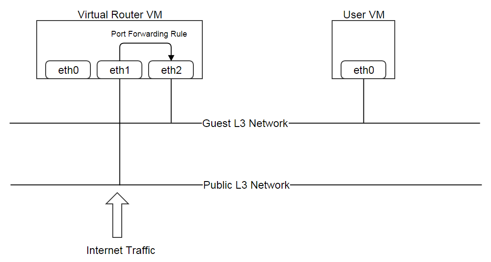
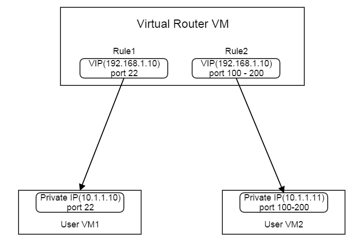

.. _port forwarding:

=======================
弹性端口转发（Elastic Port Forwarding）
=======================

.. contents:: `目录`
   :depth: 6

--------
概览（Overview）
--------

当用户虚拟机在一个启用了SNAT服务的:ref:`private network or isolated network <l3Network typology>`上时, 他们可以访问外部网络但是不能被外部网络访问到, 这也正是SNAT所定义的功能. 
用户可以创建端口转发规则（port forwarding rules）从而允许外部网络访问SNAT后面的虚拟机的某些特定端口. ZStack支持弹性端口转发规则（elastic port forwarding rules）,
也就是说这些规则可以按需的挂载到虚拟机上，或从虚拟机卸载.

由于虚拟路由器模块是当前ZStack版本的唯一一个网络服务模块（network service provider）, 端口转发规则实际上是创建于虚拟路由器虚拟机的公有网络和客户网络之间的.

一个VIP可以在多个端口转发规则中使用, 只要这些规则的端口范围没有重叠; 例如:

.. _port forwarding rule inventory:

------------------------------
端口转发规则清单（Port Forwarding Rule Inventory）
------------------------------

属性（Properties）
==========

.. list-table::
   :widths: 20 40 10 20 10
   :header-rows: 1

   * - 名字
     - 描述
     - 可选的
     - 可选的参数值
     - 起始支持版本
   * - **uuid**
     - 请参见 :ref:`resource properties`
     -
     -
     - 0.6
   * - **name**
     - 请参见 :ref:`resource properties`
     -
     -
     - 0.6
   * - **description**
     - 请参见 :ref:`resource properties`
     - 是
     -
     - 0.6
   * - **vipIp**
     - VIP的IP地址
     -
     -
     - 0.6
   * - **guestIp**
     - 虚拟机网卡的IP地址
     - 是
     -
     - 0.6
   * - **vipUuid**
     - VIP的uuid
     -
     -
     - 0.6
   * - **vipPortStart**
     - VIP的起始端口号
     -
     - 1 ~ 65535
     - 0.6
   * - **vipPortEnd**
     - VIP的结束端口号
     -
     - 1 ~ 65535
     - 0.6
   * - **privatePortStart**
     - 客户IP的起始端口号
     -
     - 1 ~ 65535
     - 0.6
   * - **privatePortEnd**
     - 客户IP的结束端口号
     -
     - 1 ~ 65535
     - 0.6
   * - **vmNicUuid**
     - 客户虚拟机网卡的uuid
     - 是
     -
     - 0.6
   * - **protocolType**
     - 网络流量的协议类型
     -
     - - TCP
       - UDP
     - 0.6
   * - **state**
     - 规则可用状态, 当前版本中未实现
     -
     - - Enabled
       - Disabled
     - 0.6
   * - **allowedCidr**
     - 源CIDR; 端口转发规则只作用于源CIDR的流量
     -
     -
     - 0.6
   * - **createDate**
     - 请参见 :ref:`resource properties`
     -
     -
     - 0.6
   * - **lastOpDate**
     - 请参见 :ref:`resource properties`
     -
     -
     - 0.6

示例
=======

::

        {
            "allowedCidr": "0.0.0.0/0",
            "createDate": "Dec 6, 2015 3:04:34 PM",
            "guestIp": "10.0.0.244",
            "lastOpDate": "Dec 6, 2015 3:04:34 PM",
            "name": "pf-9uf4",
            "privatePortEnd": 33,
            "privatePortStart": 33,
            "protocolType": "TCP",
            "state": "Enabled",
            "uuid": "310a6cd618144ca683d78d74307f16a4",
            "vipIp": "192.168.0.187",
            "vipPortEnd": 33,
            "vipPortStart": 33,
            "vipUuid": "433769b59a7c42199d762af01e08ec16",
            "vmNicUuid": "4b9c27321b794679a9ba8c18239bbb0d"
        }

----------
操作（Operations）
----------

创建端口转发规则（Create Port Forwarding Rule）
===========================

用户可以使用CreatePortForwardingRule来创建一个端口转发规则, 并可以同时挂载或者不挂载到虚拟机网卡上. 例如::

    CreatePortForwardingRule name=pf1 vipPortStart=22 vipUuid=433769b59a7c42199d762af01e08ec16 protocolType=TCP vmNicUuid=4b9c27321b794679a9ba8c18239bbb0d

一个未被挂载的规则可以稍后再挂载到虚拟机网卡上.

参数（Parameters）
++++++++++

.. list-table::
   :widths: 20 40 10 20 10
   :header-rows: 1

   * - 名字
     - 描述
     - 可选的
     - 可选的参数值
     - 起始支持版本
   * - **name**
     - 资源的名字, 请参见 :ref:`resource properties`
     -
     -
     - 0.6
   * - **resourceUuid**
     - 资源的uuid, 请参见 :ref:`create resource`
     - 是
     -
     - 0.6
   * - **description**
     - 资源的描述, 请参见 :ref:`resource properties`
     - 是
     -
     - 0.6
   * - **vipUuid**
     - VIP的UUID
     -
     -
     - 0.6
   * - **vipPortStart**
     - VIP的起始端口号
     -
     - 1 - 65535
     - 0.6
   * - **vipPortEnd**
     - VIP的结束端口号; 如果忽略不设置, 会默认设置为vipPortStart.
     - 是
     - 1 - 65535
     - 0.6
   * - **privatePortStart**
     - 客户IP（虚拟机网卡的IP地址）的起始端口号; 如果忽略不设置, 会默认设置为vipPortStart
     - 是
     - 1 - 65535
     - 0.6
   * - **privatePortEnd**
     - 客户IP（虚拟机网卡的IP地址）的结束端口号; 如果忽略不设置, 会默认设置为vipPortEnd
     - 是
     - 1 - 65535
     - 0.6
   * - **protocolType**
     - 网络流量协议类型
     -
     - - TCP
       - UDP
     - 0.6
   * - **vmNicUuid**
     - 该端口转发规则将要挂载的虚拟机网卡的uuid
     - 是
     -
     - 0.6
   * - **allowedCidr**
     - 源CIDR; 端口转发规则只作用于源CIDR的流量; 如果忽略不设置, 会默认设置为to 0.0.0.0/0
     - 是
     -
     - 0.6

删除端口转发规则（Delete Port Forwarding Rule）
===========================

用户可以使用DeletePortForwardingRule来删除端口转发规则. 例如::

    DeletePortForwardingRule uuid=310a6cd618144ca683d78d74307f16a4

如果没有端口转发规则还绑定在VIP上, VIP将被循环使用在其他的网络服务中.

参数（Parameters）
++++++++++

.. list-table::
   :widths: 20 40 10 20 10
   :header-rows: 1

   * - 名字
     - 描述
     - 可选的
     - 可选的参数值
     - 起始支持版本
   * - **deleteMode**
     - 请参见 :ref:`delete resource`
     - 是
     - - Permissive
       - Enforcing
     - 0.6
   * - **uuid**
     - 规则的uuid
     -
     -
     - 0.6

挂载端口转发规则（Attach Port Forwarding Rule）
===========================

用户可以使用AttachPortForwardingRule来挂载一个规则到虚拟机网卡上. 例如::

    AttachPortForwardingRule ruleUuid=310a6cd618144ca683d78d74307f16a4 vmNicUuid=4b9c27321b794679a9ba8c18239bbb0d

参数（Parameters）
++++++++++

.. list-table::
   :widths: 20 40 10 20 10
   :header-rows: 1

   * - 名字
     - 描述
     - 可选的
     - 可选的参数值
     - 起始支持版本
   * - **ruleUuid**
     - 规则的uuid
     -
     -
     - 0.6
   * - **vmNicUuid**
     - 虚拟机网卡的uuid
     -
     -
     - 0.6

卸载端口转发规则（Detach Port Forwarding Rule）
===========================

用户可以使用DetachPortForwardingRule来从一个虚拟机网卡卸载一个规则. 例如::

    DetachPortForwardingRule uuid=310a6cd618144ca683d78d74307f16a4

参数（Parameters）
++++++++++

.. list-table::
   :widths: 20 40 10 20 10
   :header-rows: 1

   * - 名字
     - 描述
     - 可选的
     - 可选的参数值
     - 起始支持版本
   * - **uuid**
     - 规则的uuid
     -
     -
     - 0.6

查询端口转发规则（Query Port Forwarding Rule）
==========================

用户可以使用QueryPortForwardingRule来查询规则. 例如::

    QueryPortForwardingRule vipPortStart=22 vipIp=17.200.20.6

::

    QueryPortForwardingRule vmNic.l3Network.name=database-tier

原生域（Primitive Fields）
++++++++++++++++

请参见 :ref:`port forwarding rule inventory <port forwarding rule inventory>`

嵌套和扩展域（Nested And Expanded Fields）
++++++++++++++++++++++++++

.. list-table::
   :widths: 20 30 40 10
   :header-rows: 1

   * - 域（Field）
     - 清单（Inventory）
     - 描述
     - 起始支持版本
   * - **vip**
     - :ref:`VIP inventory <vip inventory>`
     - 该规则绑定的VIP
     - 0.6
   * - **vmNic**
     - :ref:`VM nic inventory <vm nic inventory>`
     - 该规则绑定的虚拟机网卡
     - 0.6

---------------------
全局配置（Global Configurations）
---------------------

.. _portForwarding.snatInboundTraffic:

snatInboundTraffic
==================

.. list-table::
   :widths: 20 30 20 30
   :header-rows: 1

   * - 名字
     - 类别
     - 默认值
     - 可选的参数值
   * - **snatInboundTraffic**
     - portForwarding
     - false
     - - true
       - false

该配置决定是否对端口转发规则的流入流量使用源NAT. 如果设置为true, 到达portForwardingRule.guestIp的流量会使用portForwardingRule.vipIp作为源IP（source IP）; 这在一个虚拟机上挂载了多个端口转发规则的时候比较有用; 它会强制虚拟机通过VIP回复流入的流量至数据包的来源, 而不是通过默认路由来回复.

----
标签（Tags）
----

用户可以使用resourceType=PortForwardingRuleVO在端口转发上创建用户标签. 例如::

    CreateUserTag resourceType=PortForwardingRuleVO tag=ssh-rule resourceType=e960a93b7f974690bb779808f3c12a33
