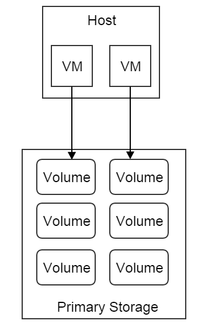
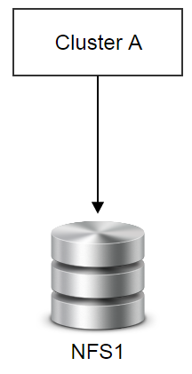
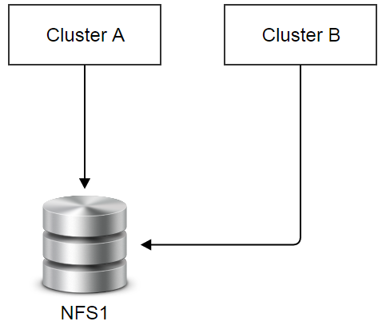
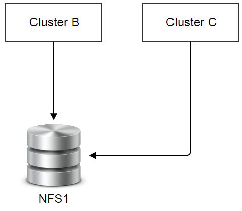
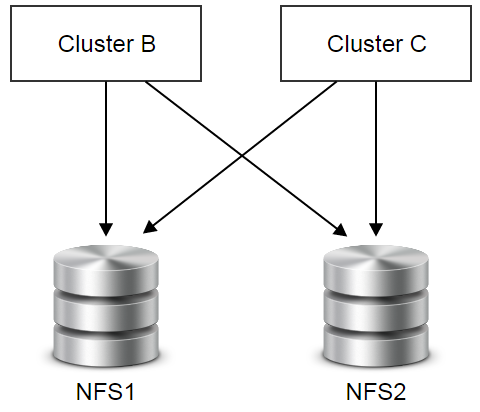

.. _primary storage:

===============
主存储（Primary Storage）
===============

.. contents:: `目录`
   :depth: 6

--------
概览（Overview）
--------

主存储是数据中心里为虚拟机提供磁盘云盘的存储系统. 主存储可以是本地磁盘（local disks，例如主机的硬盘) 或者网络共享存储（network shared storage, 例如NAS, SAN ).

挂载了主存储的集群中的虚拟机的云盘存储在该主存储上.

主存储只能挂载到同一个区域（zone）中的集群上.

.. 注意:: ZStack当前版本仅支持NFS作为主存储

.. _primary storage inventory:

---------
清单（Inventory）
---------

属性（Properties）
==========

.. list-table::
   :widths: 20 40 10 20 10
   :header-rows: 1

   * - 名字
     - 描述
     - 可选的
     - 可选的参数值
     - 起始支持版本
   * - **uuid**
     - 请参见 :ref:`resource properties`
     -
     -
     - 0.6
   * - **name**
     - 请参见 :ref:`resource properties`
     -
     -
     - 0.6
   * - **description**
     - 请参见 :ref:`resource properties`
     - 是
     -
     - 0.6
   * - **zoneUuid**
     - 父区域的uuid, 请参见 :ref:`zone <zone>`
     -
     -
     - 0.6
   * - **totalCapacity**
     - 磁盘总容量, 单位为字节, 请参见 :ref:`capacity <primary storage capacity>`
     -
     -
     - 0.6
   * - **availableCapacity**
     - 可用磁盘空间, 单位为字节, 请参见 :ref:`capacity <primary storage capacity>`
     -
     -
     - 0.6
   * - **url**
     - 请参见 :ref:`url <primary storage url>`
     -
     -
     - 0.6
   * - **type**
     - 主存储类型
     -
     - - NFS
     - 0.6
   * - **state**
     - 请参见 :ref:`state <primary storage state>`
     -
     - - Enabled
       - Disabled
     - 0.6
   * - **status**
     - 请参见 :ref:`status <primary storage status>`
     -
     - - Connecting
       - Connected
       - Disconnected
     - 0.6
   * - **attachedClusterUuids**
     - 主存储已经挂载了的集群uuid列表, 请参见 :ref:`attach cluster <primary storage attached cluster>`
     -
     -
     - 0.6
   * - **createDate**
     - 请参见 :ref:`resource properties`
     -
     -
     - 0.6
   * - **lastOpDate**
     - 请参见 :ref:`resource properties`
     -
     -
     - 0.6

示例
=======

::

    {
      "inventory": {
        "uuid": "f4ac0a3119c94c6fae844c2298615d27",
        "zoneUuid": "f04caf351c014aa890126fc78193d063",
        "name": "nfs",
        "url": "192.168.0.220:/storage/nfs",
        "description": "Test Primary Storage",
        "totalCapacity": 10995116277768819,
        "availableCapacity": 10995162768,
        "type": "NFS",
        "state": "Enabled",
        "mountPath": "/opt/zstack/f4ac0a3119c94c6fae844c2298615d27",
        "createDate": "Jun 1, 2015 2:42:51 PM",
        "lastOpDate": "Jun 1, 2015 2:42:51 PM",
        "attachedClusterUuids": [
          "f23e402bc53b4b5abae87273b6004016",
          "4a1789235a86409a9a6db83f97bc582f",
          "fe755538d4e845d5b82073e4f80cb90b",
          "1f45d6d6c02b43bfb6196dcacb5b8a25"
        ]
      }
    }

.. _primary storage capacity:

容量（Capacity）
++++++++

为了方便选择合适的主存储创建云盘, ZStack会监控主存储的容量. 不同的主存储插件可能会汇报不同的磁盘容量;
例如, 对于支持超分（over-provisioning）的主存储, 汇报的存储容量会比实际的大;
对于不支持超分的主存储, 汇报的存储容量可能会小于或等于实际的大小.

NFS容量（NFS Capacity）
------------

NFS不支持超分, 因此它的容量是用云盘的虚拟大小（volumes' virtual sizes）根据以下公式计算出来的::

    总容量 = NFS的总容量
    可用容量 = 总容量 - sum(云盘的虚拟大小)

云盘的虚拟大小会在 :ref:`volume <volume>`章节中介绍; 简单的说, 云盘的虚拟大小就是当云盘被完全填满时的大小; 
例如, 当你创建一个1G容量的云盘时, 在它被真正完全填满数据之前, 可能会因为使用了thin-provisioning技术而实际只占用了10M的容量.

.. _primary storage url:

统一资源定位符（URL）
+++

主存储需要使用URL字符串存储的信息来控制存储系统. 虽然名字叫URL, 具体的字符串存储格式依据主存储的类型而定，并不完全等同于标准的URL规范, 这样可以给插件更多的灵活性以存储一些不方便以URL格式存储的信息.

NFS主存储URL
-------

对于NFS主存储, URL被编码为下面的格式::

    nfs服务器的ip或域名:/目录的绝对路径

例如::

    192.168.0.220:/storage/nfs/

.. _primary storage state:

可用状态（State）
=====

主存储有两种可用状态:

- ** Enabled**:

  启用（Enabled）状态下，允许云盘被创建

- **Disabled**:

  禁用（Disabled）状态下，不允许云盘被创建

.. _primary storage status:

连接状态（Status）
======

类似于 :ref:`host status <host status>`, 主存储的连接状态反应了管理节点和主存储之间的命令通道的状态. 命令通道是管理节点和主存储所代表的存储系统通信的途径;
根据主存储类型的不同命令通道也可以不同, 例如, 命令通道可以是ZStack管理节点和主存储之间的HTTP连接或者存储SDK（storage SDKs）提供的通信方法.

 有三种连接状态:

- **Connecting**:

  在这种状态时，一个ZStack管理节点正在尝试建立自己和主存储之间的命令通道. 这时还不能在主存储上执行任何操作.

- **Connected**

  在这种状态时，ZStack管理节点和主存储之间的命令通道已经被成功建立. 可以在主存储上执行操作.

- **Disconnected**

  在这种状态时，ZStack管理节点和主存储之间的命令通道丢失. 这时不能在主存储上执行任何操作.

在ZStack管理节点启动过程中会开始和主存储建立命令通道，并且会在运行中周期性的向主存储发送ping命令（ping commands）以检查命令通道的健康状态;
一旦某个主存储响应失败, 或者ping命令超时，主存储的连接状态就会变为Disconnected.

.. 注意:: ZStack会持续的向断开连接的主存储发送ping命令. 一旦主存储恢复并响应ping命令, ZStack会重新建立命令通道并改变主存储为Connected状态
          因此，如果一个主存储已经从云中移除, 请记得将它从ZStack中删除，否则ZStack管理节点会一直尝试ping它.

主存储的连接状态转换图如下:

.. image:: primary-storage-status.png
   :align: center

可用状态（State）和连接状态（Status）
================

可用状态和连接状态之间没有直接关系. 可用状态代表了管理员针对主存储的意愿, 而连接状态代表了主存储的通信状况.

.. _primary storage attached cluster:

挂载集群（Attaching Cluster）
=================

挂载集群是将主存储和兄弟集群（sibling clusters）关联, 从而提供了一种灵活的方式维护主机和存储系统在实际数据中心里的关系.
我们来看一个实际的例子; 假设有一个集群(集群A)挂载了一个NFS主存储 (NFS1), 如下图所示:

一段时间后, 集群A内存耗尽但主存储还有足够的磁盘空间,
所以你决定添加另外一个使用NFS1的集群（集群B）; 那么你可以创建一个集群B, 然后将NFS1挂载在集群B上.

又运行一段时间之后, 集群A的硬件可能开始变得过时，因此你决定停止使用他们; 你添加了一个新的更加强大的集群（集群C）, 挂载到NFS1上, 然后将所有集群A中的主机设置为维护模式（maintenance mode）, 这样所有之前运行在集群A中的虚拟机都会被迁移到集群B或集群C; 最后, 你可以将NFS1从集群A卸载，然后删除集群A.现在，数据中心看起来像这样:

最后如果NFS1容量不够用了, 你可以添加另外一个主存储（NFS2）, 并加载到集群B和集群C上.

----------
操作（Operations）
----------

添加主存储（Add Primary Storage）
===================

不同主存储类型，添加的命令不同.

添加NFS主存储（Add NFS Primary Storage）
+++++++++++++++++++++++

管理员可以使用AddNfsPrimaryStorage添加一个NFS主存储. 例如::

    AddNfsPrimaryStorage name=nfs1 zoneUuid=1b830f5bd1cb469b821b4b77babfdd6f url=192.168.0.220:/storage/nfs

属性（Properties）
----------

.. list-table::
   :widths: 20 40 10 20 10
   :header-rows: 1

   * - 名字
     - 描述
     - 可选的
     - 可选的参数值
     - 起始支持版本
   * - **name**
     - 资源名字, 请参见 :ref:`resource properties`
     -
     -
     - 0.6
   * - **resourceUuid**
     - 资源的uuid, 请参见 :ref:`create resource`
     - 是
     -
     - 0.6
   * - **description**
     - 资源的描述, 请参见 :ref:`resource properties`
     - 是
     -
     - 0.6
   * - **zoneUuid**
     - 父区域的uuid, 请参见 :ref:`zone <zone>`
     -
     -
     - 0.6
   * - **url**
     - 请参见 :ref:`url <primary storage url>`
     -
     -
     - 0.6

删除主存储（Delete Primary Storage）
======================

管理员可以使用DeletePrimaryStorage来删除一个主存储. 例如::

    DeletePrimaryStorage uuid=2c830f5bd1cb469b821b4b77babfdd6f

.. 危险:: 删除一个主存储会导致所有该主存储包含的云盘和云盘快照（volume snapshots）被删除. 虚拟机也会因为根云盘（root volumes）被删除而被删除. 没有办法可以恢复已经删除的主存储. 挂载的集群也会被卸载.

属性（Properties）
++++++++++

.. list-table::
   :widths: 20 40 10 20 10
   :header-rows: 1

   * - 名字
     - 描述
     - 可选的
     - 可选的 参数值
     - 起始支持版本
   * - **deleteMode**
     - 请参见 :ref:`delete resource`
     - 是
     - - Permissive
       - Enforcing
     - 0.6
   * - **uuid**
     - 主存储的uuid
     -
     -
     - 0.6

改变主存储的可用状态（Change Primary Storage State）
============================

管理员可以使用ChangePrimaryStorageState来改变一个主存储的可用状态. 例如::

    ChangePrimaryStorageState stateEvent=enable uuid=2c830f5bd1cb469b821b4b77babfdd6f

属性（Properties）
++++++++++

.. list-table::
   :widths: 20 40 10 20 10
   :header-rows: 1

   * - 名字
     - 描述
     - 可选的
     - 可选的参数值
     - 起始支持版本
   * - **uuid**
     - 主存储的uuid
     -
     -
     - 0.6
   * - **stateEvent**
     - 可用状态触发事件

       - 启用: 改变可用状态为启用（Enabled）
       - 禁用: 改变可用状态为禁用（Disabled）
     -
     - - enable
       - disable
     - 0.6

挂载集群（Attach Cluster）
==============

请参见 :ref:`attach primary storage to cluster`.

卸载集群（Detach Cluster）
==============

请参见 :ref:`detach primary storage from cluster`.

查询主存储（Query Primary Storage）
=====================

管理员可以使用QueryPrimaryStorage来查询主存储. 例如::

    QueryPrimaryStorage totalCapacity<100000000000

::

    QueryPrimaryStorage volumeSnapshot.uuid?=13238c8e0591444e9160df4d3636be82,33107835aee84c449ac04c9622892dec

原生域查询（Primitive Fields of Query）
+++++++++++++++++++++++++

请参见 :ref:`primary storage inventory <primary storage inventory>`

嵌套和扩展域查询（Nested And Expanded Fields of Query）
+++++++++++++++++++++++++++++++++++

.. list-table::
   :widths: 20 30 40 10
   :header-rows: 1

   * - 域（Field）
     - 清单（Inventory）
     - 描述
     - 起始支持版本
   * - **zone**
     - :ref:`zone inventory <zone inventory>`
     - 父区域（parent zone）
     - 0.6
   * - **volume**
     - :ref:`volume inventory <volume inventory>`
     - 该主存储中的云盘
     - 0.6
   * - **volumeSnapshot**
     - :ref:`volume snapshot inventory <volume snapshot inventory>`
     - 该主存储中的云盘快照
     - 0.6
   * - **cluster**
     - :ref:`cluster inventory <cluster inventory>`
     - 挂载了该主存储的集群
     - 0.6

---------------------
全局配置（Global Configurations）
---------------------

.. _mount.base:

mount.base
==========

.. list-table::
   :widths: 20 30 20 30
   :header-rows: 1

   * - 名字
     - 类别
     - 默认值
     - 可选的参数值
   * - **mount.base**
     - nfsPrimaryStorage
     - /opt/zstack/nfsprimarystorage
     - 以'/'开始的绝对路径

NFS主存储在KVM主机上的挂载点（mount point）.

.. 注意:: 改变这个值只会影响新的NFS主存储

----
标签（Tags）
----

用户可以使用resourceType=PrimaryStorageVO在主存储上创建用户标签. 例如::

    CreateUserTag resourceType=PrimaryStorage tag=SSD resourceUuid=e084dc809fec4092ab0eff797d9529d5

系统标签（System Tags）
===========

存储云盘快照（Storage Volume Snapshot）
+++++++++++++++++++++++

.. list-table::
   :widths: 20 30 40 10
   :header-rows: 1

   * - 标签
     - 描述
     - 示例
     - 起始支持版本
   * - **capability:snapshot**
     - 当有该标签时, 主存储支持存储云盘快照
     - capability:snapshot
     - 0.6
