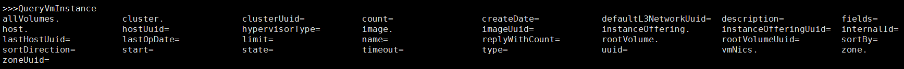

.. _query:

=====
查询
=====

.. contents:: `目录`
   :depth: 6

--------
概览
--------

对于运营大规模云的用户来说，最大的挑战是快速精准的找到所需要的资源. 例如, 要从100000个虚拟机中找到拥有EIP（17.12.53.8)的虚拟机. 
ZStack提供了丰富全面的API可以用来查询所有资源的每一个域。请参看`查询API <http://zstack.org/blog/query.html>`来了解设计架构.

---------------------
架构（Arhitect）
---------------------

每个ZStack资源都将他的属性（properties）组织成一个JSON格式的清单（inventory）; 例如, 一个区域（zone）清单::

    {
      "uuid": "b729da71b1c7412781d5de22229d5e17",
      "name": "TestZone",
      "description": "Test",
      "state": "Enabled",
      "type": "zstack",
      "createDate": "Jun 1, 2015 6:04:52 PM",
      "lastOpDate": "Jun 1, 2015 6:04:52 PM"
    }

一个资源清单可以包含其他资源的清单; 例如, 一个L3网络清单包含IP范围（IP Range）清单::

        {
            "createDate": "Nov 10, 2015 7:52:57 PM",
            "dns": [
                "8.8.8.8"
            ],
            "ipRanges": [
                {
                    "createDate": "Nov 10, 2015 7:52:58 PM",
                    "endIp": "192.168.0.190",
                    "gateway": "192.168.0.1",
                    "l3NetworkUuid": "95dede673ddf41119cbd04bcb5d73660",
                    "lastOpDate": "Nov 10, 2015 7:52:58 PM",
                    "name": "ipr-mmbj",
                    "netmask": "255.255.255.0",
                    "startIp": "192.168.0.180",
                    "uuid": "13238c8e0591444e9160df4d3636be82"
                }
            ],
            "l2NetworkUuid": "33107835aee84c449ac04c9622892dec",
            "lastOpDate": "Nov 10, 2015 7:52:57 PM",
            "name": "L3-SYSTEM-PUBLIC",
            "networkServices": [],
            "state": "Enabled",
            "system": true,
            "type": "L3BasicNetwork",
            "uuid": "95dede673ddf41119cbd04bcb5d73660",
            "zoneUuid": "3a3ed8916c5c4d93ae46f8363f080284"
        }

清单中的域（field）分为两类: 原生域（primitive field) and 嵌套域（nested field）; 原生域是由一个基本类型（primitive type）构成的域，如数字（number）, 字符串（string）, 布尔（boolean）或者日期（date）;
在上述例子中, uuid, name, system都是原生域; 一个嵌套域通常是由代表其他资源数据类型组合而成的;
在上述例子中, ipRanges就是一个嵌套域.

.. 注意:: 一个嵌套域只能通过它的子域（sub-field）来查询; 例如, 对于*ipRanges*域, 你不能这样做::

              QueryL3Network ipRanges='[{"name":"ipr-mmbj""}]'

          正确的方法是, 你需要通过它的子域来查询::

              QueryL3Network ipRanges.name=ipr-mmbj

除非特别声明，所有清单的所有域都是可以被查询的;
对于一个清单, 通常都有对应的查询API, 例如, QueryZone, QueryHost, QueryVmInstance; 查询API通常返回一个清单列表, 或者在没有匹配结果时返回一个空列表. 一个查询的结果类似于::

    {
      "inventories": [
          {
              "availableCpuCapacity": 13504,
              "availableMemoryCapacity": 16824565760,
              "clusterUuid": "b429625fe2704a3e94d698ccc0fae4fb",
              "createDate": "Nov 10, 2015 6:32:43 PM",
              "hypervisorType": "KVM",
              "lastOpDate": "Nov 10, 2015 6:32:43 PM",
              "managementIp": "192.168.0.212",
              "name": "U1404-192.168.0.212",
              "state": "Enabled",
              "status": "Connected",
              "totalCpuCapacity": 14400,
              "totalMemoryCapacity": 16828235776,
              "uuid": "d07066c4de02404a948772e131139eb4",
              "zoneUuid": "3a3ed8916c5c4d93ae46f8363f080284"
          }
      ],
      "success": true
    }

查询API由一个查询条件(query conditions)的列表和一些辅助参数(helper parameters)构成:

查询API的参数（Parameters）
==================================

.. list-table::
   :widths: 20 40 10 20 10
   :header-rows: 1

   * - 名字
     - 描述
     - 此参数可选
     - 可选参数值
     - 起始支持版本
   * - **conditions**
     - :ref:`QueryCondition <QueryCondition>`组成的列表
     -
     -
     - 0.6
   * - **limit**
     - 允许查询API返回清单的最大数量; 默认为1000
     - true
     -
     - 0.6
   * - **start**
     - 返回清单的起始编号; 默认为0
     - true
     -
     - 0.6
   * - **count**
     - 如果为true, 查询响应只返回清单数量; 默认为false
     -
     - - true
       - false
     - 0.6
   * - **replyWithCount**
     - 如果为true, 查询响应会同时返回清单及其数量; 默认为false
     -
     - - true
       - false
     - 0.6
   * - **sortBy**
     - 指定的域被作为排序依据. 这个域必须是原生域
     - true
     -
     - 0.6
   * - **sortDirection**
     - 如果'sortBy'不等于null, 这个域指定排序方向; 默认为'asc'
     -
     - - asc
       - desc
     - 0.6
   * - **fields**
     - 原生域组成的一个列表; 指定时, 查询返回的清单只会包含这些域.
     - true
     -
     - 0.6

.. _QueryCondition:

查询条件（Query Condition）
==================================

查询API接受查询条件组成的列表，这些查询条件包含以下这些属性:

.. list-table::
   :widths: 20 40 10 20 10
   :header-rows: 1

   * - 名字
     - 描述
     - 此参数可选
     - 可选的参数值
     - 起始支持版本
   * - **name**
     - 域名
     -
     -
     - 0.6
   * - **op**
     - 比较操作符（comparison operator）
     -
     - - =
       - !=
       - >
       - >=
       - <
       - <=
       - in
       - not in
       - is null
       - is not null
       - like
       - not like
     - 0.6
   * - **value**
     - 查询值
     -
     -
     - 0.6

域名可以是原生域的名字, 也可以是嵌套域的子域的名字, 或者是扩展域（expanded field）的子域（sub-field）名字(请参看:ref:`Join <query join>`);
'op'是SQL语言中的比较操作符.

.. 注意:: 对于CLI工具, 一些操作符合SQL有不同的格式, 这些操作符被列在'CLI格式'中

.. list-table::
   :widths: 10 10 80
   :header-rows: 1

   * - 操作符
     - CLI格式
     - 描述
   * - =
     - =
     - 等于操作符; 字符串比较区分大小写
   * - !=
     - !=
     - 不等于操作符; 字符串比较区分大小写
   * - >
     - >
     - 大于操作符; 字符串比较请参看MySQL的规范
   * - >=
     - >=
     - 大于等于操作符; 字符串比较请参看MySQL的规范
   * - <
     - <
     - 小于; 字符串比较请参看MySQL的规范
   * - <=
     - <=
     - 小于或等于操作符; 字符串比较请参看MySQL的规范
   * - in
     - ?=
     - 检查一个值是否在一个集合内
   * - not in
     - !?=
     - 检查值是否不在在一个集合内
   * - is null
     - =null
     - NULL值测试
   * - is not null
     - !=null
     - 非NULL值测试
   * - like
     - ~=
     - 简单模式匹配. 用%匹配任一数量的字符, 甚至零个字符; 用_匹配单个字符
   * - not like
     - !~=
     - 简单模式匹配的反式. 用%匹配任一数量的字符, 甚至零个字符; 用_匹配单个字符

查询条件之间的关系是逻辑与（logical AND）, 当前版本只支持这种关系. 例如::

    QueryL3Network ipRanges.name=range1 name=L3Network1

用来查找名字为'L3Network1'的L3网络，并且这个网络有一个或多个IP范围的名字是'range1'.

CLI查询条件
====================

有两种方式可以在CLI中使用查询条件, 一种是查询API的原始形式::

    QueryHost conditions='[{"name":"name", "op":"=", "value":"KVM1"}]'

另一种是CLI格式::

    QueryHost name=KVM1

我肯定你会更喜欢CLI格式因为它更直观更容易理解. CLI格式通常使用下面的格式来表示查询条件::

    condition_name(no_space)CLI_comparison_operator(no_space)condition_value

.. 警告:: 请注意域名和查询值之间不能有空格::

                name=KVM1

             是合法的，但是::

                name = KVM1

             是非法的. 详情请参见请参见:ref:`CLI <cli>`.

在CLI中键入命令时, 你可以使用*Tab*来自动补全或者提示包括原生域，嵌套域以及扩展域在内的可以被查询的域:

.. _query join:

联接（Join）扩展查询（expanded query）
=================================================

在ZStack中联结（Join）被称为扩展查询（expanded query）; 这种查询允许用户通过其他和要查询的目标资源有关系的资源的域来查询; 在ZStack的术语中这些域被称为扩展域.

例如, 要查找一个虚拟机的L3网络，这个虚拟机的网卡（nic）拥有EIP的VIP为17.16.0.53::

    QueryL3Network vmNic.eip.vipIp=17.16.0.53

在这里L3网络的清单没有称为'vmNic.eip.vipIp'的域; 然而, 它和虚拟机的网卡nic清单有关系，而后者又和EIP清单有关系; 因为我们可以构造一个跨越三个清单的扩展查询: L3网络清单, 虚拟机nic清单, 和EIP清单. 
拥有了这个核武器, ZStack可以提供将近400万种查询条件以及无穷无尽的组合条件. 让我们看一个人为构造的复杂例子::

    QueryVolumeSnapshot volume.vmInstance.vmNics.l3Network.l2Network.attachedClusterUuids?=13238c8e0591444e9160df4d3636be82

这个复杂的查询用来查找创建自虚拟机云盘的云盘镜像，这些虚拟机所在的L3网络的L2网络被挂载在一个uuid为13238c8e0591444e9160df4d3636be82的集群上. 虽然用户几乎不会用到这样的查询，但他展示了查询API的强大查询能力.

.. 注意:: 请查看每个章节以了解每个资源可以做的扩展查询, 或者使用CLI的自动补全来帮助提示.

查询列表（Query List）
=============================

当一个域是列表的时候, 他可以包含类似int，long，string的基本类型或者嵌套清单. 查询列表并不特殊; 我们只是用这个章节来提醒你不要误认为只能用'in'(?=)和'not in'(!?=)来查询一个列表域; 实际上, 你可以使用所有的比较操作符;
例如::

    QueryL3Network dns~=72.72.72.%

用来查找所有的拥有类似72.72.72.*的DNS的L3网络::

    QueryL3Network ipRanges.startIp=192.168.0.10

用来查找所有的IP范围从192.168.0.10开始的L3网络.

.. _query with tags:

查询标签（Query Tags）
=============================

在这一节中:ref:`tags <tag>`你会看到所有的资源都可以用用户标签（user tags)和系统标签（system tags)，他们都可以作为查询条件.
ZStack使用两个特别的域: *__userTag__*和*__systemTag__*来做查询; 例如::

    QueryVmInstance __userTag__?=web-tier-VMs

::

    QueryHost __systemTag__?=os::distribution::Ubuntu managementIp=192.168.0.212

操作符>， >=， <， <= 只会返回用有满足条件的标签的资源; 'is not null'会返回所有拥有标签的资源;
'is null'会返回所有没有标签的资源; !=， 'not in'， 'not like'会返回拥有的标签不满足条件的以及没有标签的所有资源.

.. 注意:: 如果你想让比较操作符的反式操作(!=， 'not in'， 'not like')不返回没有标签的资源, 你可以在使用他们时加上'not null'.
          例如::

              QueryVmInstance __userTag__!=database  __userTag__!=null

          用来查找所有拥有用户标签的虚拟机，并且用户标签不等于'database'.

避免循环查询（Avoid Loop Query）
=========================================

大多数ZStack资源拥有双向的扩展查询, 例如,  主机拥有扩展至集群的扩展查询而集群也拥有扩展至主机的扩展查询. 
这使得从任意方向查询资源成为可能，但同时也可能导致查询循环. 例如::

    QueryHost vmInstance.vmNics.eip.vmNic.vmInstance.uuid=d40e459b97db5a63dedaffcd05cfe3c2

就是一个循环查询, 它和下面的查询作用相同::

    QueryHost vmInstance.uuid=d40e459b97db5a63dedaffcd05cfe3c2

循环查询的行为是未定义的; 你有可能得到也有可能得不到正确的结果. 所以请你避免使用循环查询.

有效的使用查询
=====================

查询API很强大，所以你可以通过不同的查询方式得到相同的结果. 例如, 要查找运行在UUID为e497e90ab1e64db099eea93f998d525b的主机上的虚拟机，你可以使用::

    QueryVmInstance hostUuid=e497e90ab1e64db099eea93f998d525b

也可以使用::

    QueryVmInstance host.uuid=e497e90ab1e64db099eea93f998d525b

第一种方式更高效, 因为它只是用了VM表的原生域进行查询; 第二种方式使用了联结VM表和host表的扩展查询. 
当你的查询条件是UUID的时候，总是建议使用原生域而不是扩展域的子域进行查询.

--------
示例
--------

普通查询
============

::

    QueryL3Network name=L3-SYSTEM-PUBLIC

查询计数（Query Count）
==============================

::

    QueryL3Network name=L3-SYSTEM-PUBLIC count=true

带计数的普通查询
=======================

::

    QueryL3Network name=L3-SYSTEM-PUBLIC replyWithCount=true

设置限制
=========

::

    QueryL3Network name=public-l3 limit=10

设置起始
=========

::

    QueryVmInstance name=centos6 start=10 limit=100

.. 注意:: 使用起始和限制可以实现UI分页（pagination).

选择域
=============

::

    QueryL3Network fields=name,uuid l2NetworkUuid=33107835aee84c449ac04c9622892dec

.. 注意:: 只有原生域可以被选择.

排序（Sort）
=================

::

    QueryL3Network l2NetworkUuid=33107835aee84c449ac04c9622892dec sortBy=createDate sortDirection=desc

.. 注意:: 只有原生域可以用做排序.

