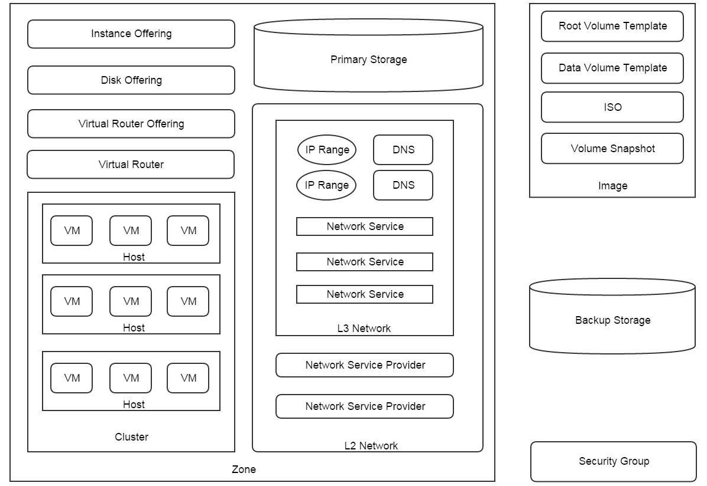

.. _resource:

==============
资源模型
==============

.. contents:: `目录`
   :depth: 6

ZStack本质上是一个云资源的配置管理系统. 资源可以是物理资源（例如，主机，网络，存储）
也可以是虚拟资源（例如，虚拟机）. 在当前版本中, 所有的资源如图所示:

.. 注意:: 本图只是示意性的展示ZStack资源，并不包含资源之间的关系或者数量信息.

---------------------
资源之间的关系
---------------------

资源之间有四种关系:

- **父子关系（Parent - Child）**:

  一个资源可以是另一个资源的父亲或孩子. 例如, 一个集群是一个区域的子资源，而一个区域是一个集群的父资源.

- **祖先后裔关系（Ancestor - Descendant）**:

  一个资源可以是另一个资源的直系祖先（lineal ancestor）或者直系后裔（lineal descendant）. 例如, 一个区域是虚拟机的祖先资源; 一个虚拟机是一个区域的直系后裔资源.

- **兄弟关系（Sibling）**:

  拥有同样父资源的资源为兄弟关系. 例如, 集群, 主机， 主存储, L2网络是兄弟资源因为他们都是区域的子资源.

- **朋友关系（Friend）**:

  一些资源资源之间没有以上三种关系，但是这些资源在某些情境下需要分工合作，这时他们是朋友关系. 例如, 主存储和
  备份存储是朋友关系, 因为在创建虚拟机时主存储需要从备份存储下载镜像.

没有关系的资源是无关资源; 例如, 安全组和集群是无关资源.

.. 注意:: 在当前版本中, ZStack没有地区（region)的概念, 所以区域（zones）和备份存储没有父资源; 然而, 他们仍然被认为是
          兄弟资源.

.. _resource properties:

-------------------
资源属性
-------------------

绝大多数资源都有四个公共属性:

- **通用唯一识别码（UUID）**:

  ZStack使用通用唯一识别码`UUIDv4 (Universally Unique Identifier) <http://en.wikipedia.org/wiki/Universally_unique_identifier>`_ 来唯一的标识一个资源. 不同于普通的UUID，ZStack去掉了字符串中的连字符。 例如, 80b5ca2c76154da298a1a248b975372a.

- **名字（Name）**:

  名字是最长255个字符组成的可读字符串. 由于ZStack不使用名字作为资源标识符，所以名字可以重复.
  名字可以包含任何可见的ASCII字符（例如，%，#，^，空格）; 然而, 在名字中放置一些字符可能导致查询API很难使用
  . 最佳做法是只用字母，数字，连字符（'-'）, 和下划线('_')来命名资源.

  .. 注意:: 虽然这是合法的，但请避免在名字中使用','(逗号). 因为在查询API中使用'?='（意为：在……之中）作为条件运算符时， ZStack使用逗号来分割参数列表.
            例如, 通过条件'name'和运算符'?='查询虚拟机::

                QueryVmInstance name?=vm1,vm2,vm3

            这条语句意思是: 找出名字为vm1或者vm2或者vm3的虚拟机. 对于熟悉SQL的朋友来说, 他等价于::

                select * from VmInstance where name in ('vm1', 'vm2', 'vm3')

            如果虚拟机名字中有逗号, 例如, 'v,m1', 那么查询就变成::

                QueryVmInstance name?=v,m1,vm2,vm3

            但实际上它会查询出名字在 ['v', 'm1', 'vm2', 'vm3] 之中的虚拟机

- **描述（Description）**:

  描述是最长2048个可读字符组成的字符串. 同样ZStack没有对描述可以使用的字符集施加任何限制.

- **创建日期（Created Date）**:

  一个不变的日期标明资源创建时间.

- **上次操作时间（Last Operation Date）**:

  资源上次被更新的时间. 每次资源被更新，这个时间都会被更新;
  更新操作可以是用户操作，也可以是ZStack内部操作.

.. 注意:: 某些资源可能没有名字或描述, 例如, DNS, 安全组规则（security group rules）. 这些资源不被认为是独立的资源，必须依附于他们的父资源.

每个资源都可能有他特有的属性, 例如, 虚拟机可能有属性'hostUuid'. ZStack在API中使用JSON, 因此资源的属性在大多数API响应中通常被包括在JSON映射中。
在ZStack中，JSON映射被称为清单（inventory). 在随后的章节中, 档提到资源清单时, 通常是指包含资源属性的JSON映射.
下面是一个虚拟机清单实例::

    {
      "inventory": {
        "uuid": "94d991c631674b16be65bfdf28b9e84a",
        "name": "TestVm",
        "description": "Test",
        "zoneUuid": "acadddc85a604db4b1b7358605cd6015",
        "clusterUuid": "f6cd5db05a0d49d8b12721e0bf721b4c",
        "imageUuid": "061141410a0449b6919b50e90d68b7cd",
        "hostUuid": "908131845d284d7f821a74362fff3d19",
        "lastHostUuid": "908131845d284d7f821a74362fff3d19",
        "instanceOfferingUuid": "91cb47f1416748afa7e0d34f4d0731ef",
        "rootVolumeUuid": "19aa7ec504a247d89b511b322ffa483c",
        "type": "UserVm",
        "hypervisorType": "KVM",
        "createDate": "Jun 1, 2015 6:11:47 PM",
        "lastOpDate": "Jun 1, 2015 6:11:47 PM",
        "state": "Running",
        "vmNics": [
          {
            "uuid": "6b58e6b2ba174ef4bce8a549de9560e8",
            "vmInstanceUuid": "94d991c631674b16be65bfdf28b9e84a",
            "usedIpUuid": "4ecc80a2d1d93d48b32680827542ddbb",
            "l3NetworkUuid": "55f85b8fa9a647f1be251787c66550ee",
            "ip": "10.12.140.148",
            "mac": "fa:f0:08:8c:20:00",
            "netmask": "255.0.0.0",
            "gateway": "10.10.2.1",
            "deviceId": 0,
            "createDate": "Jun 1, 2015 6:11:47 PM",
            "lastOpDate": "Jun 1, 2015 6:11:47 PM"
          },
          {
            "uuid": "889cfcab8c08409296c649611a4df50c",
            "vmInstanceUuid": "94d991c631674b16be65bfdf28b9e84a",
            "usedIpUuid": "8877537e11783ee0bfe8af0fcf7a6388",
            "l3NetworkUuid": "c6134efd3af94db7b2928ddc5deba540",
            "ip": "10.4.224.72",
            "mac": "fa:e3:87:b1:71:01",
            "netmask": "255.0.0.0",
            "gateway": "10.0.0.1",
            "deviceId": 1,
            "createDate": "Jun 1, 2015 6:11:47 PM",
            "lastOpDate": "Jun 1, 2015 6:11:47 PM"
          },
          {
            "uuid": "cba0da7a12d44b2e878dd5803d078337",
            "vmInstanceUuid": "94d991c631674b16be65bfdf28b9e84a",
            "usedIpUuid": "f90d01a098303956823ced02438ae3ab",
            "l3NetworkUuid": "c7e9e14f2af742c29c3e25d58f16a45f",
            "ip": "10.29.42.155",
            "mac": "fa:2d:31:08:da:02",
            "netmask": "255.0.0.0",
            "gateway": "10.20.3.1",
            "deviceId": 2,
            "createDate": "Jun 1, 2015 6:11:47 PM",
            "lastOpDate": "Jun 1, 2015 6:11:47 PM"
          }
        ],
        "allVolumes": [
          {
            "uuid": "19aa7ec504a247d89b511b322ffa483c",
            "name": "ROOT-for-TestVm",
            "description": "Root volume for VM[uuid:94d991c631674b16be65bfdf28b9e84a]",
            "primaryStorageUuid": "24931b95b45e41fb8e41a640302d4c00",
            "vmInstanceUuid": "94d991c631674b16be65bfdf28b9e84a",
            "rootImageUuid": "061141410a0449b6919b50e90d68b7cd",
            "installUrl": "/opt/zstack/nfsprimarystorage/prim-24931b95b45e41fb8e41a640302d4c00/rootVolumes/acct-36c27e8ff05c4780bf6d2fa65700f22e/vol-19aa7ec504a247d89b511b322ffa483c/19aa7ec504a247d89b511b322ffa483c.qcow2",
            "type": "Root",
            "format": "qcow2",
            "size": 3.221225472E10,
            "deviceId": 0,
            "state": "Enabled",
            "status": "Ready",
            "createDate": "Jun 1, 2015 6:11:47 PM",
            "lastOpDate": "Jun 1, 2015 6:11:47 PM"
          }
        ]
      }
    }

-------------------
资源操作（Resource Operations）
-------------------

资源支持完全的（full）或部分的（partial) CRUD（创建, 读, 更新, 删除）操作.

.. _create resource:

创建（Create Resources）
================

每个资源都有自己的创建API. 所有的创建API都有一个公共参数 'resourceUuid'.
当'resourceUuid'不等于null, ZStack使用这个值作为被创建资源的UUID; 否则ZStack会自动生成一个UUID.

.. 警告:: 使用'resourceUuid'时, 请确保你提供的UUID已经去掉了连字符. 否则, ZStack会返回无效
             参数错误当它不是一个有效的去掉连字符的UUIDv4标识符, 或者返回一个内部错误如果已经有相同类型的资源在数据库中使用了相同的UUID.

下面是一个创建集群的示例::

    CreateCluster name=cluster1 description='awesome cluster' hypervisorType=KVM zoneUuid=061141410a0449b6919b50e90d68b7cd

或者::

    CreateCluster resourceUuid=f31e38309e2047beac588e111fa2051f name=cluster1 description='awesome cluster' hypervisorType=KVM zoneUuid=061141410a0449b6919b50e90d68b7cd

读取资源（Read Resources）
==============

每个资源都有自己的查询API返回资源清单.
详细信息, 请查看 :ref:`Query <query>`. 这里是一个查询虚拟机的示例::

    QueryVmInstance allVolumes.type=Data allVolumes.size>1099511627776

示例中: 找出所有拥有一个或多个大于1099511627776字节(1T)数据卷的虚拟机

更新资源（Update Resources）
================

资源可以被多种API更新. 更新资源实际上是对资源进行某个动作. 例如,
创建一个虚拟机, 停止一个虚拟机. 请查看相关的章节来了解可对资源实施的动作. 这里是一个启动虚拟机的例子::

    StartVmInstance uuid=94d991c631674b16be65bfdf28b9e84a

大部分更新API都会返回资源清单.

.. _delete resource:

删除资源（Delete Resources）
================

资源可以被删除. ZStack中资源被删除的哲学是: 每个资源都应该可以被删除; 删除资源应该总是可以成功的除非用户允许某种失败; 
例如, 一个插件允许用户在虚拟机上设置'none-deletable'标签, 当这个虚拟机被删除时一个错误就会被抛出.

在IaaS中删除资源通常不是那么容易, 尤其是当资源有很多后裔资源; 一些软件方案通过不灵活的代码来删除所有后裔资源;
一些软件方案在删除还有后裔资源在线的资源时通过简单的抛出错误来处理.

ZStack使用一种优雅的方式来处理资源删除. 当一个资源被删除时, 一个被称为瀑布框架的组件`Cascade Framework <http://zstack.org/blog/cascade.html>`_ 将会计算被删资源和云中其他资源的关系, 必要时合适的操作会被扩散至相关的资源. 
例如, 删除一个区域时, 删除操作会被散布至所有的这个区域的后裔资源，也就是说所有的这个区域中的虚拟机，主机，集群，L2网络都在区域被删除前会被删除
; 同时挂载到这个区域的备份存储也会被卸载. 使用这个瀑布框架, 在ZStack中删除资源变得简单和可靠.

每个资源都有自己的删除API. 所有的删除API都有一个公共参数*deleteMode*，这个参数有两个选项 **Permissive** 和 **Enforcing**.
当*deleteMode*设置成Permissive时, 如果删除过程中发生错误或者删除不被允许ZStack会停止删除操作; 在这种情况下, 包含失败原因的错误代码会被返回.当*deleteMode*被设置成Enforcing, ZStack会忽略所有错误和权限而直接删除资源; 在这种情况下,
删除操作总是会成功.

下面是一个删除虚拟机的示例::

    DestroyVmInstance uuid=94d991c631674b16be65bfdf28b9e84a

