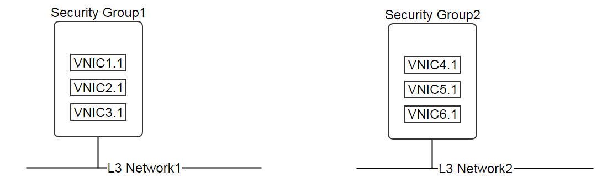
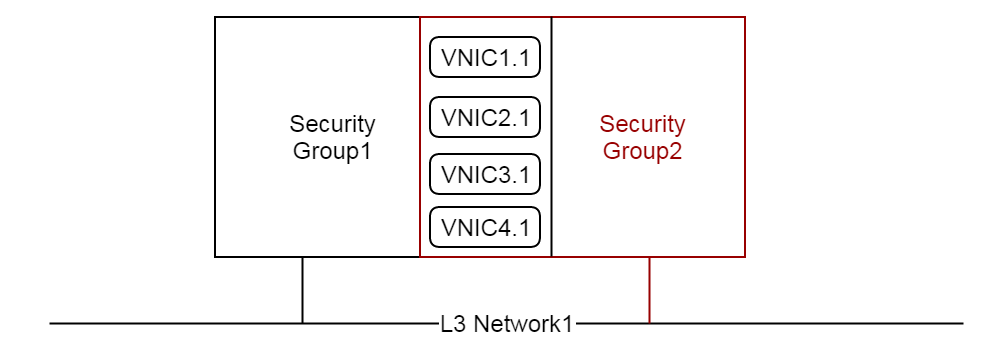
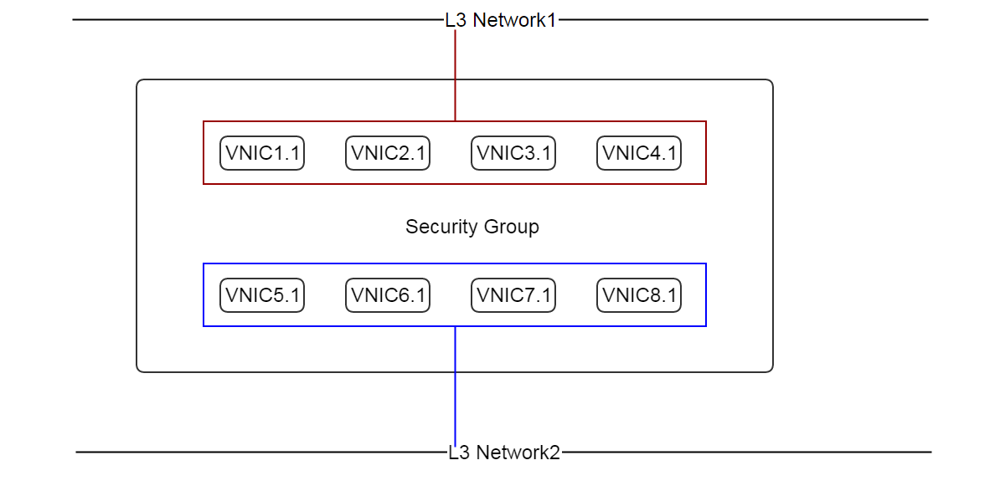

.. _security group:

=============================
安全组（Security Group）
=============================

.. contents:: `目录`
   :depth: 6

--------------------
概览（Overview）
--------------------

.. _ICMP type and code: http://www.nthelp.com/icmp.html

安全组就像一个虚拟防火墙（virtual firewall）一样控制虚拟机的网络通信. 根据L2网络采用的隔离方法（isolation method）的不同, 用户可以把安全组作为防火墙或者三层隔离方法使用. 例如, 如果多个租户共享一个L3网络,
每个租户都可以创建一个安全组来保护他们的虚拟机不被其他租户访问. 租户也可以将安全组和:ref:`EIP <eip>`一起使用来控制哪些端口向共有网络开放.

安全组包含了一系列的控制端口可访问性（accessibility）的规则（rules）. 安全组可以挂载到一个或多个L3网络;
虚拟机挂载到L3网络的网卡可以加入这些安全组. 一个虚拟机的网卡可以加入多个安全组, 安全组的规则会合并在一起并应用到该网卡上.

安全组的实现根据虚拟机管理程序的不同而有所不同; 并不是所有的虚拟机管理程序都支持安全组. ZStack当前版本是通过在KVM虚拟机管理程序中使用IPTables来实现安全组的.

.. 注意:: 大量的安全组规则会影响网络性能因为虚拟机管理程序需要对每个网络报文（network packet）针对所有的规则做检查.
          ZStack总是会尝试尽可能的精简安全组规则; 例如, 如果你分别对两个连续的端口指定了两个规则,
          通过使用端口范围匹配（port range match），他们会被归并到同一个IPTable(针对KVM)规则.

要使用安全组, L3网络必须要通过:ref:`AttachNetworkServiceToL3Network <l3Network attach service>`启用安全组服务, 例如::

    AttachNetworkServiceToL3Network l3NetworkUuid=50e637dc68b7480291ba87cbb81d94ad networkServices='{"1d1d5ff248b24906a39f96aa3c6411dd": ["SecurityGroup"]}'

对于有多个网卡的虚拟机, 所有的网卡都可以加入安全组.

安全组实际上是一个分布式的防火墙（distributed firewall）; 每次规则变化或者加入或删除网卡都会导致多个主机上的防火墙规则（firewall rules）被更新.
因此, 一些安全组的API使用异步方式实现（asynchronous manner）, 所以在这些API返回之后规则可能不会立即生效. 如果同一个端口指定了多个规则, 只有最宽松的规则（the most permissive rule）会生效. 
例如, 如果规则rule1允许从12.12.12.12访问端口22但规则rule2允许所有人访问端口22, 那么规则rule2会优先起作用.

.. _security group inventory:

-------------------------------------------------
安全组的清单（Security Group Inventory）
-------------------------------------------------

属性（Properties）
======================

.. list-table::
   :widths: 20 40 10 20 10
   :header-rows: 1

   * - 名字
     - 描述
     - 可选的
     - 可选的参数值
     - 起始支持版本
   * - **uuid**
     - 请参见 :ref:`resource properties`
     -
     -
     - 0.6
   * - **name**
     - 请参见 :ref:`resource properties`
     -
     -
     - 0.6
   * - **description**
     - 请参见 :ref:`resource properties`
     - 是
     -
     - 0.6
   * - **state**
     - 安全组可用状态; 当前版本ZStack未实现
     -
     - - Enabled
       - Disabled
     - 0.6
   * - **rules**
     - :ref:`security group rule inventory <security group rule inventory>`列表
     -
     -
     - 0.6
   * - **attachedL3NetworkUuids**
     - 安全组挂载的:ref:`L3 networks <l3Network>`的uuid列表
     -
     -
     - 0.6
   * - **createDate**
     - 请参见 :ref:`resource properties`
     -
     -
     - 0.6
   * - **lastOpDate**
     - 请参见 :ref:`resource properties`
     -
     -
     - 0.6

空的安全组会有默认的策略控制进出的流量; 对于进入（Ingress）的流量, 默认的策略是拒绝（deny）, 也就是说对于这个空白安全组的网卡所有的流入流量（inbound traffics）都被阻止（blocked）了; 对于外出（Egress）的流量, 默认的策略是允许（allow）, 也就是说对于这个空白安全组的网卡所有的流出流量都被允许.
管理员可以通过修改全局配置:ref:`ingress.defaultPolicy` 和 :ref:`egress.defaultPolicy`来改变默认的策略.

示例
=======

::

    {
        "attachedL3NetworkUuids": [
            "0b48770e593e400c8f54e71fd4e7f514"
        ],
        "createDate": "Nov 16, 2015 1:02:22 AM",
        "lastOpDate": "Nov 16, 2015 1:02:22 AM",
        "name": "sg-in",
        "rules": [
            {
                "allowedCidr": "0.0.0.0/0",
                "createDate": "April 29, 2015 9:57:10 PM",
                "state": "Enabled",
                "endPort": 22,
                "lastOpDate": "Nov 29, 2015 9:57:10 PM",
                "protocol": "TCP",
                "securityGroupUuid": "9e0a72fe64814900baa22f78a1b9d235",
                "startPort": 22,
                "type": "Ingress",
                "uuid": "a338d11be18d4e288223597682964dc8"
            }
        ],
        "state": "Enabled",
        "uuid": "9e0a72fe64814900baa22f78a1b9d235"
    }

.. _security group rule inventory:

------------------------------------------------------------
安全组规则的清单（Security Group Rule Inventory）
------------------------------------------------------------

属性（Properties）
======================

.. list-table::
   :widths: 20 40 10 20 10
   :header-rows: 1

   * - 名字
     - 描述
     - 可选的
     - 可选的参数值
     - 起始支持版本
   * - **uuid**
     - 请参见 :ref:`resource properties`
     -
     -
     - 0.6
   * - **securityGroupUuid**
     - 父安全组的uuid
     -
     -
     - 0.6
   * - **type**
     - 请参见 :ref:`traffic type <security group traffic type>`
     -
     - - Ingress
       - Egress
     - 0.6
   * - **protocol**
     - 流量协议烈性（traffic protocol type）
     -
     - - TCP
       - UDP
       - ICMP
     - 0.6
   * - **startPort**
     - 如果协议是TCP/UDP, 它是端口范围（port range）的起始端口号; 如果协议是ICMP, 它是ICMP类型（type）
     -
     - - 对于TCP/UDP: 0 - 65535
       - 对于ICMP: 请参见 `ICMP type and code`_ , 使用'-1'来表示所有的类型.
     - 0.6
   * - **endPort**
     - 如果协议是TCP/UDP, 它是端口范围（port range）的起始端口号; 如果协议是ICMP, 它是ICMP代码（code）
     -
     - - 对于TCP/UDP: 0 - 65535
       - 对于ICMP: 请参见 `ICMP type and code`_, 使用'-1'来表示所有的类型.
     - 0.6
   * - **allowedCidr**
     - 请参见 :ref:`allowedCidr <allowed cidr>`
     -
     -
     - 0.6
   * - **state**
     - 规则的可用状态, 当前版本未实现
     -
     - - Enabled
       - Disabled
     - 0.6
   * - **createDate**
     - 请参见 :ref:`resource properties`
     -
     -
     - 0.6
   * - **lastOpDate**
     - 请参见 :ref:`resource properties`
     -
     -
     - 0.6

.. _security group traffic type:

流量类型（Traffic Type）
++++++++++++++++++++++++++++++

有两种流量类型:

- **Ingress**

  访问虚拟机网卡的流入的流量

- **Egress**

  离开虚拟机网卡的流出的流量

.. _allowed cidr:

允许的CIDR（Allowed CIDR）
++++++++++++++++++++++++++++++++

根据流量类型的不同, 允许的CIDR有不同的含义; 格式为::

    ipv4地址/网络前缀（network_prefix）

    例如: 12.12.12.12/24

如果流量类型是Ingress, 允许的CIDR是允许访问虚拟机网卡的源CIDR（source CIDR）; 例如, 规则::

    startPort: 22
    endPort: 22
    protocol: TCP
    type: Ingress
    allowedCidr: 12.12.12.12/32

表示只有从IP(12.12.12.12)来的TCP流量允许访问端口22.

如果流量类型是Egress, 允许的CIDR是允许从虚拟机网卡离开并到达的目的地CIDR（destination CIDR）; 例如, 规则::

    startPort: 22
    endPort: 22
    protocol: TCP
    type: Egress
    allowedCidr: 12.12.12.12/32

表示只允许从目的地为IP为12.12.12.12端口为22的TCP的流量允许流出.

特别的是, CIDR 0.0.0.0/0表示所有IP地址.

.. 注意:: 允许的CIDR只控制安全组以外的IP地址. 规则被自动的应用到了在同一个的L3网络中并且在同一个安全组中的虚拟机的网卡的IP地址上. 例如,
          如果有两个网卡: nic1(10.10.1.5) 和 nic2(10.10.1.6) 都在同一个安全组中，这个安全组的规则如下::

                  startPort: 22
                  endPort: 22
                  protocol: TCP
                  type: Ingress
                  allowedCidr: 12.12.12.12/32

          那么虽然allowedCidr被设置为12.12.12.12/32，这两个网卡nic1和nic2仍然可以互相访问彼此的端口22.

示例
=======

::

           {
                "allowedCidr": "0.0.0.0/0",
                "state": "Enabled",
                "startPort": 22,
                "endPort": 22,
                "protocol": "TCP",
                "type": "Ingress",
                "createDate": "Nov 29, 2015 9:57:10 PM",
                "lastOpDate": "Nov 29, 2015 9:57:10 PM",
                "uuid": "a338d11be18d4e288223597682964dc8"
                "securityGroupUuid": "9e0a72fe64814900baa22f78a1b9d235",
           }

--------------------------------------------------------
安全组和L3网络（Security Group And L3 Network）
--------------------------------------------------------

就像之前提到过的一样, 一个安全组可以被挂载到多个L3网络. 这样设计是考虑到安全组是一系列的防火墙规则，它们可以被应用到任何L3网络上. 
例如, 两个不同的L3网络可能有相同的防火墙规则，那么把他们放在同一个安全组中更加合理.

具有相同安全组的不同L3网络上的虚拟机网卡则不相关. 正如在:ref:`Allowed CIDR <allowed cidr>`中提到的那样,
在一个安全组中并且在同一个L3网络的虚拟机网卡不被allowedCIDR规则所影响, 他们总是可以互相访问开放了的端口. 
然而, 如果两个网卡在同一个安全组中但来自不同的L3网络, 那么当他们互相访问的时候，会受到allowedCIDR规则的限制.

如果你觉得在多个L3网络上使用同一个安全组会使人困惑, 你总是可以对每一个L3网络创建一个单独的安全组.

-----------------------
操作（Operations）
-----------------------

创建安全组（Create Security Group）
==========================================

用户可以使用CreateSecurityGroup来创建一个安全组. 例如::

    CreateSecurityGroup name=web

参数（Parameters）
++++++++++++++++++++++

.. list-table::
   :widths: 20 40 10 20 10
   :header-rows: 1

   * - 名字
     - 描述
     - 可选的
     - 可选的参数值
     - 起始支持版本
   * - **name**
     - 资源的名字, 请参见 :ref:`resource properties`
     -
     -
     - 0.6
   * - **resourceUuid**
     - 资源的uuid, 请参见 :ref:`create resource`
     - 是
     -
     - 0.6
   * - **description**
     - 资源的描述, 请参见 :ref:`resource properties`
     - 是
     -
     - 0.6

添加规则到安全组（Add Rules To Security Group）
==========================================================

用户可以使用AddSecurityGroupRule添加规则到安全组. 例如::

   AddSecurityGroupRule securityGroupUuid=29a0f801f77b4b4f866fb4c9503d0fe9 rules="[{'type':'Ingress', 'protocol':'TCP', 'startPort':'22', 'endPort':'22', 'allowedCidr':'0.0.0.0/0'}]"

这个命令是异步执行的, 在它返回后可能规则仍然没有对所有虚拟机网卡生效.

参数（Parameters）
++++++++++++++++++++++

.. list-table::
   :widths: 20 40 10 20 10
   :header-rows: 1

   * - 名字
     - 描述
     - 可选的
     - 可选的参数值
     - 起始支持版本
   * - **securityGroupUuid**
     - 安全组的uuid
     -
     -
     - 0.6
   * - **rules**
     - :ref:`SecurityGroupRuleAO <SecurityGroupRuleAO>`列表
     -
     -
     - 0.6

.. _SecurityGroupRuleAO:

SecurityGroupRuleAO
-------------------
.. list-table::
   :widths: 20 40 10 20 10
   :header-rows: 1

   * - 名字
     - 描述
     - 可选的
     - 可选的参数值
     - 起始支持版本
   * - **type**
     - 流量类型, 请参见 :ref:`traffic type <security group traffic type>`
     -
     - - Ingress
       - Egress
     - 0.6
   * - **startPort**
     - 起始端口或ICMP类型
     -
     - - port: 0 - 65535
       - ICMP类型: 请参见 `ICMP type and code`_
     - 0.6
   * - **endPort**
     - 结束端口或ICMP代码
     -
     - - port: 0 - 65535
       - ICMP代码: 请参见 `ICMP type and code`_
     - 0.6
   * - **protocol**
     - 协议类型
     -
     - - TCP
       - UDP
       - ICMP
     - 0.6
   * - **allowedCidr**
     - 请参见 :ref:`allowed CIDR <allowed cidr>`; 默认为 0.0.0.0/0
     - 是
     -
     - 0.6

从安全组删除规则（Delete Rules From Security Group）
===============================================================

用户可以使用DeleteSecurityGroupRule来从安全组删除规则. 例如::

    DeleteSecurityGroupRule ruleUuids=a338d11be18d4e288223597682964dc8,9e0a72fe64814900baa22f78a1b9d235

这个命令是异步执行的, 在它返回后可能规则仍然没有对所有的主机上生效.

参数（Parameters）
++++++++++++++++++++++

.. list-table::
   :widths: 20 40 10 20 10
   :header-rows: 1

   * - 名字
     - 描述
     - 可选的
     - 可选的参数值
     - 起始支持版本
   * - **ruleUuids**
     - :ref:`rule inventory <security group rule inventory>`的uuid列表
     -
     -
     - 0.6

添加虚拟机网卡到安全组（Add VM Nics Into Security Group）
=======================================================================

用户可以使用AddVmNicToSecurityGroup来添加虚拟机网卡到安全组. 例如::

    AddVmNicToSecurityGroup securityGroupUuid=0b48770e593e400c8f54e71fd4e7f514 vmNicUuids=b429625fe2704a3e94d698ccc0fae4fb,6572ce44c3f6422d8063b0fb262cbc62,d07066c4de02404a948772e131139eb4

这个命令是异步执行的, 在它返回后可能规则仍然没有对所有的网卡生效.

.. 注意:: 虚拟机网卡只可以加入已经挂载到他们所在的L3网络上的安全组.

参数（Parameters）
++++++++++++++++++++++

.. list-table::
   :widths: 20 40 10 20 10
   :header-rows: 1

   * - 名字
     - 描述
     - 可选的
     - 可选的参数值
     - 起始支持版本
   * - **securityGroupUuid**
     - 安全组的uuid
     -
     -
     - 0.6
   * - **vmNicUuids**
     - :ref:`vm nic inventory <vm nic inventory>`的uuid列表
     -
     -
     - 0.6

从安全组移除虚拟机网卡（Remove VM Nics from Security Group）
==========================================================================

用户可以使用DeleteVmNicFromSecurityGroup来从安全组删除虚拟机网卡. 例如::

    DeleteVmNicFromSecurityGroup securityGroupUuid=0b48770e593e400c8f54e71fd4e7f514 vmNicUuids=b429625fe2704a3e94d698ccc0fae4fb,6572ce44c3f6422d8063b0fb262cbc62,d07066c4de02404a948772e131139eb4

这个命令是异步执行的, 在它返回后可能规则仍然没有对所有虚拟机网卡生效.

参数（Parameters）
++++++++++++++++++++++

.. list-table::
   :widths: 20 40 10 20 10
   :header-rows: 1

   * - 名字
     - 描述
     - 可选的
     - 可选的参数值
     - 起始支持版本
   * - **securityGroupUuid**
     - 安全组的uuid
     -
     -
     - 0.6
   * - **vmNicUuids**
     - :ref:`vm nic inventory <vm nic inventory>`的uuid列表
     -
     -
     - 0.6

挂载安全组到L3网络（Attach Security Group To L3 Network）
====================================================================

用户可以使用AttachSecurityGroupToL3Network来挂载一个安全组到L3网络. 例如::

    AttachSecurityGroupToL3Network securityGroupUuid=0b48770e593e400c8f54e71fd4e7f514 l3NetworkUuid=95dede673ddf41119cbd04bcb5d73660

.. 注意::  安全组只可以被挂载到启用了安全组网络服务的L3网络上

参数（Parameters）
++++++++++++++++++++++

.. list-table::
   :widths: 20 40 10 20 10
   :header-rows: 1

   * - 名字
     - 描述
     - 可选的
     - 可选的参数值
     - 起始支持版本
   * - **securityGroupUuid**
     - 安全组的uuid
     -
     -
     - 0.6
   * - **l3NetworkUuid**
     - L3网络的uuid
     -
     -
     - 0.6

从L3网络卸载安全组（Detach Security Group From L3 Network）
======================================================================

用户可以使用DetachSecurityGroupFromL3Network来从一个L3网络卸载一个安全组::

    DetachSecurityGroupFromL3Network securityGroupUuid=0b48770e593e400c8f54e71fd4e7f514 l3NetworkUuid=95dede673ddf41119cbd04bcb5d73660

卸载后, 所有的规则都会从这个L3网络上的并且在这个安全组中的虚拟机网卡上删除. 这个命令是异步执行的, 在它返回后可能规则仍然没有对所有虚拟机网卡生效.

参数（Parameters）
++++++++++++++++++++++

.. list-table::
   :widths: 20 40 10 20 10
   :header-rows: 1

   * - 名字
     - 描述
     - 可选的
     - 可选的参数值
     - 起始支持版本
   * - **securityGroupUuid**
     - 安全组的uuid
     -
     -
     - 0.6
   * - **l3NetworkUuid**
     - L3网络的uuid
     -
     -
     - 0.6

删除安全组（Delete Security Group）
===========================================

用户可以使用DeleteSecurityGroup来删除安全组. 例如::

    DeleteSecurityGroup uuid=0b48770e593e400c8f54e71fd4e7f514

删除后, 所欲规则都会从这个安全组中的虚拟机网卡移除.
这个命令是异步执行的, 在它返回后可能规则仍然没有对所有虚拟机网卡生效.

参数（Parameters）
++++++++++++++++++++++

.. list-table::
   :widths: 20 40 10 20 10
   :header-rows: 1

   * - 名字
     - 描述
     - 可选的
     - 可选的参数值
     - 起始支持版本
   * - **deleteMode**
     - 请参见 :ref:`delete resource`
     - 是
     - - Permissive
       - Enforcing
     - 0.6
   * - **uuid**
     - 安全组的uuid
     -
     -
     - 0.6

查询安全组（Query Security Group）
==========================================

用户可以使用QuerySecurityGroup来查询安全组. 例如::

    QuerySecurityGroup rules.startPort=22 rules.type=Ingress rules.protocol=TCP

::

    QuerySecurityGroup vmNic.ip=192.168.0.205

原生域（Primitive Fields）
+++++++++++++++++++++++++++++++

请参见 :ref:`security group inventory <security group inventory>`.

嵌套和扩展域（Nested And Expanded Fields）
+++++++++++++++++++++++++++++++++++++++++++++++++++

.. list-table::
   :widths: 20 30 40 10
   :header-rows: 1

   * - 域（Field)
     - 清单（Inventory）
     - 描述
     - 起始支持版本
   * - **rules**
     - :ref:`security group rule inventory <security group rule inventory>`
     - 安全组中的规则
     - 0.6
   * - **vmNic**
     - :ref:`VM nic inventory <vm nic inventory>`
     - 加入该安全组的虚拟机网卡
     - 0.6
   * - **l3Network**
     - :ref:`L3 network inventory <l3Network inventory>`
     - 该安全组挂载的L3网络
     - 0.6

----------------------------------------
全局配置（Global Configurations）
----------------------------------------

.. _ingress.defaultPolicy:

ingress.defaultPolicy
=====================

.. list-table::
   :widths: 20 30 20 30
   :header-rows: 1

   * - 名字
     - 类别
     - 默认值
     - 可选的参数值
   * - **ingress.defaultPolicy**
     - securityGroup
     - deny
     - - deny
       - accept

空白安全组的默认流入策略.

.. _egress.defaultPolicy:

egress.defaultPolicy
====================

.. list-table::
   :widths: 20 30 20 30
   :header-rows: 1

   * - 名字
     - 类别
     - 默认值
     - 可选的参数值
   * - **egress.defaultPolicy**
     - securityGroup
     - accept
     - - deny
       - accept

空白安全组的默认流出策略.

-----------------
标签（Tags）
-----------------

用户可以使用resourceType=SecurityGroupVO在安全组上创建标签. 例如::

    CreateUserTag tag=web-tier-security-group resourceType=SecurityGroupVO resourceUuid=f25a28fdb21147f8b183296550a98799
