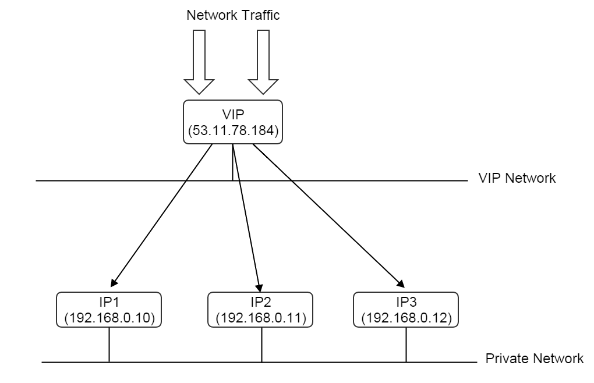

.. _vip:

======================================
虚拟IP地址（Virtual IP Address）
======================================

.. contents:: `目录`
   :depth: 6

--------------------
概览（Overview）
--------------------

当桥接（bridging）两个网络的通信时, 许多网络服务（network services）都需要虚拟IP地址（virtual Ip addresses, VIP）, 例如端口转发（Port Forwarding）, EIP, VPN, 负载均衡（Load Balancing）; 
流入的数据包（incoming packets）被发送到VIP，并被路由到（routed）私有网络IP（private network IPs）.

实际上, VIP通常是可以被internet访问到的公有IP（public IP）, 而路由到背后的私有IP的流量通常都是在对internet来说不可见的私有网络上.

当前ZStack版本中, 必须首先分配一个VIP，才能创建端口转发或EIP. 由于现在虚拟路由器模块（virtual router provider）是唯一的网络服务模块（network service provider）, 因此需要从虚拟路由器虚拟机（virtual router VM）的公有网络创建VIP(请参见 :ref:`virtual router offering <virtual router offering>`)才能将外部流量路由至客户网络（guest network）.

.. _vip inventory:

----------------------
清单（Inventory）
----------------------

属性（Properties）
======================

.. list-table::
   :widths: 20 40 10 20 10
   :header-rows: 1

   * - 名字
     - 描述
     - 可选的
     - 可选的参数值
     - 起始支持版本
   * - **uuid**
     - 请参见 :ref:`resource properties`
     -
     -
     - 0.6
   * - **name**
     - 请参见 :ref:`resource properties`
     -
     -
     - 0.6
   * - **description**
     - 请参见 :ref:`resource properties`
     - 是
     -
     - 0.6
   * - **ipRangeUuid**
     - 分配VIP的IP范围（IP range）的uuid
     -
     -
     - 0.6
   * - **l3NetworkUuid**
     - 分配VIP的L3网络的uuid
     -
     -
     - 0.6
   * - **ip**
     - IP地址
     -
     -
     - 0.6
   * - **state**
     - VIP可用状态, 当前版本中未实现
     -
     - - Enabled
       - Disabled
     - 0.6
   * - **gateway**
     - 网关
     -
     -
     - 0.6
   * - **netmask**
     - 子网掩码
     -
     -
     - 0.6
   * - **serviceProvider**
     - 使用该VIP的网络服务模块的名字
     - 是
     -
     - 0.6
   * - **peerL3NetworkUuid**
     - 该VIP路由流量目的L3网络的uuid
     -
     -
     - 0.6
   * - **useFor**
     - 使用该VIP的服务名
     - 是
     - - EIP
       - PortForwarding
     - 0.6
   * - **createDate**
     - 请参见 :ref:`resource properties`
     -
     -
     - 0.6
   * - **lastOpDate**
     - 请参见 :ref:`resource properties`
     -
     -
     - 0.6

示例
=======

::

    {
        "createDate": "Nov 28, 2015 6:52:01 PM",
        "gateway": "192.168.0.1",
        "ip": "192.168.0.189",
        "l3NetworkUuid": "95dede673ddf41119cbd04bcb5d73660",
        "lastOpDate": "Nov 28, 2015 6:52:01 PM",
        "name": "vip-905d8a5c191c6e30173037e9d4c0ec56",
        "netmask": "255.255.255.0",
        "peerL3NetworkUuid": "6572ce44c3f6422d8063b0fb262cbc62",
        "serviceProvider": "VirtualRouter",
        "state": "Enabled",
        "useFor": "Eip",
        "uuid": "429106d5a63a4995911c2c5f14299b85"
    }

-----------------------
操作（Operations）
-----------------------

创建VIP（Create VIP）
=========================

用户可以使用CreateVip来创建VIP. 例如::

    CreateVip name=vip1 l3NetworkUuid=95dede673ddf41119cbd04bcb5d73660

参数（Parameters）
++++++++++++++++++++++

.. list-table::
   :widths: 20 40 10 20 10
   :header-rows: 1

   * - 名字
     - 描述
     - 可选的
     - 可选的参数值
     - 起始支持版本
   * - **name**
     - 资源的名字, 请参见 :ref:`resource properties`
     -
     -
     - 0.6
   * - **resourceUuid**
     - 资源的uuid, 请参见 :ref:`create resource`
     - 是
     -
     - 0.6
   * - **description**
     - 资源的描述, 请参见 :ref:`resource properties`
     - 是
     -
     - 0.6
   * - **l3NetworkUuid**
     - 分配VIP的L3网络的uuid
     -
     -
     - 0.6
   * - **requiredIp**
     - 打算获得的IP地址, 请参见 :ref:`requiredIp <requiredIp>`
     -
     -
     - 0.6
   * - **allocatorStrategy**
     - 分配VIP的算法
     -
     - - RandomIpAllocatorStrategy
     - 0.6

.. _requiredIp:

RequiredIp
----------

用户可以通过指定'requiredIp'来分配特定, 只要这个IP地址在目录L3网络中仍然可用.

删除VIP（Delete VIP）
==========================

用户可以使用DeleteVip来删除VIP. 例如::

    DeleteVip uuid=429106d5a63a4995911c2c5f14299b85

.. 警告:: 如果有网络服务绑定了该VIP, 例如, 一个EIP; 网络服务实体（network service entity, 一个EIP或一个端口转发规则）同样也会被自动删除.

查询VIP（Query VIP）
=========================

用户可以使用QueryVip来查询VIP. 例如::

    QueryVip ip=17.16.89.2 serviceProvider!=null

::

    QueryVip eip.guestIp=10.256.99.2

原生域（Primitive Fields）
+++++++++++++++++++++++++++++++

请参见 :ref:`VIP inventory <vip inventory>`

嵌套和扩展域（Nested And Expanded Fields）
+++++++++++++++++++++++++++++++++++++++++++++++++++

.. list-table::
   :widths: 20 30 40 10
   :header-rows: 1

   * - 域（Field）
     - 清单（Inventory）
     - 描述
     - 起始支持版本
   * - **eip**
     - :ref:`EIP inventory <eip inventory>`
     - VIP所绑定的EIP
     - 0.6
   * - **portForwarding**
     - :ref:`port forwarding rule inventory <port forwarding inventory>`
     - VIP所绑定的端口转发规则
     - 0.6

-----------------
标签（Tags）
-----------------

用户可以使用resourceType=VipVO来在VIP上创建一个用户标签. 例如::

    CreateUserTag tag=web-tier-vip resourceType=VipVO resourceUuid=c3206d0e29074e21984c584074c63920
