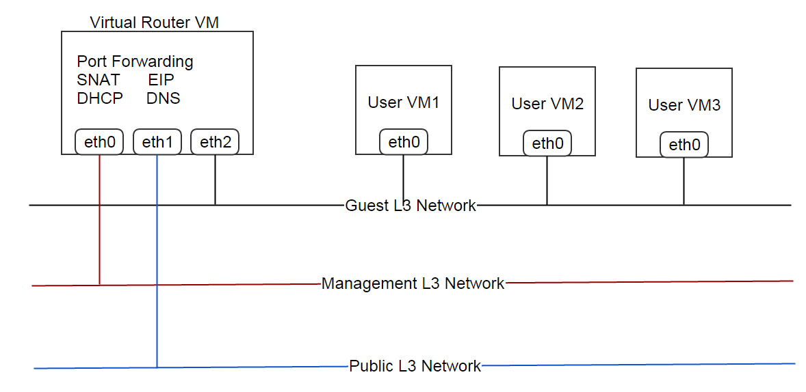

.. _virtual router:

=======================================================================
网络服务和虚拟路由器（Network Services And Virtual Router）
=======================================================================

.. contents:: `目录`
   :depth: 6

--------------------
概览（Overview）
--------------------

ZStack支持很多OSI　4 ~ 7层的网络服务: DHCP, DNS, SNAT, EIP, 和端口转发（PortForwarding）.
L3网络可以启用它所在的L2网络提供的网络服务.
请参考 :ref:`l3Network network services` 获取支持的网络服务列表.

ZStack提供了一个内建的（builtin）网络服务模块（network service provider） -- 虚拟机路由器模块（Virtual Router Provider）, 它是通过定制的Linux虚拟机来实现的网络服务.
当在一个提供虚拟机路由器模块的L3网络上创建一个新的虚拟机时，如果这个特殊的虚拟机之前还不存在，一个特殊的提供虚拟路由器的虚拟机将被创建.

虚拟路由器的虚拟机的计算容量（Computing capacity, CPU, 内存等）是由一个特殊的称为虚拟路由器规格（virtual router offering）的计算规格（instance offering）定义的. 
除了CPU和内存以外, 在虚拟路由器规格中还可以定义许多的额外参数，例如镜像（image）, 管理L3网络（management L3 network）, 共有L3网络（public L3 network）;
详细信息请参见:ref:`virtual router offering inventory <virtual router offering inventory>`.

虽然在ZStack当前版本中虚拟机路由器模块是唯一的网络服务模块(除了安全组模块),
但网络服务框架（network services framework）是高度可插件扩展的（highly pluggable），第三方可以很容易通过一些小插件实现他们自己的功能.

-----------------------------------
网络拓扑（Network typology）
-----------------------------------

一个虚拟机路由器通常包含三个L3网络:

- **管理网络（Management Network）**:

  ZStack管理节点通过这个网络和虚拟路由器代理（virtual router agents）通信; eth0是连接在管理网络上的网卡.

- **公有网络（Public Network）**:

  公有网络提供互联网访问（internet access）, 并且为使用EIP的用户虚拟机提供公有IP地址, 端口转发（port forwarding）, 和源网络地址转换（source NAT）;
  eth1是连接在公有网络上的网卡.

  .. 注意:: 只要能访问互联网，RFC 1918定义的私有子网（private subnet）也可以作为公有网络.

- **客户网络（Guest Network）**

  这个网络用于用户虚拟机连接. eth2是连接在客户网络上的网卡.

在普通的设置中, 所有三个网络应该是不同的L3网络; 然而, 根据你所使用网络拓扑的不同，可以合并为两个或者一个网络.

对于一个:ref:`flat network <l3Network typology>`, 只有一个虚拟机路由器虚拟机仅仅提供DHCP和DNS服务, 网络拓扑可以是像这样的:

- **合并公有网络和客户网络; 一个独立的管理网络**

  .. image:: virtualrouter2.png
     :align: center

- **合并所有三个网络**

  .. image:: virtualrouter3.png
     :align: center

对于一个 :ref:`private network or isolated network <l3Network typology>`, 有一个虚拟机路由器虚拟机提供DHCP, DNS, SNAT; 用户可以选择提供或不提供EI和端口转发; 网络拓扑可以是像这样的:

- **合并公有网络和管理网络; 一个独立的客户网络**

  .. image:: virtualrouter4.png
     :align: center

- **独立的公有网络, 管理网络, 和客户网络**

  .. image:: virtualrouter5.png
     :align: center

.. 注意:: 因为SSH所用的端口22在管理网络中是开放的, 所以把管理网络和其他网络合并可能会有安全隐患.
          因此强烈建议使用独立的管理网络.

.. 注意:: 当前ZStack版本不支持VPC.

--------------------------------------------------------------------
虚拟机路由器网络服务（Virtual Router Network Services）
--------------------------------------------------------------------

在ZStack当前版本中, 虚拟机路由器模块提供了五种网络服务: DHCP, DNS, SNAT, EIP, 以及端口转发; 由于EIP和端口转发有它们自己的API，我们将在专门的章节中介绍它们.

- **DHCP**

  在客户L3网络中, 虚拟机路由器虚拟机可以作为一个DHCP服务器工作; 虚拟路由器DHCP服务器使用静态的IP-MAC映射，因此用户虚拟机将总会获得同一个IP地址.

- **DNS**

  无论DNS服务是否启用, 虚拟路由器虚拟机在客户L3网络中总是作为DNS服务器.
  如果DNS服务启用, 客户L3网络的DNS会作为虚拟路由器虚拟机的上一级DNS服务器（upstream DNS servers）.
  对于如果添加DNS到一个L3网络，请参见 :ref:`L3 network <l3Network>` for how to add DNS to a L3 network.

- **SNAT**

  虚拟路由器虚拟机可以作为路由器向用户虚拟机提供原网络地址转换（source NAT）.

.. _appliance vm inventory:

----------------------
清单（Inventory）
----------------------

除了在:ref:`VM instance inventory <vm inventory>`中提供的属性以外, 虚拟路由器虚拟机还有以下一些额外属性.

属性（Properties）
======================

.. list-table::
   :widths: 20 40 10 20 10
   :header-rows: 1

   * - 名字
     - 描述
     - 可选的
     - 可选的参数值
     - 起始支持版本
   * - **applianceVmType**
     - 特殊虚拟机的类型（appliance VM type）
     -
     - - VirtualRouter
     - 0.6
   * - **managementNetworkUuid**
     - 管理L3网络的uuid
     -
     -
     - 0.6
   * - **defaultRouteL3NetworkUuid**
     - 虚拟路由虚拟机提供默认路由（default routing）的L3网络的uuid
     -
     -
     - 0.6
   * - **publicNetworkUuid**
     - 公有L3网络的uuid
     -
     -
     - 0.6
   * - **status**
     - 虚拟路由器代理（virtual router agent）的连接状态
     -
     - - Connecting
       - Connected
       - Disconnected
     - 0.6

示例
=======

::

        {
            "allVolumes": [
                {
                    "createDate": "August 2, 2015 5:54:12 PM",
                    "description": "Root volume for VM[uuid:f1e76cb2ef0c4dfa87f3b807eb4d7437]",
                    "deviceId": 0,
                    "format": "qcow2",
                    "installPath": "/opt/zstack/nfsprimarystorage/prim-a82b75ee064a48708960f42b800bd910/rootVolumes/acct-36c27e8ff05c4780bf6d2fa65700f22e/vol-2acccd875e364b53824def6248c94a51/2acccd875e364b53824def6248c94a51.qcow2",
                    "lastOpDate": "Dec 2, 2015 5:54:12 PM",
                    "name": "ROOT-for-virtualRouter.l3.8db7eb2ccdab4c4eb4784e46895bb016",
                    "primaryStorageUuid": "a82b75ee064a48708960f42b800bd910",
                    "rootImageUuid": "b4fe2ebbc4522e199d36985012254d7d",
                    "size": 462945280,
                    "state": "Enabled",
                    "status": "Ready",
                    "type": "Root",
                    "uuid": "2acccd875e364b53824def6248c94a51",
                    "vmInstanceUuid": "f1e76cb2ef0c4dfa87f3b807eb4d7437"
                }
            ],
            "applianceVmType": "VirtualRouter",
            "clusterUuid": "b429625fe2704a3e94d698ccc0fae4fb",
            "createDate": "Dec 2, 2015 5:54:12 PM",
            "defaultRouteL3NetworkUuid": "95dede673ddf41119cbd04bcb5d73660",
            "hostUuid": "d07066c4de02404a948772e131139eb4",
            "hypervisorType": "KVM",
            "imageUuid": "b4fe2ebbc4522e199d36985012254d7d",
            "instanceOfferingUuid": "f50a232a1448401cb8d049aad9c3860b",
            "lastHostUuid": "d07066c4de02404a948772e131139eb4",
            "lastOpDate": "Dec 2, 2015 5:54:12 PM",
            "managementNetworkUuid": "95dede673ddf41119cbd04bcb5d73660",
            "name": "virtualRouter.l3.8db7eb2ccdab4c4eb4784e46895bb016",
            "rootVolumeUuid": "2acccd875e364b53824def6248c94a51",
            "publicNetworkUuid": "95dede673ddf41119cbd04bcb5d73660",
            "state": "Running",
            "status": "Connected",
            "type": "ApplianceVm",
            "uuid": "f1e76cb2ef0c4dfa87f3b807eb4d7437",
            "vmNics": [
                {
                    "createDate": "Dec 2, 2015 5:54:12 PM",
                    "deviceId": 1,
                    "gateway": "10.1.1.1",
                    "ip": "10.1.1.155",
                    "l3NetworkUuid": "8db7eb2ccdab4c4eb4784e46895bb016",
                    "lastOpDate": "Dec 2, 2015 5:54:12 PM",
                    "mac": "fa:99:e7:31:98:01",
                    "metaData": "4",
                    "netmask": "255.255.255.0",
                    "uuid": "30bd463b926e4299a1326293ee75ae13",
                    "vmInstanceUuid": "f1e76cb2ef0c4dfa87f3b807eb4d7437"
                },
                {
                    "createDate": "Dec 2, 2015 5:54:12 PM",
                    "deviceId": 0,
                    "gateway": "192.168.0.1",
                    "ip": "192.168.0.188",
                    "l3NetworkUuid": "95dede673ddf41119cbd04bcb5d73660",
                    "lastOpDate": "Dec 2, 2015 5:54:12 PM",
                    "mac": "fa:74:3f:40:cb:00",
                    "metaData": "3",
                    "netmask": "255.255.255.0",
                    "uuid": "dc02fee25e9244ad8cbac151657a7b34",
                    "vmInstanceUuid": "f1e76cb2ef0c4dfa87f3b807eb4d7437"
                }
            ],
            "zoneUuid": "3a3ed8916c5c4d93ae46f8363f080284"
        }

.. _virtual router offering:

---------------------------------------------------
虚拟路由器规格（Virtual Router Offering）
---------------------------------------------------

虚拟路由器规格是包含额外属性的一个特殊的:ref:`instance offering <instance offering>`.

.. _virtual router offering inventory:

清单（Inventory）
=====================

除了在:ref:`instance offering inventory <instance offering inventory>`中提到的属性以外, 虚拟路由器规格还有以下额外的属性:

属性（Properties）
++++++++++++++++++++++

.. list-table::
   :widths: 20 40 10 20 10
   :header-rows: 1

   * - **managementNetworkUuid**
     - 管理L3网络的uuid
     -
     -
     - 0.6
   * - **publicNetworkUuid**
     - 公有L3网络的uuid
     -
     -
     - 0.6
   * - **zoneUuid**
     - 所在区域的uuid. 虚拟机路由器只能从同一个区域中的虚拟机路由器规格创建出来.
     -
     -
     - 0.6
   * - **isDefault**
     - 请参见 ::ref:`default offering <default offering>`
     -
     -
     - 0.6
   * - **imageUuid**
     - 虚拟路由器镜像的uuid, 请参见 :ref:`image <virtual router image>`
     -
     -
     - 0.6

示例
+++++++

::

        {
            "allocatorStrategy": "DefaultHostAllocatorStrategy",
            "cpuNum": 1,
            "cpuSpeed": 128,
            "createDate": "Nov 30, 2015 3:31:43 PM",
            "imageUuid": "b4fe2ebbc4522e199d36985012254d7d",
            "isDefault": true,
            "lastOpDate": "Nov 30, 2015 3:31:43 PM",
            "managementNetworkUuid": "95dede673ddf41119cbd04bcb5d73660",
            "memorySize": 536870912,
            "name": "VROFFERING5",
            "publicNetworkUuid": "95dede673ddf41119cbd04bcb5d73660",
            "sortKey": 0,
            "state": "Enabled",
            "type": "VirtualRouter",
            "uuid": "f50a232a1448401cb8d049aad9c3860b",
            "zoneUuid": "3a3ed8916c5c4d93ae46f8363f080284"
        }

.. _default offering:

默认规格（Default Offering）
----------------------------------

在一个L3网络上创建一个虚拟路由器时, ZStack需要决定使用哪一个虚拟路由器规格; 决定的策略如下:

1. 使用这个规格，如果某个虚拟路由器规格包含系统标签:ref:`guestL3Network <vr tag guestL3Network>`, 并且这个系统标签中包含了这个L3网络的uuid.
2. 如果没有在步骤1中找到合适的规格, 使用默认的虚拟路由器规格.

每一个区域都必须有一个默认的虚拟路由器规格.

.. _virtual router image:

镜像（Image）
------------------

虚拟路由器虚拟机可以使用从http://download.zstack.org/templates/zstack-virtualrouter-0.6.qcow2下载的定制的Linux镜像.
这个Linux操作系统的root密码是::

    username: root
    password: password

用户可以通过终端（console）访问虚拟路由器虚拟机，并是用这个用户名和密码登陆.

在创建虚拟路由器规格之前, 用户需要使用:ref:`add image <add image>`将这个镜像添加到备份存储（backup storage）中;
为了避免从这个镜像创建用户虚拟机, 用户可以将参数'system'设置为true.

.. 注意:: 在将来的ZStack版本中, 会支持生成随机的root密码，以提高虚拟路由器虚拟机的安全性.

管理网络和公有网络（Management Network and Public Network）
-----------------------------------------------------------------------

在创建虚拟路由器规格之前, 用户必须首先通过使用:ref:`create L3 network <create L3 network>`创建对应的L3网络.
用户可以把参数'system'设置true, 来避免从这些网络上创建用户虚拟机.

-----------------------
操作（Operations）
-----------------------

创建虚拟路由器规格（Create Virtual Router Offering）
===============================================================

用户可以使用CreateVirtualRouterOffering来创建一个虚拟路由器规格. 例如::

    CreateVirtualRouterOffering name=small cpuNum=1 cpuSpeed=1000 memorySize=1073741824 isDefault=true
    managementNetworkUuid=95dede673ddf41119cbd04bcb5d73660 publicNetworkUuid=8db7eb2ccdab4c4eb4784e46895bb016 zoneUuid=3a3ed8916c5c4d93ae46f8363f080284
    imageUuid=95dede673ddf41119cbd04bcb5d73660

除了在:ref:`CreateInstanceOffering <CreateInstanceOffering>`中提到的参数以外, 还有以下额外的参数:

参数（Parameters）
++++++++++++++++++++++

.. list-table::
   :widths: 20 40 10 20 10
   :header-rows: 1

   * - 名字
     - 描述
     - 可选的
     - 可选的参数值
     - 起始支持版本
   * - **managementNetworkUuid**
     - 管理L3网络的uuid
     -
     -
     - 0.6
   * - **publicNetworkUuid**
     - 公有L3网络的uuid; 默认为managementNetworkUuid.
     - 是
     -
     - 0.6
   * - **zoneUuid**
     - 所在区域的uuid
     -
     -
     - 0.6
   * - **imageUuid**
     - 镜像的uuid
     -
     -
     - 0.6

删除虚拟路由器规格（Delete Virtual Router Offering）
================================================================

请参见 :ref:`DeleteInstanceOffering <DeleteInstanceOffering>`

.. _ReconnectVirtualRouter:

重连虚拟路由器代理（Reconnect Virtual Router Agent）
================================================================

正如之前提到的一样, 在虚拟路由器虚拟机上有一个Python虚拟路由器代理（Python virtual router agent）.
用户可以使用ReconnectVirtualRouter来重新初始化从一个ZStack管理节点到一个虚拟路由器虚拟机的连接过程, 这会使得:

1. 如果代理的二进制文件（agent binary）的MD5校验值和管理节点库（repository）中的不一致，更新虚拟路由器代理.
2. 重启代理
3. 重新应用包括DHCP, DNS, SNAT, EIP, 和端口转发在内的所有网络服务配置到虚拟路由器虚拟机.

命令示例::

    ReconnectVirtualRouter vmInstanceUuid=bd1652b1e44144e6b9b5b286b82edb69

参数（Parameters）
++++++++++++++++++++++

.. list-table::
   :widths: 20 40 10 20 10
   :header-rows: 1

   * - 名字
     - 描述
     - 可选的
     - 可选的参数值
     - 起始支持版本
   * - **vmInstanceUuid**
     - 虚拟路由器虚拟机的uuid
     -
     -
     - 0.6

启动虚拟路由器虚拟机（Start Virtual Router VM）
============================================================

请参见 :ref:`StartVmInstance <StartVmInstance>`. 在启动时,
虚拟路由器虚拟机会执行:ref:`ReconnectVirtualRouter <ReconnectVirtualRouter>`中描述的代理连接过程.

重启虚拟路由器虚拟机（Reboot Virtual Router VM）
=============================================================

请参见 :ref:`RebootVmInstance <RebootVmInstance>`. 在重启时,
虚拟路由器虚拟机会执行 :ref:`ReconnectVirtualRouter <ReconnectVirtualRouter>`中描述的代理连接过程.

停止虚拟路由器虚拟机（Stop Virtual Router VM)
=========================================================

请参见 :ref:`StopVmInstance <StopVmInstance>`.

.. 警告:: 虚拟路由器虚拟机停止后, 可能会导致客户L3网络上该虚拟路由器虚拟机服务的虚拟机的网络不工作.

删除虚拟路由器虚拟机（Destroy Virtual Router VM）
==============================================================

请参见 :ref:`DestroyVmInstance <DestroyVmInstance>`.

.. 警告:: 虚拟路由器虚拟机被删除后, 可能会导致客户L3网络上该虚拟路由器虚拟机服务的虚拟机的网络不工作.

迁移虚拟路由器虚拟机（Migrate Virtual Router VM）
==============================================================

请参见 :ref:`MigrateVm <MigrateVm>`.

创建虚拟路由器虚拟机（Create Virtual Router VM）
=============================================================

虽然没有现成的API可以手动创建一个虚拟路由器虚拟机, 但是用户在客户L3网络上创建或启动一个虚拟机的时候会自动触发创建一个虚拟路由器虚拟机.
如果该L3网络没有已经在运行的虚拟路由器虚拟机, 创建或停止/启动一个虚拟机的时候会自动触发创建一个虚拟路由器虚拟机.

查询虚拟路由器虚拟机（Query Virtual Router VM）
============================================================

用户可以使用QueryVirtualRouterVm来查询虚拟路由器虚拟机. 例如::

    QueryVirtualRouterVm defaultRouteL3NetworkUuid=95dede673ddf41119cbd04bcb5d73660

::

    QueryVirtualRouterVm vmNics.mac=fa:d9:af:a1:38:01

原生域（Primitive Fields）
+++++++++++++++++++++++++++++++

请参见 :ref:`appliance vm inventory <appliance vm inventory>`.

嵌套和扩展域（Nested And Expanded Fields）
+++++++++++++++++++++++++++++++++++++++++++++++++++

.. list-table::
   :widths: 20 30 40 10
   :header-rows: 1

   * - 域（Field）
     - 清单（Inventory）
     - 描述
     - 起始支持版本
   * - **vmNics**
     - :ref:`VM nic inventory <vm nic inventory>`
     - 虚拟路由器虚拟机的虚拟机网卡
     - 0.6
   * - **allVolumes**
     - :ref:`volume inventory <volume inventory>`
     - 虚拟路由器虚拟机的云盘
     - 0.6
   * - **host**
     - :ref:`host inventory <host inventory>`
     - 运行虚拟路由器虚拟机的主机
     - 0.6
   * - **cluster**
     - :ref:`cluster inventory <cluster inventory>`
     - 虚拟路由器虚拟机所属的集群
     - 0.6
   * - **image**
     - :ref:`image inventory <image inventory>`
     - 用于创建虚拟路由器虚拟机的镜像
     - 0.6
   * - **zone**
     - :ref:`zone inventory <zone inventory>`
     - 虚拟路由器虚拟机所属的区域
     - 0.6
   * - **rootVolume**
     - :ref:`volume inventory <volume inventory>`
     - 虚拟路由器虚拟机的根云盘
     - 0.6
   * - **virtualRouterOffering**
     - :ref:`virtual router offering inventory <virtual router offering inventory>`
     -
     - 0.6
   * - **eip**
     - :ref:`EIP inventory <eip inventory>`
     - 虚拟路由器虚拟机提供服务的EIP
     - 0.6
   * - **vip**
     - :ref:`VIP inventory <vip inventory>`
     - 虚拟路由器虚拟机提供服务的VIP
     - 0.6
   * - **portForwarding**
     - :ref:`port forwarding rule inventory <port forwarding rule inventory>`
     - 虚拟路由器虚拟机提供服务的端口转发
     - 0.6

查询虚拟路由器规格（Query Virtual Router Offering）
===============================================================

用户可以使用QueryVirtualRouterOffering来查询虚拟路由器规格. 例如::

    QueryVirtualRouterOffering managementNetworkUuid=a82b75ee064a48708960f42b800bd910 imageUuid=6572ce44c3f6422d8063b0fb262cbc62

::

    QueryVirtualRouterOffering managementL3Network.name=systemL3Network image.name=newVirtualRouterImage

原生域（Primitive Fields）
+++++++++++++++++++++++++++++++

请参见 :ref:`virtual router offering inventory <virtual router offering inventory>`.

嵌套和扩展域（Nested And Expanded Fields）
+++++++++++++++++++++++++++++++++++++++++++++++++++

.. list-table::
   :widths: 20 30 40 10
   :header-rows: 1

   * - 域（Field）
     - 清单（Inventory）
     - 描述
     - 起始支持版本
   * - **image**
     - :ref:`image inventory <image inventory>`
     - 规格包含的镜像
     - 0.6
   * - **managementL3Network**
     - :ref:`L3 network inventory <l3Network inventory>`
     - 规格包含的管理L3网络
     - 0.6
   * - **publicL3Network**
     - :ref:`L3 network inventory <l3Network inventory>`
     - 规格包含的公有L3网络
     - 0.6
   * - **zone**
     - :ref:`zone inventory <zone inventory>`
     - 规格所属的区域
     - 0.6

----------------------------------------
全局配置（Global Configurations）
----------------------------------------

.. _agent.deployOnStart:

agent.deployOnStart
===================

.. list-table::
   :widths: 20 30 20 30
   :header-rows: 1

   * - 名字
     - 类别
     - 默认值
     - 可选的参数值
   * - **agent.deployOnStart**
     - virtualRouter
     - false
     - - true
       - false

是否要在虚拟路由器虚拟机启动/停止/重启的时候部署虚拟路由器代理;
由于虚拟路由器代理是内建在虚拟路由器虚拟机中的，因此这个配置只应在用户想要升级代理的时候设置为true.

.. _command.parallelismDegree:

command.parallelismDegree
=========================

.. list-table::
   :widths: 20 30 20 30
   :header-rows: 1

   * - 名字
     - 类别
     - 默认值
     - 可选的参数值
   * - **command.parallelismDegree**
     - virtualRouter
     - 100
     - > 0

在虚拟路由器代理上可并行执行命令的最大数目.

.. _applianceVm.connect.timeout:

connect.timeout
===============

.. list-table::
   :widths: 20 30 20 30
   :header-rows: 1

   * - 名字
     - 类别
     - 默认值
     - 可选的参数值
   * - **connect.timeout**
     - applianceVm
     - 300
     - > 0

当管理节点连接虚拟路由器代理时的SSH连接超时设置, 单位是秒. 如果在设定的时间限制内管理节点不能和虚拟路由器虚拟机建立SSH连接, 会报告一个错误.

.. _applianceVm.agent.deployOnStart:

agent.deployOnStart
===================

.. list-table::
   :widths: 20 30 20 30
   :header-rows: 1

   * - 名字
     - 类别
     - 默认值
     - 可选的额参数值
   * - **agent.deployOnStart**
     - applianceVm
     - false
     - - true
       - false

是否要在虚拟路由器虚拟机启动/停止/重启的时候部署特殊虚拟机代理; 由于虚拟路由器代理是内建在特殊虚拟机中的，因此这个配置只应在用户想要升级代理的时候设置为true.

.. 注意:: 在虚拟路由器虚拟机上实际有两个代理, 一个是虚拟路由器代理，另一个是特殊虚拟机代理（appliance VM agent）.
          它们是为了不同的目的, 通常用户不需要关心它们.

-----------------
标签（Tags）
-----------------

用户可以使用计算规格章节中和虚拟机章节中提到的方法分别在虚拟路由器规格或虚拟路由器虚拟机上创建用户标签.

系统标签（System Tags）
=============================

命令并行度（Parallel Command Level）
+++++++++++++++++++++++++++++++++++++++++++

管理可以限制在一个虚拟路由器虚拟机上并行执行命令的最大数量.

.. list-table::
   :widths: 20 30 40 10
   :header-rows: 1

   * - 标签
     - 描述
     - 示例
     - 起始支持版本
   * - **commandsParallelismDegree::{parallelismDegree}**
     - 在一个虚拟路由器虚拟机上并行执行命令的最大数量
     - commandsParallelismDegree::100
     - 0.6

这个标签既可以在虚拟路由器规格上创建，也可以在虚拟路由器虚拟机上创建; 如果是在虚拟路由器规格上创建的g, 从这个虚拟路由器规格创建的所有虚拟路由器虚拟机都将继承这个标签. 对于虚拟路由器规格请使用resourceType=InstanceOfferingVO创建标签,
对于虚拟路由器虚拟机请使用resourceType=VmInstanceVO创建标签.

.. _vr tag guestL3Network:

客户L3网络（Guest L3 Network）
+++++++++++++++++++++++++++++++++++++

管理员可以将虚拟路由器规格绑定到一个客户L3网络, 以指定在该客户L3网络上创建虚拟路由器虚拟机的时候使用哪一个虚拟路由器规格.

.. list-table::
   :widths: 20 30 40 10
   :header-rows: 1

   * - 标签
     - 描述
     - 示例
     - 起始支持版本
   * - **guestL3Network::{guestL3NetworkUuid}**
     - 客户L3网络的uuid
     - guestL3Network::dd56c5c209a74b669b3fe6115a611d57
     - 0.6

例如::

    CreateSystemTag resourceType=InstanceOfferingVO resourceUuid=YOUR_VR_OFFERING_UUID tag=guestL3Network::YOUR_L3_NETWORK_UUID
