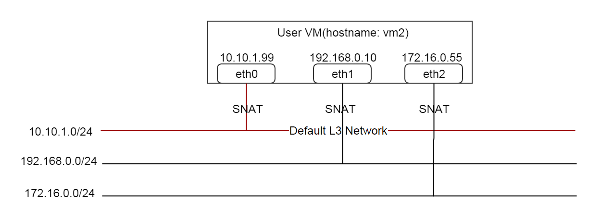
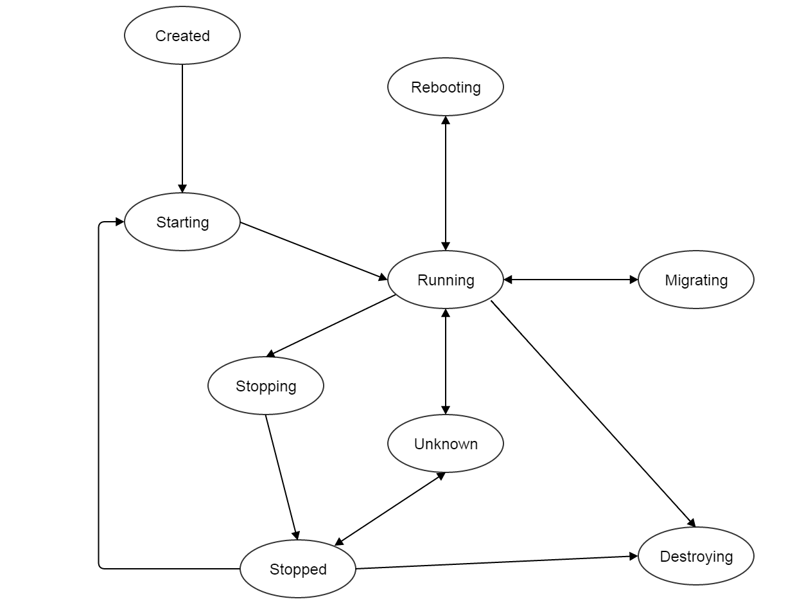

.. _vm:

===============
虚拟机（Virtual Machine）
===============

.. contents:: `目录`
   :depth: 6

--------
概览（Overview）
--------

虚拟机(VM)消耗了数据中心里的计算（computing）, 存储（storage）, 以及网络（network）资源.

.. _vm inventory:

---------
清单（Inventory）
---------

属性（Properties）
==========

.. list-table::
   :widths: 20 40 10 20 10
   :header-rows: 1

   * - 名字
     - 描述
     - 可选的
     - 可选的参数值
     - 起始支持版本
   * - **uuid**
     - 请参见 :ref:`resource properties`
     -
     -
     - 0.6
   * - **name**
     - 请参见 :ref:`resource properties`
     -
     -
     - 0.6
   * - **description**
     - 请参见 :ref:`resource properties`
     - 是
     -
     - 0.6
   * - **zoneUuid**
     - 所在区域的uuid, 请参见 :ref:`zone` 和 :ref:`location <vm location>`
     - 是
     -
     - 0.6
   * - **clusterUuid**
     - 所在集群的uuid, 请参见 :ref:`cluster` 和 :ref:`location <vm location>`
     - 是
     -
     - 0.6
   * - **hostUuid**
     - 运行虚拟机当前的主机uuid, 请参见 :ref:`host` and :ref:`location <vm location>`
     - 是
     -
     - 0.6
   * - **lastHostUuid**
     - 上一次运行虚拟机的主机uuid, 请参见 :ref:`host` and :ref:`location <vm location>`
     - 是
     -
     - 0.6
   * - **imageUuid**
     - 用于创建虚拟机根云盘的镜像uuid, 请参见 :ref:`image`
     -
     -
     - 0.6
   * - **instanceOfferingUuid**
     - 计算规格的uuid, 请参见 :ref:`instance offering`
     -
     -
     - 0.6
   * - **rootVolumeUuid**
     - 虚拟机根云盘的uuid, 请参见 :ref:`volume`
     -
     -
     - 0.6
   * - **defaultL3NetworkUuid**
     - 虚拟机默认L3网络的uuid, 请参见 :ref:`L3 network<l3Network>` 和 :ref:`networks <vm networks>`
     -
     -
     - 0.6
   * - **type**
     - 虚拟机类型

       - UserVm: 用户创建的虚拟机
       - ApplianceVm: ZStack创建的帮助管理云的虚拟机
     -
     - - UserVm
       - ApplianceVm
     - 0.6
   * - **hypervisorType**
     - 虚拟机的虚拟机管理程序类型, 请参见 :ref:`host` 和 :ref:`hypervisor type <vm hypervisor type>`
     -
     - - KVM
     - 0.6
   * - **state**
     - 虚拟机的可用状态, 请参见 :ref:`state <vm state>`
     - - Created
       - Starting
       - Running
       - Stopping
       - Stopped
       - Rebooting
       - Destroying
       - Destroyed
       - Migrating
       - Unknown
     -
     - 0.6
   * - **vmNics**
     - :ref:`nic inventory <vm nic inventory>`列表, 请参见 :ref:`networks <vm networks>`
     -
     -
     - 0.6
   * - **allVolumes**
     - :ref:`volume inventory <volume inventory>`列表, 请参见 :ref:`volumes <vm volumes>`
     -
     -
     - 0.6
   * - **createDate**
     - 请参见 :ref:`resource properties`
     -
     -
     - 0.6
   * - **lastOpDate**
     - 请参见 :ref:`resource properties`
     -
     -
     - 0.6

示例
+++++++

::

        {
            "allVolumes": [
                {
                    "createDate": "Dec 2, 2015 5:53:42 PM",
                    "description": "Root volume for VM[uuid:d92a03ed745a0d32fe63dc30051d3862]",
                    "deviceId": 0,
                    "format": "qcow2",
                    "installPath": "/opt/zstack/nfsprimarystorage/prim-a82b75ee064a48708960f42b800bd910/rootVolumes/acct-36c27e8ff05c4780bf6d2fa65700f22e/vol-e9555324042542288ec20a67797d476c/e9555324042542288ec20a67797d476c.qcow2",
                    "lastOpDate": "Dec 2, 2015 5:53:42 PM",
                    "name": "ROOT-for-vm-4-vlan10",
                    "primaryStorageUuid": "a82b75ee064a48708960f42b800bd910",
                    "rootImageUuid": "f1205825ec405cd3f2d259730d47d1d8",
                    "size": 419430400,
                    "state": "Enabled",
                    "status": "Ready",
                    "type": "Root",
                    "uuid": "e9555324042542288ec20a67797d476c",
                    "vmInstanceUuid": "d92a03ed745a0d32fe63dc30051d3862"
                }
            ],
            "clusterUuid": "b429625fe2704a3e94d698ccc0fae4fb",
            "createDate": "Dec 2, 2015 5:53:42 PM",
            "defaultL3NetworkUuid": "6572ce44c3f6422d8063b0fb262cbc62",
            "hostUuid": "d07066c4de02404a948772e131139eb4",
            "hypervisorType": "KVM",
            "imageUuid": "f1205825ec405cd3f2d259730d47d1d8",
            "instanceOfferingUuid": "04b5419ca3134885be90a48e372d3895",
            "lastHostUuid": "d07066c4de02404a948772e131139eb4",
            "lastOpDate": "Dec 2, 2015 5:53:42 PM",
            "name": "vm-4-vlan10",
            "rootVolumeUuid": "e9555324042542288ec20a67797d476c",
            "state": "Running",
            "type": "UserVm",
            "uuid": "d92a03ed745a0d32fe63dc30051d3862",
            "vmNics": [
                {
                    "createDate": "Dec 2, 2015 5:53:42 PM",
                    "deviceId": 0,
                    "gateway": "10.0.0.1",
                    "ip": "10.0.0.218",
                    "l3NetworkUuid": "6572ce44c3f6422d8063b0fb262cbc62",
                    "lastOpDate": "Dec 2, 2015 5:53:42 PM",
                    "mac": "fa:ef:34:5c:6c:00",
                    "netmask": "255.255.255.0",
                    "uuid": "fb8404455cf84111958239a9ec19ca28",
                    "vmInstanceUuid": "d92a03ed745a0d32fe63dc30051d3862"
                }
            ],
            "zoneUuid": "3a3ed8916c5c4d93ae46f8363f080284"
        }

.. _vm location:

位置（Location）
++++++++

由于ZStack通过区域（zones）, 集群（clusters）, 和主机（hosts）组织计算资源（computing resources）, 因此虚拟机的位置可以通过zoneUuid, clusterUuid, 和hostUuid标识.
当虚拟机开始运行后, 这些UUIDs会被设置为标识虚拟机当前位置的值; 当虚拟机停止运行后,
hostUuid会被设置为NULL, zoneUuid和clusterUuid会保持不变. lastHostUuid比较特别, 因为它代表了虚拟机上次运行的主机; 
对于新创建的虚拟机, lastHostUuid被设置为NULL; 一旦虚拟机停止运行, lastHostUuid就被设置为之前的hostUuid值.

在:ref:`host allocator strategy <instance offering allocator strategy>`章节中已经详细描述了对于新创建虚拟机的主机选择算法.
在本章后面的小节中, 会展示启动和迁移虚拟机的策略.

.. _vm networks:

网络（Networks）
++++++++

虚拟机可以有一个或多个:ref:`L3 networks <l3Network>`; :ref:`vm nics <vm nic inventory>` 包含了每个L3网络的IP地址, 子网掩码, MAC地址信息. 
如果一个虚拟机有不止一个L3网络，那么它必须制定一个默认的L3网络，这个网络提供默认的路由（routing), DNS, 和主机名; 
如果一个虚拟机只有一个L3网络, 那么它就自动成为默认的L3网络.

下面的示例会帮助理解什么是默认的L3网络. 假设你有一个如下图所示的用户虚拟机:

虚拟机所连接的三个L3网络都提供SNAT服务, 并且默认的L3网络是10.10.1.0/24:

::

    CIDR: 10.10.1.0/24
    Gateway: 10.10.1.1
    DNS domain: web.tier.mycompany.com

那么虚拟机的路由表（routing table）将会是这样:

::

    default via 10.10.1.1 dev eth0
    10.10.1.0/24 dev eth0  proto kernel  scope link  src 10.10.1.99
    192.168.0.0/24 dev eth1  proto kernel  scope link  src 192.168.0.10
    172.16.0.0/24 dev eth2  proto kernel  scope link  src 172.16.0.55

可见，默认路由（default routing）指向了**10.10.1.1**，也就是默认L3网络的网关; 同时虚拟机的/etc/resolv.conf如下所示:

::

    search web.tier.mycompany.com
    nameserver 10.10.1.1

也就是说DNS域也是来自默认L3网络; DNS域名服务器（DNS name server）也是设置为**10.10.1.1**, 因为默认L3网络提供了DNS服务器; 最终, 虚拟机的FQDN(Full Qualified Domain Name)看起来会像这样:

::

    vm2.web.tier.mycompany.com

它是从DNS域扩展而来的.

.. _vm nic inventory:

虚拟机网络接口清单（VM Nic Inventory）
----------------

.. list-table::
   :widths: 20 40 10 20 10
   :header-rows: 1

   * - 名字
     - 描述
     - 可选的
     - 可选的参数值
     - 起始支持版本
   * - **uuid**
     - 请参见 :ref:`resource properties`
     -
     -
     - 0.6
   * - **vmInstanceUuid**
     - 父虚拟机的uuid
     -
     -
     - 0.6
   * - **l3NetworkUuid**
     - 网卡所连接的:ref:`l3 network <l3Network>`的uuid
     -
     -
     - 0.6
   * - **ip**
     - IP地址
     -
     -
     - 0.6
   * - **mac**
     - MAC地址
     -
     -
     - 0.6
   * - **netmask**
     - 子网掩码
     -
     -
     - 0.6
   * - **gateway**
     - 网关
     -
     -
     - 0.6
   * - **metaData**
     - 内部使用的保留域
     - 是
     -
     - 0.6
   * - **deviceId**
     - 标识网卡在客户操作系统（guest operating system）以太网设备中顺序的整形数字. 例如, 0通常代表eth0, 1通常代表eth1.
     -
     -
     - 0.6

在ZStack当前版本中, 一旦虚拟机的网卡被分配了IP地址, 这个IP地址将一直伴随这个网卡直到虚拟机被删除.

示例
*******

::

      {
          "createDate": "Dec 2, 2015 5:53:42 PM",
          "deviceId": 0,
          "gateway": "10.0.0.1",
          "ip": "10.0.0.218",
          "l3NetworkUuid": "6572ce44c3f6422d8063b0fb262cbc62",
          "lastOpDate": "Dec 2, 2015 5:53:42 PM",
          "mac": "fa:ef:34:5c:6c:00",
          "netmask": "255.255.255.0",
          "uuid": "fb8404455cf84111958239a9ec19ca28",
          "vmInstanceUuid": "d92a03ed745a0d32fe63dc30051d3862"
      }

.. _vm volumes:

云盘（Volumes）
+++++++

`allVolumes`域是由:ref:`volume inventory <volume inventory>`组成的列表，其中包含了根云盘（root volume）和数据云盘（data volumes）.
如果要找出其中的根云盘，用户可以通过迭代这个列表，并检查云盘的类型或者使用域'rootVolumeUuid'来匹配云盘的UUID.
根云盘会一直和虚拟机伴随，直到虚拟机被删除.

.. _vm hypervisor type:

虚拟机管理程序类型（Hypervisor Type）
+++++++++++++++

根据虚拟机创建方式的不同，虚拟机的虚拟机管理程序类型可能是从镜像的虚拟机管理程序类型，或主机的虚拟机管理程序类型继承而来的.

- **从RootVolumeTemplate创建的虚拟机**:

  由于镜像中已经安装有操作系统, 虚拟机会被创建在和镜像有相同虚拟机管理程序类型的主机上, 因此虚拟机的虚拟机管理程序类型是从镜像继承而来的.

- **从ISO文件创建的虚拟机**:
  由于会使用ISO安装操作系统到虚拟机的空白根云盘上, 虚拟机可能被创建在拥有任何类型的虚拟机管理程序的主机上, 因此虚拟机的虚拟机管理程序类型是从创建的主机上继承而来的.

.. _vm state:

可用状态（State）
+++++

虚拟机的生命周期中有10中可用状态.

- **Created**

  在这种状态时，虚拟机还只是创建于数据库中的一个记录而已, 并没有在任何的主机上启动. 这个状态仅在创建一个新的虚拟机的时候出现.

- **Starting**

  在这种状态时，虚拟机正在一个主机上启动

- **Running**

  在这种状态时，虚拟机正运行在一个主机

- **Stopping**

  在这种状态时，虚拟机正在一个主机上停止过程中

- **Stopped**

  在这种状态时，虚拟机已经停止，没有运行在任何主机上

- **Rebooting**

  在这种状态时，虚拟机正在先前运行的主机上重启

- **Destroying**

  在这种状态时，虚拟机正在被删除

- **Migrating**

  在这种状态时，虚拟机正在被迁移到另一个主机上

- **Unknown**

  由于某些原因, 例如, 由于失去和主机的连接, ZStack不能检查虚拟机的可用状态

ZStack会使用VmTracer来周期性的跟踪虚拟机的状态; 默认的间隔时间（interval）是60秒. 虚拟机的状态可能会被ZStack之外的因素影响,
例如, 主机掉电（power outage）会导致所有该主机上运行的虚拟机停止运行; 一旦VmTracer检测到虚拟机的实际状态和数据库中的记录不匹配, 数据库会被更新为实际的状态. 
如果VmTracer不能成功检查虚拟机的状态, 例如, 由于ZStack管理节点和主机之间的连接丢失, 虚拟机会被设置为Unknown状态;
一旦VmTracer再次成功检测到虚拟机的状态, 例如, ZStack管理节点和主机之间的连接恢复之后, 虚拟机的状态也会被更新为实际的状态.

----------
操作（Operations）
----------

.. _CreateVmInstance:

创建虚拟机（Create VM）
=========

用户可以使用CreateVmInstance来创建一个虚拟机. 例如::

    CreateVmInstance name=vm imageUuid=d720ff0c60ee48d3a2e6263dd3e12c33 instanceOfferingUuid=76789b62aeb542a5b4b8b8488fbaced2 l3NetworkUuids=37d3c4a1e2f14a1c8316a23531e62988,05266285f96245f096f3b7dce671991d defaultL3NetworkUuid=05266285f96245f096f3b7dce671991d

参数（Parameters）
++++++++++

.. list-table::
   :widths: 20 40 10 20 10
   :header-rows: 1

   * - 名字
     - 描述
     - 可选的
     - 可选的参数值
     - 起始支持版本
   * - **name**
     - 资源的名字, 请参见 :ref:`resource properties`
     -
     -
     - 0.6
   * - **resourceUuid**
     - 资源的uuid, 请参见 :ref:`create resource`
     - 是
     -
     - 0.6
   * - **description**
     - 资源的描述, 请参见 :ref:`resource properties`
     - 是
     -
     - 0.6
   * - **instanceOfferingUuid**
     - :ref:`instance offering <instance offering>`的uuid
     -
     -
     - 0.6
   * - **imageUuid**
     - :ref:`image <image>`的uuid. 镜像只可以是RootVolumeTemplate或ISO类型
     -
     -
     - 0.6
   * - **l3NetworkUuids**
     - :ref:`L3 network <l3Network>`的uuid列表
     -
     -
     - 0.6
   * - **type**
     - 保留的域, 默认为UserVm
     -
     - - UserVm
       - ApplianceVm
     - 0.6
   * - **rootDiskOfferingUuid**
     - 根云盘:ref:`disk offering <disk offering>`的uuid, 请参见 :ref:`rootDiskOfferingUuid`
     - 是
     -
     - 0.6
   * - **dataDiskOfferingUuids**
     - :ref:`disk offering <disk offering>`的uuid列表, 请参见 :ref:`dataDiskOfferingUuids`
     - 是
     -
     - 0.6
   * - **zoneUuid**
     - 如果非null, 虚拟机将在所指定的区域上创建; clusterUuid和hostUuid优先于这个参数的设置
     - 是
     -
     - 0.6
   * - **clusterUuid**
     - 如果非null, 虚拟机将在所指定的集群上创建; hostUuid优先于这参数的设置
     - 是
     -
     - 0.6
   * - **hostUuid**
     - 如果非null, 虚拟机将在所指定的主机上创建
     - 是
     -
     - 0.6
   * - **defaultL3NetworkUuid**
     - 如果l3NetworkUuids包含了多余一个的L3网络的UUID, 这个参数指定哪个L3网络是默认的L3网络.
       如果l3NetworkUuids只有一个L3网络UUID，可不设置这个参数.
     - 是
     -
     - 0.6q

.. _rootDiskOfferingUuid:

rootDiskOfferingUuid
--------------------

如果虚拟机是从ISO镜像创建的, 用户必须通过rootDiskOfferingUuid指定一个:ref:`disk offering <disk offering>，这样ZStack才能知道根云盘的磁盘大小; 
如果虚拟机是从RootVolumeTemplate镜像创建的, 可以忽略这个域.

.. _dataDiskOfferingUuids:

dataDiskOfferingUuids
---------------------

通过在dataDiskOfferingUuids指定云盘规格的UUID列表, 用户可以创建一个挂载了多个数据云盘的虚拟机.
如果某个数据云盘创建失败了，整个虚拟机的创建也会失败.

.. _StopVmInstance:

停止虚拟机（Stop VM）
=======

用户可以使用StopVmInstance来停止一个虚拟机. 例如::

    StopVmInstance uuid=76789b62aeb542a5b4b8b8488fbaced2

参数（Parameters）
++++++++++

.. list-table::
   :widths: 20 40 10 20 10
   :header-rows: 1

   * - 名字
     - 描述
     - 可选的
     - 可选的参数值
     - 起始支持版本
   * - **uuid**
     - 虚拟机的uid
     -
     -
     - 0.6

.. _StartVmInstance:

启动虚拟机（Start VM）
========

用户可以使用StartVmInstance来启动一个虚拟机. 例如::

    StartVmInstance uuid=76789b62aeb542a5b4b8b8488fbaced2

参数（Parameters）
++++++++++

.. list-table::
   :widths: 20 40 10 20 10
   :header-rows: 1

   * - 名字
     - 描述
     - 可选的
     - 可选的参数值
     - 起始支持版本
   * - **uuid**
     - 虚拟机的uuid
     -
     -
     - 0.6

当启动一个虚拟机的时候, ZStack会使用LastHostPreferredAllocatorStrategy算法尽可能的使用虚拟机之前运行的主机启动虚拟机;
如果用虚拟机之前运行的主机不可用, 会使用:ref:`DesignatedHostAllocatorStrategy`算法在一个新的主机上启动虚拟机.

.. _RebootVmInstance:

重启虚拟机（Reboot VM）
=========

用户可以使用RebootVmInstance来重启一个虚拟机. 例如::

    RebootVmInstance uuid=76789b62aeb542a5b4b8b8488fbaced2

参数（Parameters）
++++++++++

.. list-table::
   :widths: 20 40 10 20 10
   :header-rows: 1

   * - 名字
     - 描述
     - 可选的
     - 可选的参数值
     - 起始支持版本
   * - **uuid**
     - 虚拟机的uuid
     -
     -
     - 0.6

.. _DestroyVmInstance:

删除虚拟机（Destroy VM）
==========

用户可以使用DestroyVmInstance来删除一个虚拟机. 例如::

    DestroyVmInstance uuid=76789b62aeb542a5b4b8b8488fbaced2

参数（Parameters）
++++++++++

.. list-table::
   :widths: 20 40 10 20 10
   :header-rows: 1

   * - 名字
     - 描述
     - 可选的
     - 可选的参数值
     - 起始支持版本
   * - **deleteMode**
     - 请参见 :ref:`delete resource`
     - 是
     - - Permissive
       - Enforcing
     - 0.6
   * - **uuid**
     - 虚拟机的uuid
     -
     -
     - 0.6

.. 警告:: 没有办法可以恢复一个已经被删除的虚拟机; 一旦虚拟机被删除, 它的根云盘也会被删除; 如果全局设置:ref:`dataVolume.deleteOnVmDestroy`为true, 虚拟机挂载的数据云盘也会被删除; 否则, 数据云盘只会被卸载.

.. _MigrateVm:

迁移虚拟机（Migrate VM）
==========

管理员可以使用MigrateVm来在线迁移（live migrate）一个正在运行的虚拟机，从当前主机到另一个主机. 例如::

    MigrateVm vmInstanceUuid=76789b62aeb542a5b4b8b8488fbaced2 hostUuid=37d3c4a1e2f14a1c8316a23531e62988

参数（Parameters）
++++++++++

.. list-table::
   :widths: 20 40 10 20 10
   :header-rows: 1

   * - 名字
     - 描述
     - 可选的
     - 可选的参数值
     - 起始支持版本
   * - **vmInstanceUuid**
     - 虚拟机的uuid
     -
     -
     - 0.6
   * - **hostUuid**
     - 目标主机的uuid; 如果指定这个参数, ZStack会尝试自动选择合适的主机
     - 是
     -
     - 0.6

虚拟机只能在两个拥有完全相同操作系统版本的两个主机之间迁移. 对于KVM而言, 操作系统的版本取决于三个系统标签（system tag): :ref:`os::distribution <host metadata information>`, :ref:`os::release <host metadata information>`, 和 :ref:`os::version <host metadata information>`.

在虚拟机迁移时, *MigrateVmAllocatorStrategy*检查操作系统版本并使用类似于:ref:`DesignatedHostAllocatorStrategy`的算法来选择目标迁移主机.

.. 警告:: 对于KVM而言, 如果你使用了定制版本（customized）的libvirt和qemu，而不是系统自带的版本（builtin ones）, 及时操作系统版本相同，迁移也可能会失败. 请确保迁移中的两台主机的操作系统版本, libvirt版本, 和qemu版本都相同.

挂载数据云盘（Attach Data Volume）
==================

请参见 :ref:`attach volume to vm <AttachDataVolumeToVm>`.

卸载数据云盘（Detach Data volume）
==================

请参见 :ref:`detach volume from vm <DetachDataVolumeFromVm>`.

查询虚拟机（Query VM）
========

用户可以使用QueryVmInstance来查询虚拟机. 例如::

    QueryVmInstance state=Running hostUuid=33107835aee84c449ac04c9622892dec

::

    QueryVmInstance vmNics.eip.guestIp=10.23.109.23

原生域查询（Primitive Fields of Query）
+++++++++++++++++++++++++

请参见 :ref:`VM inventory <vm inventory>`

嵌套和扩展域查询（Nested And Expanded Fields of Query）
+++++++++++++++++++++++++++++++++++

.. list-table::
   :widths: 20 30 40 10
   :header-rows: 1

   * - 域（Field）
     - 清单（Inventory）
     - 描述
     - 起始支持版本
   * - **vmNics**
     - :ref:`VM nic inventory <vm nic inventory>`
     - 虚拟机拥有的所有网卡
     - 0.6
   * - **allVolumes**
     - :ref:`volume inventory <volume inventory>`
     - 虚拟机拥有的所有云盘
     - 0.6
   * - **zone**
     - :ref:`zone inventory <zone inventory>`
     - 所在区域
     - 0.6
   * - **cluster**
     - :ref:`cluster inventory <cluster inventory>`
     - 所在集群
     - 0.6
   * - **host**
     - :ref:`host inventory <host inventory>`
     - 父主机
     - 0.6
   * - **image**
     - :ref:`image inventory <image inventory>`
     - 用于创建该虚拟机的镜像
     - 0.6
   * - **instanceOffering**
     - :ref:`instance offering inventory <instance offering inventory>`
     - 用于创建该虚拟机的计算规格
     - 0.6
   * - **rootVolume**
     - :ref:`volume inventory <volume inventory>`
     - 该虚拟机的根云盘
     - 0.6

查询虚拟机的网卡（Query VM Nic）
============

用户可以使用QueryVmNic来查询虚拟机的网卡. 例如::

    QueryVmNic gateway=10.1.1.1

::

    QueryVmNic eip.guestIp=11.168.2.13

网卡原生域查询（Primitive Fields of Query Nic）
+++++++++++++++++++++++++++++

请参见 :ref:`VM nic inventory <vm nic inventory>`

网卡嵌套和扩展域查询（Nested And Expanded Fields of Query Nic）
+++++++++++++++++++++++++++++++++++++++

.. list-table::
   :widths: 20 60 20
   :header-rows: 1

   * - 域（Field）
     - 清单（Inventory）
     - 起始支持版本
   * - **vmInstance**
     - :ref:`VM inventory <vm inventory>`
     - 0.6
   * - **l3Network**
     - :ref:`L3 network inventory <l3Network inventory>`
     - 0.6
   * - **eip**
     - :ref:`EIP inventory <eip inventory>`
     - 0.6
   * - **portForwarding**
     - :ref:`port forwarding inventory <port forwarding rule inventory>`
     - 0.6
   * - **securityGroup**
     - :ref:`security group inventory <security group inventory>`
     - 0.6

---------------------
全局配置（Global Configurations）
---------------------

.. _dataVolume.deleteOnVmDestroy:

dataVolume.deleteOnVmDestroy
============================

.. list-table::
   :widths: 20 30 20 30
   :header-rows: 1

   * - 名字
     - 类别
     - 默认值
     - 可选的参数值
   * - **dataVolume.deleteOnVmDestroy**
     - vm
     - false
     - - true
       - false

如果设置为true, 当虚拟机被删除时，虚拟机上挂载的数据云盘也会被删除;
否则, 数据云盘仅会被卸载.

----
标签（Tags）
----

用户可以使用resourceType=VmInstanceVO在虚拟机上创建用户标签. 例如::

    CreateUserTag tag=web-server-vm resourceType=VmInstanceVO resourceUuid=a12b3cc9ee4440dfb00d41c1d2f72d08

系统标签（System Tags）
===========

HostName
++++++++

用户可以为一个虚拟机的默认L3网络指定一个主机名. 这个标签通常在调用CreateVmInstance时在*systemTags*参数中指定; 
如果默认的L3网络有DNS域, 虚拟机操作系统收到的主机名会自动使用这个DNS域扩展. 例如, 假设主机名为'web-server'
并且默认L3网络的DNS域为'zstack.org', 那么最终的机器名将会是'web-server.zstack.org'.

.. list-table::
   :widths: 20 30 40 10
   :header-rows: 1

   * - 标签
     - 描述
     - 示例
     - 起始支持版本
   * - **hostname::{hostname}**
     - 默认L3网络的机器名
     - hostname::web-server
     - 0.6

例如::

    CreateVmInstance name=vm systemTags=hostname::vm1 imageUuid=d720ff0c60ee48d3a2e6263dd3e12c33 instanceOfferingUuid=76789b62aeb542a5b4b8b8488fbaced2 l3NetworkUuids=37d3c4a1e2f14a1c8316a23531e62988,05266285f96245f096f3b7dce671991d defaultL3NetworkUuid=05266285f96245f096f3b7dce671991d
