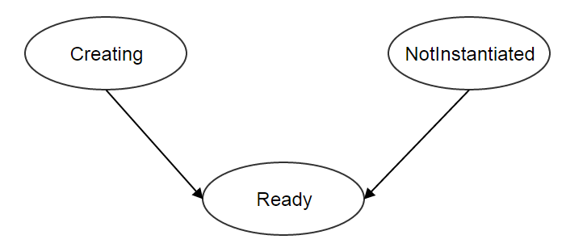

.. _volume:

======
卷（Volume）
======

.. contents:: `目录`
   :depth: 6

--------
概览（Overview）
--------

卷为虚拟机提供存储. 根据卷的作用不同，卷可以分为两种类型根（root）或数据（data）. 根卷是安装虚拟机操作系统的磁盘, 例如C:或者sda; 而数据卷则提供了额外的存储空间, 例如D:或者sdb.

虚拟机管理程序不同，卷也会有所不同; 也就是说, 不同类型虚拟机管理程序创建的卷可能不能互相加载;
例如, KVM虚拟机的卷不能被VMWare虚拟机加载. 类似于:ref:`image format <image format>`, 虚拟机管理器的信息被隐式包含在域:ref:`format <volume format>`中, 不同的是镜像格式还有一个额外的'ISO'值.

由于使用了`thin provisioning <http://en.wikipedia.org/wiki/Thin_provisioning>`_, 卷会拥有两种大小: 实际大小（real size）和虚拟大小（virtual
size）. 实际大小是指卷在存储系统上实际占用的大小; 虚拟大小是指卷声明的大小，也就是卷完全填满后的大小. 虚拟机大小总是大于或等于实际的大小.

主存储（:ref:`primary storage <primary storage>`）上的卷可以直接被虚拟机访问. 卷同一时间只能挂载到一个虚拟机. 根卷总是被挂载到拥有它的虚拟机上，不能被卸载; 而数据卷则可以在相同类型虚拟机管理程序管理的不同虚拟机之间挂载和卸载, 只要这些虚拟机可以访问数据卷所在的主存储.

.. _volume inventory:

---------
清单（Inventory）
---------

属性（Properties）
==========

.. list-table::
   :widths: 20 40 10 20 10
   :header-rows: 1

   * - 名字
     - 描述
     - 可选的
     - 可选的参数值
     - 起始支持版本
   * - **uuid**
     - 请参见 :ref:`resource properties`
     -
     -
     - 0.6
   * - **name**
     - 请参见 :ref:`resource properties`
     -
     -
     - 0.6
   * - **description**
     - 请参见 :ref:`resource properties`
     - 是
     -
     - 0.6
   * - **primaryStorageUuid**
     - 卷所在的主存储的uuid, 请参见 :ref:`primary storage <primary storage>`
     -
     -
     - 0.6
   * - **vmInstanceUuid**
     - 卷所挂载的虚拟机的uuid, 如果没有挂载虚拟机为NULL; 请参见 :ref:`attach VM <volume attach VM>`
     - 是
     -
     - 0.6
   * - **diskOfferingUuid**
     - 磁盘方案（:ref:`disk offering <disk offering>`）的uuid, 如果卷是从磁盘方案创建出来的
     - 是
     -
     - 0.6
   * - **rootImageUuid**
     - 镜像（:ref:`image <image>`）的uuid, 如果卷是从一个镜像创建出来的
     - 是
     -
     - 0.6
   * - **installPath**
     - 卷在主存储上的安装路径
     -
     -
     - 0.6
   * - **type**
     - 卷的类型
     -
     - - Root
       - Data
     - 0.6
   * - **format**
     - 请参见 :ref:`format <volume format>`
     -
     - - qcow2
     - 0.6
   * - **size**
     - 卷的虚拟大小, 单位是字节
     -
     -
     - 0.6
   * - **deviceId**
     - 请参见 :ref:`device id <volume device id>`
     - 是
     -
     - 0.6
   * - **state**
     - 请参见 :ref:`state <volume state>`
     -
     - - Enabled
       - Disabled
     - 0.6
   * - **status**
     - 请参见 :ref:`status <volume status>`
     -
     - - Creating
       - Ready
       - NotInstantiated
     - 0.6
   * - **createDate**
     - 请参见 :ref:`resource properties`
     -
     -
     - 0.6
   * - **lastOpDate**
     - 请参见 :ref:`resource properties`
     -
     -
     - 0.6

示例
+++++++

::

        {
            "description": "Root volume for VM[uuid:1a2b197060eb4593bf5bbf2a83b3d625]",
            "deviceId": 0,
            "format": "qcow2",
            "installPath": "/opt/zstack/nfsprimarystorage/prim-302055ec45794423af7f5d3c5081bc87/rootVolumes/acct-36c27e8ff05c4780bf6d2fa65700f22e/vol-f7bbb3ae1c674ecda3b0f4c025e333f9/f7bbb3ae1c674ecda3b0f4c025e333f9.qcow2",
            "createDate": "Jun 1, 2015 3:45:44 PM",
            "lastOpDate": "Jun 1, 2015 3:45:44 PM",
            "name": "ROOT-for-virtualRouter.l3.1b7f47f5350c488c99e8f54142ddffbd",
            "primaryStorageUuid": "302055ec45794423af7f5d3c5081bc87",
            "rootImageUuid": "178c662bfcdd4145920682c58ebcbed4",
            "size": 1364197376,
            "state": "Enabled",
            "status": "Ready",
            "type": "Root",
            "uuid": "f7bbb3ae1c674ecda3b0f4c025e333f9",
            "vmInstanceUuid": "1a2b197060eb4593bf5bbf2a83b3d625"
        }

.. _volume attach VM:

挂载的虚拟机（Attached VM）
+++++++++++

数据卷可以被挂载到正在运行的（Running）或者已经停止的（Stopped）虚拟机上, 但在同一时间一个卷只能挂载到一个虚拟机上; 挂载后虚拟机的UUID会出现在'vmInstanceUuid'中. 数据卷可以从一个虚拟机上卸载，然后挂载到另一个虚拟机上，但是这两个虚拟机需要是相同类型的虚拟机管理程序管理的. 根卷总是被挂载到拥有它的虚拟机上，不能被卸载.

.. _volume format:

格式（Format）
++++++

卷格式揭示了卷和虚拟机管理程序之间的关系, 指示了该卷可以挂载到哪种虚拟机管理程序管理的虚拟机上.
卷格式和镜像格式（:ref:`image format <image format>`）很类似. ZStack当前版本仅支持KVM虚拟机管理程序, 因此卷格式支持'qcow2'.

.. _volume device id:

设备ID（Device ID）
+++++++++

设备号表明了卷挂载到虚拟机的顺序. 由于第一个被挂载的卷总是根卷, 它将有固定的设备ID 0; 数据卷则可能有1, 2, 3 ... N这样的设备ID, 取决于他们挂载到虚拟机的顺序. 设备ID可以用来识别卷在客户操作系统（guest operating system）中的盘符（disk letter）; 
例如, 在Linux系统中, 0通常代表/dev/xvda, 1通常代表/dev/xvdb，一次类推.

.. _volume state:

可用状态（State）
+++++

卷有两种可用状态:

- **Enabled**:

  启用（Enabled）状态下，允许卷被挂载到虚拟机上.

- **Disabled**:

  禁用（Disabled）状态下，不允许卷被挂载到虚拟机上; 然而, 数据卷总是可以被卸载，即使已经是禁用状态的数据卷也可以被卸载.

.. 注意:: 根卷总是在启用状态因为他们不能被卸载.

.. _volume status:

连接状态（Status）
++++++

连接状态体现了卷的生命周期:

- **NotInstantiated**:

  数据卷特有的状态. 在这个连接状态中，数据卷只是在数据库中分配了还没有在任何主存储上实例化; 也就是说, 他们还只存在于数据库的表记录中. 
  NotInstantiated状态的数据卷可以挂载到任何类型虚拟机管理程序管理的虚拟机上; 当他们挂载到虚拟机上后，他们会在主存储上被实例化为虚拟机管理程序类型的实际二进制文件.
  挂载之后, 数据卷的hypervisorType域会存储虚拟机对应的虚拟机管理程序类型, 同时连接状态会改为就绪（Ready）; 在这之后，这些数据卷就只能被重新挂载到相同类型虚拟机管理程序管理的虚拟机上了.

- **Ready**:

 在这种状态时，卷已经在主存储上实例化，已就绪可以使用.

- **Creating**:

  在这种状态时，正在从镜像或卷快照创建卷; 未就绪不能使用.

连接状态转换图如下所示:

.. 注意:: 根卷总是在就绪状态（Ready）.

----------
操作（Operations）
----------

创建一个数据卷（Create a Data Volume）
====================

.. 注意:: 根卷是在创建虚拟机时自动创建的; 没有用于创建根卷的API.

从磁盘方案创建（From a Disk Offering）
++++++++++++++++++++

用户可以使用CreateDataVolume从磁盘方案（:ref:`disk offering <disk offering>`）创建数据卷. 例如::

    CreateDataVolume name=data1 diskOfferingUuid=fea135f1d1de40b4915a19aa155983b3

参数（Parameters）
----------

.. list-table::
   :widths: 20 40 10 20 10
   :header-rows: 1

   * - 名字
     - 描述
     - 可选的
     - 可选的参数值
     - 起始支持版本
   * - **name**
     - 资源的名字, 请参见 :ref:`resource properties`
     -
     -
     - 0.6
   * - **resourceUuid**
     - 资源的uuid, 请参见 :ref:`create resource`
     - 是
     -
     - 0.6
   * - **description**
     - 资源的描述, 请参见 :ref:`resource properties`
     - 是
     -
     - 0.6
   * - **diskOfferingUuid**
     - 磁盘方案的uuid, 请参见 :ref:`disk offering <disk offering>`
     -
     -
     - 0.6

从镜像创建（From an Image）
+++++++++++++

用户可以使用CreateDataVolumeFromVolumeTemplate从一个镜像创建数据卷. 例如::

    CreateDataVolumeFromVolumeTemplate name=data1 imageUuid=ee6fa27ade8c42a2bdda8f9b1eee8c93 primaryStorageUuid=302055ec45794423af7f5d3c5081bc87

镜像可以是RootVolumeTemplate或DataVolumeTemplate媒介类型.

参数（Parameters）
----------

.. list-table::
   :widths: 20 40 10 20 10
   :header-rows: 1

   * - 名字
     - 描述
     - 可选的
     - 可选的参数值
     - 起始支持版本
   * - **name**
     - 资源的名字, 请参见 :ref:`resource properties`
     -
     -
     - 0.6
   * - **resourceUuid**
     - 资源的uuid, 请参见 :ref:`create resource`
     - 是
     -
     - 0.6
   * - **description**
     - 资源的描述, see :ref:`resource properties`
     - true
     -
     - 0.6
   * - **imageUuid**
     - 镜像的uuid, 请参见 :ref:`image <image>`
     -
     -
     - 0.6
   * - **primaryStorageUuid**
     - | 即将用于创建数据卷的主存储的uuid; 对于要挂载该数据卷的虚拟机，该主存储必须能被访问; 否则你可能会创建一个不能被挂载到该虚拟机的悬挂数据卷（dangling data volume）.
       | 请参见 :ref:`primary storage <primary storage>`.
     -
     -
     - 0.6

.. _create data volume from volume snapshot:

从卷镜像创建（From a Volume Snapshot）
++++++++++++++++++++++

用户可以使用CreateDataVolumeFromVolumeSnapshot来从:ref:`volume snapshot <volume snapshot>`创建数据卷. 例如::

    CreateDataVolumeFromVolumeSnapshot name=data1 primaryStorageUuid=302055ec45794423af7f5d3c5081bc87 volumeSnapshotUuid=178c662bfcdd4145920682c58ebcbed4

参数（Parameters）
----------

.. list-table::
   :widths: 20 40 10 20 10
   :header-rows: 1

   * - 名字
     - 描述
     - 可选的
     - 可选的参数值
     - 起始支持版本
   * - **name**
     - 资源的名字, 请参见 :ref:`resource properties`
     -
     -
     - 0.6
   * - **resourceUuid**
     - 资源的uuid, 请参见 :ref:`create resource`
     - 是
     -
     - 0.6
   * - **description**
     - 资源的描述, see :ref:`resource properties`
     - 是
     -
     - 0.6
   * - **volumeSnapshotUuid**
     - 卷镜像的uuid, 请参见 :ref:`volume snapshot <volume snapshot>`
     -
     -
     - 0.6
   * - **primaryStorageUuid**
     - | 即将用于创建数据卷的主存储的uuid; 对于要挂载该数据卷的虚拟机，该主存储必须能被访问; 否则你可能会创建一个不能被挂载到该虚拟机的悬挂数据卷（dangling data volume）.
       | 请参见 :ref:`primary storage <primary storage>`.
     -
     -
     - 0.6

删除数据卷（Delete Data Volume）
==================

用户可以使用DeleteDataVolume来删除数据卷. 例如::

    DeleteDataVolume uuid=178c662bfcdd4145920682c58ebcbed4

.. 注意:: 根卷会在删除虚拟机时自动删除, 没有API可以直接删除根卷.

参数（Parameters）
++++++++++

.. list-table::
   :widths: 20 40 10 20 10
   :header-rows: 1

   * - 名字
     - 描述
     - 可选的
     - 可选的参数值
     - 起始支持版本
   * - **deleteMode**
     - 请参见 :ref:`delete resource`
     - 是
     - - Permissive
       - Enforcing
     - 0.6
   * - **uuid**
     - 卷的uuid
     -
     -
     - 0.6

.. 危险:: 没有办法可以恢复一个已经被删除的数据卷.

改变可用状态（Change State）
============

用户可以使用ChangeVolumeState来改变一个数据卷的可用状态. 例如::

    ChangeVolumeState uuid=be19ce415bbe44539b0bd276633470e0 stateEvent=enable

.. 注意:: 根卷的可用状态不可改变.

参数（Parameters）
++++++++++

.. list-table::
   :widths: 20 40 10 20 10
   :header-rows: 1

   * - 名字
     - 描述
     - 可选的
     - 可选的参数值
     - 起始支持版本
   * - **uuid**
     - 卷的uuid
     -
     -
     - 0.6
   * - **stateEvent**
     - 状态触发事件

       - 启用: 改变可用状态为启用（Enabled）
       - 禁用: 改变可用状态为禁用（Disabled）
     -
     - - enable
       - disable
     - 0.6

.. _AttachDataVolumeToVm:

挂载虚拟机（Attach VM）
=========

用户可以使用AttachDataVolumeToVm来挂载一个卷到虚拟机上. 例如::

    AttachDataVolumeToVm volumeUuid=178c662bfcdd4145920682c58ebcbed4 vmInstanceUuid=c5b443a20341418b9120c7e3b3cd34f5

参数（Parameters）
++++++++++

.. list-table::
   :widths: 20 40 10 20 10
   :header-rows: 1

   * - 名字
     - 描述
     - 可选的
     - 可选的参数值
     - 起始支持版本
   * - **volumeUuid**
     - 卷的uuid
     -
     -
     - 0.6
   * - **vmInstanceUuid**
     - 虚拟机的uuid, 请参见 :ref:`VM <vm>`
     -
     -
     - 0.6

.. _DetachDataVolumeFromVm:

卸载虚拟机（Detach VM）
=========

用户可以使用DetachDataVolumeFromVm从虚拟机卸载一个数据卷. 例如::

    DetachDataVolumeFromVm uuid=178c662bfcdd4145920682c58ebcbed4

参数（Parameters）
++++++++++

.. list-table::
   :widths: 20 40 10 20 10
   :header-rows: 1

   * - 名字
     - 描述
     - 可选的
     - 可选的参数值
     - 起始支持版本
   * - **uuid**
     - 卷的uuid
     -
     -
     - 0.6

.. 警告:: 从虚拟机卸载数据卷之前，请确保虚拟机操作系统将所有改变写到磁盘（flush）并确保没有应用程序访问它; 否则数据卷中的数据可能会崩溃. 可以把卸载数据卷想象成从计算机热拔出（hot unplugging）一个磁盘的过程.

查询卷（Query Volume）
============

用户可以使用QueryVolume来查询卷. 例如::

      QueryVolume type=Data vmInstanceUuid=71f5376ef53a46a9abddd59c942cf45f

::

      QueryVolume diskOffering.name=small primaryStorage.uuid=8db7eb2ccdab4c4eb4784e46895bb016

原生域查询（Primitive Fields of Query）
+++++++++++++++++++++++++

请参见 :ref:`volume inventory <volume inventory>`

嵌套和扩展域查询（Nested And Expanded Fields of Query）
+++++++++++++++++++++++++++++++++++

.. list-table::
   :widths: 20 30 40 10
   :header-rows: 1

   * - 域（Field)
     - 清单（nventory）
     - 描述
     - 起始支持版本
   * - **vmInstance**
     - :ref:`VM inventory <vm inventory>`
     - 卷所挂载的虚拟机
     - 0.6
   * - **snapshot**
     - :ref:`volume snapshot inventory <volume snapshot inventory>`
     - 从该卷创建出来的所有卷快照
     - 0.6
   * - **diskOffering**
     - :ref:`disk offering inventory <disk offering inventory>`
     - 从该卷创建出来的所有磁盘方案
     - 0.6
   * - **primaryStorage**
     - :ref:`primary storage inventory <primary storage inventory>`
     - 该卷所在的主存储
     - 0.6
   * - **image**
     - :ref:`image inventory <image inventory>`
     - 从该卷创建出来的镜像
     - 0.6

----
标签（Tags）
----

用户可以使用resourceType=VolumeVO在卷上创建标签. 例如::

    CreateUserTag resourceType=VolumeVO tag=goldenVolume resourceUuid=f97b8cb9bccc4872a723c8b7785d9a12
