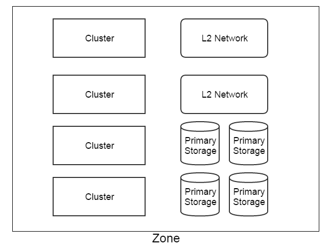

.. _zone:

================
区域（Zone）
================

.. contents:: `目录`
   :depth: 6

--------------------
概览（Overview）
--------------------

一个区域是由类似主存储，集群，L2网络的资源组成的逻辑组; 它定义一个可见的边界，在相同区域中的资源互相可见并且可以形成某种关系，但在不同区域中的资源是不行的.
例如, 区域A中的一个主存储可以挂载到区域A中的一个集群，但不能挂载到区域B的集群上.

区域的子资源，包括集群，L2网络和主存储，以下面的形式组织:

区域中的后裔资源没有在上图中列举出来。例如, 一个集群中的主机是集群的父区域的一个后裔资源.

作为逻辑资源（logic resource）, 区域将数据中心中的设备映射为逻辑组（logic groups）. 虽然没有强制要求这些设备需要如何做映射,
下面这些建议可以使事情变得简单:

- 同一个物理二层广播域中的主机应该在同一个区域中, 被划分为一个或多个集群.
- 物理二层广播域不应该跨域多个区域, 而应该映射为单个区域中的L2网络.
- 为虚拟机存储云盘提供磁盘空间的物理存储，也就是主存储，不应该跨越多个区域, 而应该被映射为单个区域中的主存储.
- 一个数据中心可以有多个区域.

一个区域可以有一个或多个备份存储（:ref:`backup storage`）挂载. 一个区域中的资源, 例如主存储, 只能访问挂载在同一区域中的备份存储。
同时， 一个备份存储可以从一个区域中卸载; 在卸载后, 区域中的资源就不能再看见这个备份存储了. 
当数据中心中的网络拓扑改变导致一个备份存储不能再被一个区域中的资源访问时，可以将备份存储从区域上卸载掉（Detaching backup storage）.

.. _zone inventory:

----------------------
清单（Inventory）
----------------------

属性（Properties):
=====================

.. list-table::
   :widths: 20 40 10 20 10
   :header-rows: 1

   * - 名字
     - 描述
     - 可选的
     - 可选的参数值
     - 起始支持版本
   * - **uuid**
     - 请参见 :ref:`resource properties`
     -
     -
     - 0.6
   * - **name**
     - 请参见 :ref:`resource properties`
     -
     -
     - 0.6
   * - **description**
     - 请参见 :ref:`resource properties`
     - 是
     -
     - 0.6
   * - **state**
     - 请参见 `zone state`_
     -
     - - Enabled
       - Disabled
     - 0.6
   * - **createDate**
     - 请参见 :ref:`resource properties`
     -
     -
     - 0.6
   * - **lastOpDate**
     - 请参见 :ref:`resource properties`
     -
     -
     - 0.6
   * - **type**
     - 保留域
     -
     -
     - 0.6

示例
=======

::

    {
      "uuid": "b729da71b1c7412781d5de22229d5e17",
      "name": "TestZone",
      "description": "Test",
      "state": "Enabled",
      "type": "zstack",
      "createDate": "Jun 1, 2015 6:04:52 PM",
      "lastOpDate": "Jun 1, 2015 6:04:52 PM"
    }

.. _`zone state`:

可用状态（State）
========================

区域拥有两种可用状态: 启用（Enabled）和禁用（Disabled）. 当改变一个区域的可用状态时, 这个操作会被迭代（cascaded）到归属于这个区域的所有的集群和主机.
例如, 禁用一个区域会导致所以这个区域中的集群和主机被禁用. 由于在已经禁用的主机上不能创建或者启动虚拟机,
禁用一个区域可以避免在这个区域中创建或者启动任何虚拟机.但不影响已有的虚拟机正常使用及重启操作。

.. 注意:: 管理员可以有选择在已经禁用的区域中启用一些主机或者集群，或者在启用的区域中有选择的禁用一些主机或集群, 以达到用更好的粒度来控制可用状态.

-----------------------
操作（Operations）
-----------------------

创建区域（Create Zone）
=============================

管理员可以使用CreateZone命令来创建一个新的区域. 例如::

    CreateZone name='San Jose Zone' description='this is a zone in San Jose datacenter'

参数（Parameters）
++++++++++++++++++++++

.. list-table::
   :widths: 20 40 10 20 10
   :header-rows: 1

   * - 名字
     - 描述
     - 可选的
     - 可选的参数值
     - 起始支持版本
   * - **name**
     - 资源名字, 请参见 :ref:`resource properties`
     -
     -
     - 0.6
   * - **resourceUuid**
     - 资源uuid, 请参见 :ref:`create resource`
     - 是
     -
     - 0.6
   * - **description**
     - 资源描述, 请参见 :ref:`resource properties`
     - 是
     -
     - 0.6
   * - **type**
     - 保留域, 请不要使用它
     - 是
     -
     - 0.6
   * - **userTags**
     - 用户标签, 请参见 :ref:`create tags`; 资源类型是 ZoneVO
     - 是
     -
     - 0.6
   * - **systemTags**
     - 系统标签, 请参见 :ref:`create tags`; 资源类型是 ZoneVO
     - 是
     -
     - 0.6

删除区域（Delete Zone）
==============================

管理员可以使用DeleteZone命令来删除一个区域. 例如::

    DeleteZone uuid=28e94936284b45f99842ababfc3f976d

.. 危险:: 没有办法可以恢复一个删除的区域.

参数（Parameters）
++++++++++++++++++++++

.. list-table::
   :widths: 20 40 10 20 10
   :header-rows: 1

   * - 名字
     - 描述
     - 可选的
     - 可选的参数值
     - 起始支持版本
   * - **uuid**
     - 区域 uuid
     -
     -
     - 0.6
   * - **deleteMode**
     - 请参见 :ref:`delete resource`
     - 是
     - - Permissive
       - Enforcing
     - 0.6

改变可用状态（Change State）
=====================================

管理员可以使用ChangeZoneState命令来改变区域的可用状态. 例如::

    ChangeZoneState stateEvent=enable uuid=737896724f2645de9372f11b13a48223

参数（Parameters）
++++++++++++++++++++++

.. list-table::
   :widths: 20 40 10 20 10
   :header-rows: 1

   * - 名字
     - 描述
     - 可选的
     - 可选的参数值
     - 起始支持版本
   * - **uuid**
     - 区域 uuid
     -
     -
     - 0.6
   * - **stateEvent**
     - 状态触发事件.

       - enable: 改变可用状态为启用（Enabled）
       - disable: 改变可用状态为禁用（Disabled）
     -
     - - enable
       - disable
     - 0.6

挂载备份存储（Attach Backup Storage）
==============================================

请参见 :ref:`attach backup storage to zone <attach backup storage to zone>`.

卸载备份存储（Detach Backup Storage）
==============================================

请参见 :ref:`detach backup storage from zone <detach backup storage from zone>`.

查询区域（Query Zone）
=============================

管理员可以使用QueryZone来查询区域. 例如::

    QueryZone name=zone1

::

    QueryZone vmInstance.uuid=13238c8e0591444e9160df4d3636be82

原生域查询（Primitive Fields of Query）
++++++++++++++++++++++++++++++++++++++++++++++

请参见 :ref:`zone inventory <zone inventory>`

嵌套域和扩展域查询（Nested And Expanded Fields of Query）
+++++++++++++++++++++++++++++++++++++++++++++++++++++++++++++++++++++

.. list-table::
   :widths: 20 30 40 10
   :header-rows: 1

   * - 域（Field）
     - 清单（Inventory）
     - 描述
     - 其实支持版本
   * - **vmInstance**
     - :ref:`vm inventory <vm inventory>`
     - 属于这个区域的虚拟机
     - 0.6
   * - **cluster**
     - :ref:`cluster inventory <cluster inventory>`
     - 属于这个区域的集群
     - 0.6
   * - **host**
     - :ref:`host inventory <host inventory>`
     - 属于这个区域的主机
     - 0.6
   * - **primaryStorage**
     - :ref:`primary storage inventory <primary storage inventory>`
     - 属于这个区域的主存储
     - 0.6
   * - **l2Network**
     - :ref:`L2 network inventory <l2Network inventory>`
     - 属于这个区域的L2网络
     - 0.6
   * - **l3Network**
     - :ref:`L3 network inventory <l3Network inventory>`
     - 属于这个区域的L3网络
     - 0.6
   * - **backupStorage**
     - :ref:`backup storage inventory <backup storage inventory>`
     - 属于这个区域的备份存储
     - 0.6

-----------------
标签（Tags）
-----------------

管理员可以在一个区域上用resourceType=ZoneVO创建用户标签. 例如::

    CreateUserTag resourceType=ZoneVO resourceUuid=0cd1ef8c9b9e0ba82e0cc9cc17226a26 tag=privateZone

系统标签（System Tags）
=============================

.. _zone.host.reservedMemory:

保留容量（Reserved Capacity）
+++++++++++++++++++++++++++++++++++

.. list-table::
   :widths: 20 30 40 10
   :header-rows: 1

   * - 标签（Tag）
     - 描述
     - 示例
     - 起始支持版本
   * - **host::reservedMemory::{capacity}**
     - 请参见 :ref:`host capacity reservation`
     - host::reservedMemory::1G
     - 0.6
